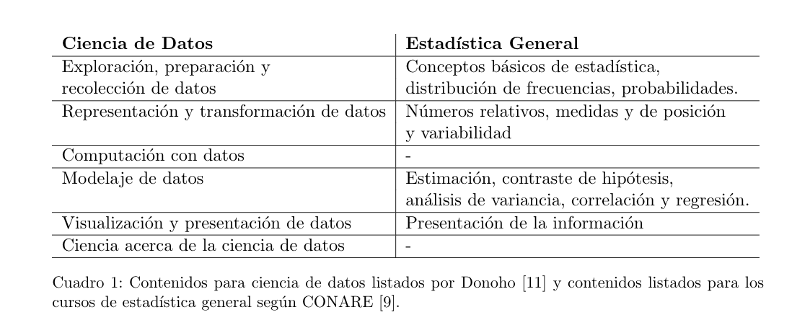

```{r setup, include=FALSE}
options(htmltools.dir.version = FALSE)
```

## Bienvenida

### Alejandro Salas Vargas

* Licenciado en la Enseñanaza de la Matemática
* MSc en Estadística
* Profesor en UNED y UCR

### Áreas de interés

* Matemática y su enseñanaza
* Estadística Bayesiana
* Análisis de Datos Funcionales
* Teoría Estadística
* Ciencia de Datos

<!--   
## Bienvenida

### Maikol Solís

* Profesor Asociado, Escuela de Matemática 
* Bach. Ciencias Actuariales. 
* Msc. en Matemática Aplicada, Université Paul Sabatier. 
* Msc. en Matemática Aplicada, Universidad de Costa Rica.
* Ph.D en Estadística, Université Paul Sabatier. 

### Áreas de interés

Mi trabajo reciente se enfoca en el análisis de sensibilidad en modelos estadísticos a través de distintos métodos: 
* Estadística no paramétrica,
* Teoría topológica y geometría,
* Usando "relative weight analysis". 

Además, como parte de una colaboración interdisciplinaria, estoy colaborando en proyecto para la generación de estrategias de muestreo masivo para la detección de enfermedades virales (SARS-COV2). 
-->
---

## Bienvenida
### Acerca de ustedes

* Compartan su nombre, año de carrera y algo que le gustaría compartir


---

## Información importante

## Mediación virtual 

[Mediación Virtual](https://mv1.mediacionvirtual.ucr.ac.cr/course/view.php?id=21179)

### Carta al estudiante

[Programa del curso](http://www.estadistica.ucr.ac.cr/images/EEST/Programas/Bachi/2022/IC/Programa-XS-3310.pdf)

### Pendientes para ustedes: 


* Rellenar este formulario: 
[Llenar el formulario](https://forms.gle/q8CR77qTxJE8cwoZ8)


---

class: center, middle

## Hasta ahora en la carrera de Estadística:

En medio del auge de ciencia de datos, datos grandes, y tantas puertas que la tecnología nos ha abierto.




---

class: center, middle

# Hasta ahora en la carrera de Estadística:

 ¿Qué vimos en modelos probabilísticos discretos y contínuos? 

## https://seeing-theory.brown.edu


---

# ¿Para qué necesitamos Teoría Estadística?

Necesitamos entender el porqué los resultados teóricos funcionan. 

Es decir, si tomamos el promedio de un conjunto de dato, 

- ¿Es el mejor estimador que podemos generar? 
- ¿Qué significa mejor?
- ¿Puedo probar que efectivamente es el mejor?


---

## Repaso de Inferencia Estadística

### Variable aleatoria (v.a.)

###  Muestra aleatoria (m.a.)

###  Parámetro

###  Estadístico
###  Estimador 

###  Modos de convergencia 

### Ley de lo grandes números 

### Teorema del límite central


---


## Parámetros, estadísticos y estimadores
	
### Variable aleatoria (v.a.)	

Una variable aleatoria (v.a.) ${\displaystyle X}$ es una función real definida en el espacio de probabilidad ${\displaystyle (\Omega ,{\mathcal {A}},P)}$, asociado a un experimento aleatorio.

> ${\displaystyle X:\Omega \to \mathbb {R} }$

### Muestra aleatoria (m.a.)

Sean $X_{1}, X_{2}, ... , X_{n}$ un conjunto de variables aleatorias (v.a.) independientes e idénticamente distribuidas; este conjunto se denomina *muestra aleatoria* de una población infinita.

---

## Parámetros, estadísticos y estimadores

### Parámetro

Es una característica de la población. Algunos parámetros de interés podría ser la media, varianza o la proporción en una población.

### Estadístico

Es una función de la muestra aleatoria, $T=f\left(X_{1}, X_{2}, ... , X_{n}\right)$. Un estadístico es a su vez una variable aleatoria y como tal tiene su propia distribución, denominada distribución muestral, con sus parámetros correspondientes.

---

## Parámetros, estadísticos y estimadores

### Estimador

Cuando un estadístico, llámese $\hat{\theta}$, se utiliza para aproximar el valor de un parámetro $\theta$, entonces se acostumbra llamar a ese estadístico con el nombre de estimador.

> **Notación:** $\theta$ parámetro a estimar.

> $\hat{\theta}$ estimador de $\theta$.

### Ejemplo:

* $\bar{X}$ es un estimador de $\mu$
* $S^2$ es un estimador de $\sigma^2$
* $\hat{p}$ es un estimador de $p$
* $\hat{\theta}=\frac{X_1+X_n}{2}$ es un estimador de $\mu$

---

## Modos de convergencia 

## Desigualdad de Markov  

Si $X$ es una v.a. tal que  $\operatorname{Pr}(X \geq 0)=1$. Entonces para cada número real  $t>0$, se tiene que 

\begin{equation}
\operatorname{Pr}(X \geq t) \leq \frac{E(X)}{t}
\end{equation}

## Desigualdad de Chebyshev 

Si  $X$ es una v.a. que cumple que  $\operatorname{Var}(X)$ existe. Entonces para cada número  $t>0$

$$
\operatorname{Pr}(|X-E(X)| \geq t) \leq \frac{\operatorname{Var}(X)}{t^{2}}
$$
---

## Modos de convergencia 

## Propiedades de la media muestral 

Sea $X_{1}, \ldots, X_{n}$ una v.a. con una  distribución con media  $\mu$ y varianza $\sigma^{2}$. Sea  $\bar{X}_{n}$ la media muestral. Entonces,  $E\left(\overline{X}_{n}\right)=\mu$ y $\operatorname{Var}\left(\bar{X}_{n}\right)=\sigma^{2} / n$

## Convergencia en probabilidad 

Decimos que  $Z_{1}, Z_{2}, \ldots$ de v.a. converge a $b$ en probabilidad si para cada número  $\varepsilon>0$,

$$\lim _{n \rightarrow \infty} \operatorname{Pr}\left(\left|Z_{n}-b\right|<\varepsilon\right)=1$$

Esta propiedad se denota como

$$
Z_{n} \stackrel{p}{\longrightarrow} b.
$$
---
## Parámetros, estadísticos y estimadores 
### Ley de los grandes números 

Suponga que  $X_{1}, \ldots, X_{n}$ es una muestra de una distribución con media $\mu$ y varianza finita. Sea  $\bar{X}_{n}$ la media muestral. Entonces, 
\begin{equation*}
\bar{X}_{n} \stackrel{p}{\longrightarrow} \mu
\end{equation*}

¿Cómo se puede probar este resultado usando la desigualdad de Chebyshev?


---
## Parámetros, estadísticos y estimadores 
### Convergencia en distribución 

Suponga que se tienen una secuencia de funciones de distribución $F_1, \ldots, F_n$ para la muestra $X_1,\ldots,X_n$. Se dice que $X_1,\ldots$  converge en distribución a $F^*$ si 


\begin{equation*}
\lim _{n \rightarrow \infty} F_{n}(x)=F^{*}(x)
\end{equation*}
Se denota también como 
\begin{equation*}
\bar{F}_{n}(x) \stackrel{d}{\longrightarrow} F^*(x)
\end{equation*}

### Teorema del límite central

Si $X_1,\ldots, X_n$ es una muestra aleatoria de tamaño $n$, y la distribución tiene media $\mu$ y varianza $\sigma^2<0$. Entonces se cumple que 

$$Z_{n} = \frac{\overline{X}-\mu}{\frac{\sigma}{\sqrt{n}}} \stackrel{d}{\longrightarrow} N\left(0,1\right) \quad si\quad n \rightarrow \infty$$
o lo que es equivalente 
$\overline{X} \xrightarrow{\text{d}} N\left(\mu, \frac{\sigma^2}{n}\right) \quad si\quad n \rightarrow \infty.$
---
## Relaciones entre los modos de convergencia 

Se puede probar que 
\begin{equation*}
\text{Convergencia en Probabilidad} \implies \text{Convergencia en distribución}
\end{equation*}

Para un resumen más detallado, les dejo este video donde se explica mucho mejor

https://www.youtube.com/watch?v=bTMnnrw0v2Y

---

<!-- ## Parámetros, estadísticos y estimadores -->

<!-- ### Ejemplo: -->

<!-- 1. Media muestral: $\bar{X} =\frac{\sum_{i=1}^n{ {X}_i } }{n}$ -->

<!-- Se sabe que $\displaystyle E\left(\bar{X}\right)=\mu$ y $\displaystyle Var\left(\bar{X}\right)=\frac{\sigma^2}{n}$, donde $\mu$ y $\sigma^2$ son la media y variancia poblacional.  -->

<!-- La distribución de $\bar{X}$ va a depender de la distribución de la población. No obstante, con muestras grandes podemos hacer uso del Teorema del Límite Central, el cual dice: -->

<!-- $$Z_{n} = \frac{\bar{X}-\mu}{\frac{\sigma}{\sqrt{n}}} \xrightarrow{\text{d}} N\left(0,1\right) \quad si\quad n \rightarrow \infty$$ -->

<!-- O lo que es equivalente a decir que $\bar{X} \xrightarrow{\text{d}} N\left(\mu, \frac{\sigma^2}{n}\right) \quad si\quad n \rightarrow \infty$. -->

<!-- --- -->

## Parámetros, estadísticos y estimadores
	
### Varianza muestral

 $$S^{2} = \frac{\sum{\left(X_{j}-\bar{X}\right)^2}}{n-1}$$

Podemos demostrar que $E\left(S^2\right)=\sigma^2$ y $Var\left(S^2\right)=\frac{2\sigma^4}{n-1}$.


En la sección siguiente, probaremos que si la población es $N\left(\mu,\sigma^2\right)$, entonces, $$\displaystyle \frac{\left(n-1\right)S^2}{\sigma^2} \sim \chi^{2}_\left(n-1\right).$$ 
Además sabemos que el valor esperado de una $\chi^2$ son sus grados de libertad y la varianza son dos veces los grados de libertad. Por lo tanto,
F
$$ E\left(\frac{\left(n-1\right)S^2}{\sigma^2}\right) = n-1  \\
    \Rightarrow \frac{\left(n-1\right)E\left(S^2\right)}{\sigma^2} = n-1 \\
	  \Rightarrow E\left(S^2\right) = \sigma^2 $$

---

## Parámetros, estadísticos y estimadores
	

Podemos hacer lo mismo para encontrar la varianza cuando la población es Normal:

$$  Var\left(\frac{\left(n-1\right)S^2}{\sigma^2}\right) = 2\left(n-1\right) $$ 

$$ \Rightarrow \frac{\left(n-1\right)^2}{\sigma^4}Var\left(S^2\right) = 2\left(n-1\right) \\
\Rightarrow Var\left(S^2\right) = \frac{2\sigma^4}{n-1} $$
---
## Parámetros, estadísticos y estimadores

En realidad la distribución $\chi^2$ es la distribución muestral de $S^2$. O sea que si se extraen todas las muestras posibles de una población normal y a cada muestra se le calcula su varianza, se obtendrá la distribución muestral de varianzas.

Para estimar la varianza poblacional o la desviación estándar, se necesita conocer el estadístico $X^2$. Si se elige una muestra de tamaño $n$ de una población normal con varianza $\sigma^2$, el estadístico:

$$X^2= \displaystyle \frac{(n-1)S^2}{\sigma^2}$$

tiene una distribución muestral que es una distribución $\chi^2$ con $gl= n-1$ grados de libertad, es decir, $$\displaystyle \frac{\left(n-1\right)S^2}{\sigma^2} \sim \chi^{2}_\left(n-1\right)$$. 