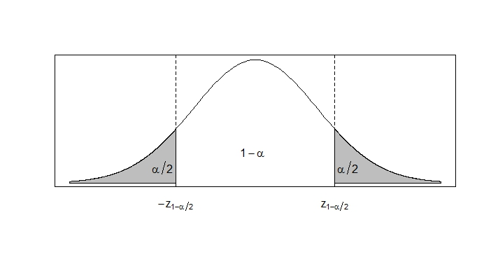
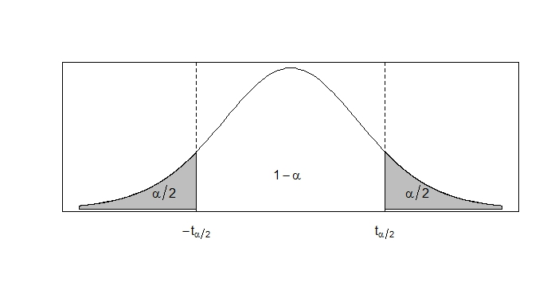

```{r setup, include=FALSE}
knitr::opts_chunk$set(echo = TRUE)
```

class: center, middle

# ¿Qué hemos visto hasta ahora?

Todo sobre estimadores puntuales + intro a los pivotes.

# ¿Qué vamos a discutir hoy?

Intervalos de confianza clásicos.


---

### Cómo leer  los cuantiles de las tablas en los libros 

Algunas tablas en los libros se expresan sus cuantiles de formas diferentes. 

Hay que tener mucho cuidado si acumulan hacia la izquierda o hacia la derecha.

Ver ejemplos.
 
---

class: justify

## IC para poblaciones normales
	
 
  
### Intervalos de confianza para $\mu$
	
Sea $X_{1}, X_{2}, ... , X_{n}$ una muestra aleatoria de una población Normal con media $\mu$ y variancia $\sigma^2$, donde $\mu$ es desconocido pero $\sigma^2$ es conocido. Vamos a construir un intervalo de confianza bilateral para $\mu$ con probabilidad $1-\alpha$. 
	
Primero debemos encontrar un pivote que dependa de la muestra y de $\mu$ en su forma de cálculo pero cuya distribución no dependa de $\mu$. Como habiamos visto en un ejemplo anterior podemos utilizar como pivote a $Z = \dfrac{\overline{X} - \mu}{\dfrac{\sigma}{\sqrt{n}}}$, ya que $Z \sim N(0,1)$. Luego procedemos a encontrar los valroes $a$ y $b$ que satisfacen $P(a \leq Z \leq b) = 1-\alpha$ y $P(Z < a) = P(Z > b) = \frac{\alpha}{2}$. 

Como no conocemos una expresión cerrada para la función de distribución de una Normal Estándar, procedemos a utilizar las tablas. Estas tablas acumulan hacia la izquierda (a menos de), por lo que $a$ es el valor de la tabla que acumula a su izquierda una probabilidad de $\frac{\alpha}{2}$, mientras que $b$ es el valor de la tabla que acumula a su izquierda $1 - \frac{\alpha}{2}$. Por simplicidad llamaremos a estos valores $z_{\frac{\alpha}{2}}$ y $z_{1-\frac{\alpha}{2}}$, respectivamente. 

---


Sin embargo, sabemos que la distribución Normal Estándar es simétrica alrededor de cero, por lo que $z_{\frac{\alpha}{2}} = -z_{1-\frac{\alpha}{2}}$. Por lo tanto tenemos que, $a = -z_{1-\frac{\alpha}{2}}$ y $b = z_{1-\frac{\alpha}{2}}$
	

---


Con estos valores podemos proceder a despejar $\mu$ de la expresión $P(a \leq Z \leq b) = 1-\alpha$: 
	
$P(a \leq Z \leq b) = P\left(-z_{1-\frac{\alpha}{2}} \leq \dfrac{\overline{X} - \mu}{\dfrac{\sigma}{\sqrt{n}}} \leq z_{1-\frac{\alpha}{2}} \right)$


$= P\left( \overline{X} - z_{1-\frac{\alpha}{2}} \dfrac{\sigma}{\sqrt{n}} \leq \mu \leq \overline{X} + z_{1-\frac{\alpha}{2}} \dfrac{\sigma}{\sqrt{n}} \right) = 1-\alpha$
		
Por lo tanto, con confianza del $(1-\alpha)\%$, el intervalo $\overline{X} \pm z_{1-\frac{\alpha}{2}} \dfrac{\sigma}{\sqrt{n}}$ contiene al valor de $\mu$. 

---

	
### ¿Qué sucede si $\sigma^2$ es desconocido? 
	
Si esto pasa no podemos hacer uso del mismo pivote pues no cumple la primera condición de ser un pivote. Recordemos que esta condición nos pide que el pivote esté en términos de la muestra y el parámetro desconocido, pero además no puede estar en términos de otro parámetro desconocido. Hasta el momento todos los otros parámetros que no eran en el de interés eran conocidos, pero ahora $\sigma^2$, que formaba parte del pivote, ya no es conocido. Por lo tanto, debemos hacer uso de un nuevo pivote. 
	
En este caso podemos usar la siguiente variable aleatoria: 
	
$$T = \dfrac{\overline{X} - \mu}{\dfrac{s}{\sqrt{n}}}$$
	
Recordemos que esta variable aleatoria se distribuye como una t-student con $n-1$ grados de libertad. Nótese que esta variable aleatoria sí cumple todas las condiciones de un pivote pues está en términos de la muestra aleatoria (a través de $\overline{X}$ y $S$) y del parámetro desconocido $\mu$ y ya no depende del parámetro desconocido $\sigma^2$. Adicionalmente su distribución es conocida y no depende de $\mu$. Ahora procedemos a encontrar los valores de $a$ y $b$. 

---


Las tablas de la t-student que utilizamos acumulan hacia la derecha, por lo que $a$ es el valor de la tabla con $n-1$ grados de libertad que acumula a su derecha una probabilidad de $1-\frac{\alpha}{2}$ y por lo tanto $b$ es el valor de la misma tabla que acumula a su derecha $\frac{\alpha}{2}$. Por simplicidad llamaremos a estos valores $t_{1-\frac{\alpha}{2}, n-1}$ y $t_{\frac{\alpha}{2}, n-1}$, respectivamente. Nuevamente, podemos hacer uso de la simetría alrededor de cero que tiene la t-student. Por lo tanto, 
	
$a = -t_{\frac{\alpha}{2}, n-1}$ y $b = t_{\frac{\alpha}{2}, n-1}$

---



	
Si despejamos el valor de $\mu$ de $P(a \leq T \leq b) = 1-\alpha$, obtenemos el intervalo $\overline{X} \pm t_{\frac{\alpha}{2}, n-1} \dfrac{s}{\sqrt{n}}$. Por lo tanto podemos concluir que con una confianza del $(1-\alpha)\%$ el intervalo $\overline{X} \pm t_{\frac{\alpha}{2}, n-1} \dfrac{s}{\sqrt{n}}$ contiene el verdadero valor de $\mu$. 

---

## Intervalos de confianza para $\mu_{1} - \mu_{2}$
	
Ahora supongamos que tenemos dos poblaciones Normales e independientes y que obtenemos una muestra de cada una. Sean $X_{1}, X_{2}, ... , X_{n}$ y $Y_{1}, Y_{2}, ... , Y_{m}$ estas dos muestras aleatorias, tal que $X_{j} \sim N(\mu_{1}, \sigma^{2}_{1})$ y $Y_{i} \sim N(\mu_{2}, \sigma^{2}_{2})$, donde $\mu_{1}$ y $\mu_2$ son parámetros desconocidos y $\sigma^{2}_{1}$ y $\sigma^{2}_{2}$ son parámetros conocidos. Nos interesa construir un intervalo bilateral, con una confianza del $(1-\alpha)\%$, para $\mu_{1} - \mu_{2}$.
	
Igual que siempre, nuesto primer paso es obtener una cantidad pivote. Ya conocemos como se distribuyen los promedios muestrales, por lo que podemos partir de ahí. Recordemos que $\overline{X} \sim N\left(\mu_{1}, \dfrac{\sigma^{2}_{1}}{n}\right)$ y $\overline{Y} \sim N\left(\mu_{2}, \dfrac{\sigma^{2}_{2}}{m}\right)$. Como ambos son Normales entonces una combinación lineal de ellos también sería Normal; necesitamos una combinación lineal de estos dos que tenga como parámetro a $\mu_{1} - \mu_{2}$. 

---


Esto lo podemos lograr utilizando $\overline{X} - \overline{Y}$, la cual se distribuye Normal con media $\mu_{1} - \mu_{2}$ y variancia $\dfrac{\sigma^{2}_{1}}{n} + \dfrac{\sigma^{2}_{2}}{m}$. Dado que esta variancia es conocida podemos usar como pivote una Normal Estandár, la cual tendría la siguiente forma:
	
$$Z = \dfrac{(\overline{X} - \overline{Y}) - (\mu_{1} - \mu_{2})}{\sqrt{\dfrac{\sigma^{2}_{1}}{n} + \dfrac{\sigma^{2}_{2}}{m}}}$$
	
Ya con esto podemos proceder como habiamos hecho en el primer caso de esta sección. De esta manera volveriamos a obtener que $a = -z_{1-\frac{\alpha}{2}}$ y $b = z_{1-\frac{\alpha}{2}}$. Ahora procedemos a despejar nuestro parámetro de interés, $\mu_{1} - \mu_{2}$, de la expresión $P(a \leq Z \leq b) = 1-\alpha$. Después de hacer el despeje podemos ver que con una confianza del $(1-\alpha)\%$, el intervalo $(\overline{X} - \overline{Y}) \pm z_{1-\frac{\alpha}{2}} \sqrt{\dfrac{\sigma^{2}_{1}}{n} + \dfrac{\sigma^{2}_{2}}{m}}$ incluye el verdadero valor de $\mu_{1} - \mu_{2}$. 
	

---

	
	
Si fuese el caso donde las variancias poblaciones son conocidas (*i.e.* $\sigma^{2}_{1} = \sigma^{2}_{2} = \sigma^{2}$) Entonces podriamos escribir el intervalo como: 
	
$$(\overline{X} - \overline{Y}) \pm z_{1-\frac{\alpha}{2}} \cdot \sigma \sqrt{\dfrac{1}{n} + \dfrac{1}{m}}$$
	

---

	
	
Nuevamente podemos postular la interrogante: ¿qué sucede si se desconocen las variancias poblaciones? 
	
En este caso vamos a hacer el supuesto de que $\sigma^{2}_{1} = \sigma^{2}_{2} = \sigma^{2}$ (homoscedasticidad) para poder encontrar un pivote satisfactorio. Podemos intentar volver a utilizar una t-student para solventar el problema de las variancias desconocidas. Recordemos que para una variable aleatoria $T$, esta se distribuye t-student si 
	
$$T = \dfrac{Z}{\sqrt{\dfrac{W}{v}}}$$
	
donde $Z \sim N(0,1)$ y $W \sim \chi^{2}(v)$. Para este caso podemos usar la misma $Z$ que usamos anteriormente:
	
$$Z = \dfrac{(\overline{X} - \overline{Y}) - (\mu_{1} - \mu_{2})}{\sigma \sqrt{\dfrac{1}{n} + \dfrac{1}{m}}}$$

---

	
	
Ahora debemos construir una $\chi^2$ adecuada que nos permita cancelar el $\sigma$ que se encuentra en $Z$. Sabemos lo siguiente:
	
$$\dfrac{(n-1)S^{2}_1}{\sigma^{2}} \sim \chi^{2}(n-1) \qquad \dfrac{(m-1)S^{2}_2}{\sigma^{2}} \sim \chi^{2}(m-1)$$
	
donde $S^{2}_1$ y $S^{2}_2$ son las variancias muestrales de la primera y segunda población, respectivamente. También sabemos que la suma de ji-cuadrado es una ji-cuadrado con la suma de los grados de libertad:
	
$$W = \dfrac{(n-1)S^{2}_{1} + (m-1)S^{2}_{2} }{\sigma^{2}} \sim \chi^{2}(n+m-2)$$

---

	
		
Si procedemos a dividir esta ji-cuadrado entre sus grados de libertad obtenemos:
	
$$\dfrac{W}{v} = \dfrac{(n-1)S^{2}_{1} + (m-1)S^{2}_{2} }{\sigma^{2}(n+m-2)}$$
	
Para simplificar un poco esta expresión vamos a definir $S^{2}_{p} = \dfrac{(n-1)S^{2}_{1} + (m-1)S^{2}_{2}}{(n+m-2)}$, por lo tanto
	
$$\dfrac{W}{v} = \dfrac{S^{2}_{p}}{\sigma^{2}}$$
	
Ya con esto podemos montar una t-student, la cual tendría la forma:
	
$$T = \dfrac{(\overline{X} - \overline{Y}) - (\mu_{1} - \mu_{2})}{S_{p} \sqrt{\dfrac{1}{n} + \dfrac{1}{m}}}$$

---

	
Esta es una t-student con $n+m-2$ grados de libertad y la podemos usar como pivote pues cumple todas las condiciones y ya no está en términos de parámetros desconocidos. El procedimiento a seguir es similar al otro caso donde teniamos una t-student y luego de desarrollarlo obtenemos el intervalo 
	
$$\displaystyle (\overline{X} - \overline{Y}) \pm t_{\frac{\alpha}{2}, n+m-2} \cdot S_{p} \sqrt{\frac{1}{n} + \dfrac{1}{m}}$$ 
	
Concluimos que con una confianza del $(1-\alpha)\%$ el intervalo $\displaystyle (\overline{X} - \overline{Y}) \pm t_{\frac{\alpha}{2}, n+m-2} \cdot S_{p} \sqrt{\dfrac{1}{n} + \dfrac{1}{m}}$ contiene el verdadero valor de $\mu_{1} - \mu_{2}$. 


---

# Pivotes para distribuciones con forma posición-escala

En los ejercicios 9.8 y 9.9 de Casella y Berger, se utiliza la siguiente tabla para clasificar las distribuciones de densidad según forma. En esta tabla se refieren a la mayoría de distribuciones de la familia Exponencial, en las cuales la función de densidad (o pdf) se puede reescribir siguiendo la forma de la primera columna.

Forma del pdf        | Tipo de pdf      | Pivote       |
---------------------|------------------|--------------|
$f(x-\mu)$           | Posición         | $\bar{X}-\mu$|
$\dfrac{1}{\sigma}f(x/\sigma)$ | Escala  | $\dfrac{\bar{X}}{\sigma}$|
$\dfrac{1}{\sigma}f\left( \dfrac{x-\mu}{\sigma}\right)$|Posición-Escala| $\dfrac{\bar{X}-\mu}{S}$|

---

# Pivotes para distribuciones con forma posición-escala

Para aclarar un poco más la columna de formas, voy a poner un ejemplo para cada una. 

Para $f(x-\mu)$:

Sea $X \sim N(\mu, 1)$, entonces la función de densidad es:

$$f(x) = \dfrac{1}{\sqrt{2\pi}} \exp{\left(\dfrac{-1}{2}(x-\mu)^2\right)} = g(z)$$
en donde $z = x-\mu$, y $g(z)=\dfrac{1}{\sqrt{2\pi}} \exp{\left(\dfrac{-1}{2}(z)^2\right)}$.

---

# Pivotes para distribuciones con forma posición-escala


Para $\dfrac{1}{\sigma}f(x/\sigma)$:

Sea $X \sim N(0, \sigma^2)$, entonces la función de densidad es:

$$f(x) = \dfrac{1}{\sigma}\dfrac{1}{\sqrt{2\pi}} \exp{\left(\dfrac{-1}{2}(x/\sigma)^2\right)} = \dfrac{1}{\sigma} g(z)$$
en donde $z = x/\sigma$, y $g(z)=\dfrac{1}{\sqrt{2\pi}} \exp{\left(\dfrac{-1}{2}(z)^2\right)}$.

---

# Pivotes para distribuciones con forma posición-escala

Finalmente, para $\dfrac{1}{\sigma}f\left(\dfrac{x-\mu}{\sigma}\right)$:

Sea $X \sim N(\mu, \sigma^2)$, entonces la función de densidad es:

$$f(x) = \dfrac{1}{\sigma}\dfrac{1}{\sqrt{2\pi}} \exp{\left(\dfrac{-1}{2}\left(\dfrac{x-\mu}{\sigma}\right)^2\right)} = \dfrac{1}{\sigma} g(z)$$
en donde $z = \dfrac{x-\mu}{\sigma}$, y $g(z)=\dfrac{1}{\sqrt{2\pi}} \exp{\left(\dfrac{-1}{2}(z)^2\right)}$.


---
class: center, middle

# ¿Qué discutimos hoy?

Estimación por intervalos, método del pivote. Fórmulas para las estimaciones por intervalo más comunes (media, diferencias de medias para distribuciones normales), 

# ¿Qué nos falta para el I Parcial?

Intervalos de confianza para variancias, para muestras grandes

Bootstrap y contrastes de hipótesis.


