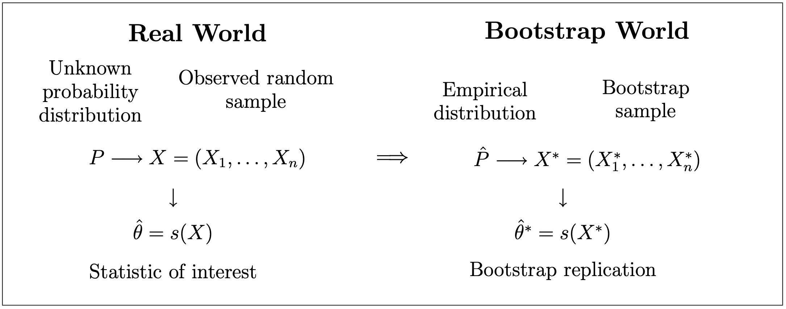

```{r setup, include=FALSE}
knitr::opts_chunk$set(echo = TRUE)
```

class: center, middle

# ¿Qué hemos visto hasta ahora?

Todo sobre estimadores puntuales + pivotes e intervalos de confianza.
Introducción a Bootstrap.

# ¿Qué vamos a discutir hoy?

Bootstrap

---

# Bootstrap

* La inferencia frecuentista se basa en modelos y supuestos. En muchos casos, las expresiones acerca de la exactitud (tales como el error estándar) están basadas en teoría asintótica, y por lo tanto no deberían usarse con muestras pequeñas.

* En otros casos, no estamos usando teoría asintótica, pero no sabemos cómo hacer una suposición acerca de la distribución poblacional, debido a que la muestra no se parece a ninguna forma conocida.

* Una alternativa "moderna" es el método de bootstrap, introducida por Efron así casi 40 años (1979). Bootstrap es un método de remuestreo que es computacionalmente intensivo, y que es aplicable a una gran variedad de casos, incluyendo aquellos en los que los supuestos son más realistas. 

Visualmente:
https://seeing-theory.brown.edu/frequentist-inference/es.html


---

# Bootstrap

¿De dónde viene la expresión?


https://www.huffpost.com/entry/pull-yourself-up-by-your-bootstraps-nonsense_n_5b1ed024e4b0bbb7a0e037d4

---

## Dr. Bradley Efron

<iframe width="560" height="315" src="https://www.youtube.com/embed/Cx5pgZCdDGM" frameborder="0" allow="accelerometer; autoplay; encrypted-media; gyroscope; picture-in-picture" allowfullscreen></iframe>

---

# Principios de Bootstrap

* Si no existe información acerca de la distribución, en la muestra observada podemos encontrar información acerca de la distribución subyacente. Por lo tanto, re-muestrear la muestra es la mejor forma de acercarnos a lo que obtendríamos si se pudiera la oportunidad de re-muestrear de la distribución poblacional.

* Suponga que una muestra $X = (X_1, \dots, X_n)^T$ es utilizada para estimar un parámetro $\theta$. Sea $\hat{\theta}= s(X)$ un estadístico para estimar el parámetro $\theta$. Para hacer inferencia acerca de $\theta$, nos interesa la distribución muestral de $\hat{\theta}$, o ciertos aspectos acerca de esa distribución: la exactitud de nuestra estimación, el intervalo de confianza, etc. En muchas aplicaciones, la distribución muestral de $\hat{\theta}$ no se puede encontrar.

* Si conociéramos la distribución poblacional $P$, podríamos sacar muestras $X^{(b)}, b=1,\dots,B$ de P usando métodos de Monte Carlo para estimar la distribución muestral del estimado. Sin embargo, si $F$ es desconocido, entonces bootstrap sugiere que podemos aproximar ese muestreo re-muestreando nuestra muestra original. Así, podemos encontrar la distribución *empírica* del estimador.

https://seeing-theory.brown.edu/frequentist-inference/es.html

---

# Distribución Empírica

Para una muestra $X_1, \dots, X_n$ de variables aleatorias con valores reales, independientes con distribución P, definimos la distribución $\hat{P}$ como:

$P(A) = \frac{1}{n}\sum_{i=1}^{n} 1_A(X_i)$ para $A \subseteq \mathbb{R}$.

$\hat{P}$ es la distribución empírica de la muestra $X$. $\hat{P}$ puede pensarse como una distribución que pone masa $1/n$ en cada observación $X_i$ (para valores que ocurren más de una vez la masa será un múltiplo de $1/n$). Entonces, $\hat{P}$ es una distribución de probabilidad discreta con un espacio efectivo de muestreo ${X_1, \dots, X_n}$.

Puede demostrarse que $\hat{P}$ es el estimador máximo verosimil no paramétrico de $P$, lo cual justifica que podamos estimar $P$ con $\hat{P}$ sin tener otra información acerca de P (como por ejemplo si P pertenece a una familia paramétrica).

---

# Distribución Empírica

## Resultados teóricos

Sea $A \subseteq \mathbb{R}$ (tal que $P(A)$ está definido), entonces tenemos: $\hat{P}(A) \xrightarrow{d} P(A)$ cuando $n \rightarrow \infty$.

Este resultado es una consecuencia directa de La Ley de los Grandes Números, ya que:

$$n \hat{P}(A) = \sum_{i=0}^{n} 1_A(X_i) \sim Bin(n, P(A))$$

por lo que $\hat{P}(A)$ tiende a su valor esperado $P(A)$ cuando $n \rightarrow \infty$. Este resultado puede formalizarse mediante:

$$\sup_{A\in I}|\hat{P}(A)-P(A)| \rightarrow 0 \quad \text{as} \quad n \rightarrow \infty$$ 
donde $I$ es el conjunto de intervalos en $\mathbb{R}$. En otras palabras, la distribución P(A) puede ser aproximada por $\hat{P}(A)$ igual de bien para toda $A\in I$.

---

# Distribución Empírica

## Muestras de una distribución empírica $\hat{P}$

Suponga que queremos una muestra iid de $\hat{P}$: $X^* = (X^*_1, \dots, X^*_n)^T$. Como mencionamos antes, $\hat{P}$ pone masa $1/n$ en cada observación $X_i$. Entonces, cuando muestreamos de $\hat{P}$, la observación i-ésima $X_i$ en la muestra original puede ser seleccionada con probabilidad $1/n$. Esto nos lleva al siguiente proceso:

* Seleccione $i_1, \dots, i_n$ independientemente de una distribución uniforme en ${1, \dots, n}$.

* Ahora haga $X_{j}^{*} = X_{i_{j}}$ y $X^* = (X^*_1, \dots, X^*_n)^T$.

En otras palabras, saque una muestra aleatoria con reemplazo de la muestra original $X_1, \dots, X_n$.

---

# El Principio de Bootstrap

* $X = (X_1, \dots, X_n)^T$ es una muestra aleatoria de una distribución $P$.

* $\theta = t(P)$ es algún parámetro de la distribución.

* $\hat{\theta} = s(X)$ es un estimador para $\theta$.

La distribución muestral de $\hat{\theta}$ es entonces estimada por su equivalente de bootstrap:

$$\hat{P}(\hat{\theta} \in A) = P^*(\hat{\theta} \in A)$$

---

# El Principio de Bootstrap




---

# La aproximación de Monte Carlo

* En algunas ocasiones la forma de la distribución poblacional es conocida, pero la evaluación de la distribución exacta de la distribución muestral no es calculable. 

* El procedimiento consiste en:

    - Escoja B muestras bootstrap independientes $X^{*(1)}, \dots, X^{*(B)}$ de $\hat{P}$: $X_1^{*(b)}, \dots, X^{*(b)}_n \sim_{iid} \hat{P}$ para $b = 1, \dots, B$.
    - Evalúe las repeticiones de bootstrap: $\hat{\theta}^{*(b)}=s(X^{*(b)})$.
    - Estime la distribución muestral de $\theta$ con la distribución empírica de las repeticiones bootstrap: $\hat{\theta}^{*(1)}, \dots,\hat{\theta}^{*(B)}$:
    
    $$\hat{P}(\hat{\theta}(A)) = \frac{1}{B}\sum_{b=1}^{B} 1_A(\hat{\theta}^{*(b)})$$ 
    
para conjuntos apropiados de $A \subseteq \mathbb{R}^p$ (si $\hat{\theta} \in \mathbb{R}^p$).

Pero, ¿y si solo queremos una cantidad de esa distribución muestral? pues hay fórmulas para calcularlas directamente.

---

# Bootstrap para calcular errores estándar

Sea $\hat{\theta}$ un estimador de $\theta$ y suponga que queremos conocer el error estándar de $\hat{\theta}$. Un error estándar estimado de bootstrap se puede obtener con el siguiente algoritmo:

  - Escoja B muestras bootstrap independientes $X^{*(1)}, \dots, X^{*(B)}$ de $\hat{P}$: $X_1^{*(b)}, \dots, X^{*(b)}_n \sim_{iid} \hat{P}$ para $b = 1, \dots, B$.
  - Evalúe las repeticiones de bootstrap: $\hat{\theta}^{*(b)}=s(X^{*(b)})$.
  - Estime los errores estándar con la desviación estándar de las B repeticiones:
    
$$\hat{se}_{boot} = \sqrt{\frac{1}{B-1}\sum_{b=1}^{B}\left(\hat{\theta}^{*(b)}-\hat{\theta}^{*(.)}\right)^2}$$

donde $\hat{\theta}^{*(.)} = \frac{1}{B}\sum_{b=1}^{B}\hat{\theta}^{*(b)}$.

---

# Bootstrap para calcular el sesgo

Suponga que queremos estimar un parámetro $\theta = t(P)$ con el estadístico $\hat{\theta}= s(X)$. El sesgo de un estimador $\hat{\theta}$ está definido como:

$$bias(\hat{\theta})= E(\hat{\theta})-\theta$$ 

Si sustituimos $P$ por la distribución empírica $\hat{P}$, entonces obtenemos el estimado bootstrap del sesgo:

$$\hat{bias}(\hat{\theta})= bias^*(\hat{\theta}^*) =  E(\hat{\theta}^*)-\theta^*$$
donde $\theta^* = t(\hat{P})$. Note que $\hat{\theta}$ y $\theta^*$ pueden ser diferentes.

---

# Bootstrap para calcular el intervalo de confianza

Si tenemos las repeticiones bootstrap $\hat{\theta}^{*(1)}, \dots,\hat{\theta}^{*(B)}$, podemos estimar la distribución muestral de $\hat{\theta}$. A partir de esto, podemos construir intervalos de confianza para $\theta$. Hay cuatro opciones: IC estándar, IC bootstrap t, IC percentiles, IC percentiles corregido por sesgo.

* IC estándar: Utilizamos el resultado del TLC para decir que $\hat{\theta}$ es distribuido aproximadamente normal con media $\theta$ y variancia $se(\hat{\theta})^2$. Entonces, un IC $(1-\alpha)$ aproximado para $\theta$ está dado por:

$$\hat{\theta} \pm z_{\alpha/2} \hat{se}_{boot}(\hat{\theta})$$


---

# Bootstrap para calcular el intervalo de confianza


* IC bootstrap t: Utilizando el mismo resultado anterior, pero ahora usando $\hat{se}_X(\hat{\theta})$ como estimador de $se(\hat{\theta})$ basado en la muestra $X$. De las muestras bootstrap $X^{*(b)}$ se calcula:

$$T^{*(b)} = \frac{\hat{\theta}^{*(b)}-\hat{\theta}}{\hat{se}_{X^*}(\hat{\theta})}$$

De los valores $T^{*(b)}$, podemos estimar el valor crítico $t_{\alpha/2}$ como $\hat{t}_{\alpha/2}$ tal que: 

$$\frac{1}{B} \sum_{b=1}^{B} 1 {[ T^{*(b)} \leq \hat{t}_{\alpha/2} ]} \approx \alpha/2$$

Entonces: 

$$\hat{\theta} \pm \hat{t}_{\alpha/2} se(\hat{\theta})$$

---

# Bootstrap para calcular el intervalo de confianza


* IC percentiles: si solo queremos utilizar los cuantiles empíricos:

$$\hat{P}^*(\hat{\theta}^* \leq \hat{\theta}_L) = \frac{1}{B} \sum_{b=1}^{B} 1 {[ \hat{\theta}^{*(b)} \leq \hat{\theta}_{L} ]} \approx \alpha/2$$

$$\hat{P}^*(\hat{\theta}^* \geq \hat{\theta}_U) = \frac{1}{B} \sum_{b=1}^{B} 1 {[ \hat{\theta}^{*(b)} \geq \hat{\theta}_{U} ]} \approx \alpha/2$$


* IC percentiles corregido por sesgo. La opción anterior asume que el área debajo de la curva en las dos colas es igual. Si el estimador $\hat{\theta}$ no es la mediana de la distribución bootstrap, entonces esta condición no se cumple. En este caso debemos corregirlo, y hay varias opciones que no serán vistas en esta ocasión.


---

# Ejercicio:

Calcule el error estándar, el sesgo y al menos dos de los intervalos de confianza con los ejemplos 1 dado al inicio (diapositiva 5 de la clase 12).


# Referencias:

* [UC3M - español](http://halweb.uc3m.es/esp/Personal/personas/jmmarin/esp/Boots/tema1BooPres.pdf)

* [Chicago - inglés](http://galton.uchicago.edu/~eichler/stat24600/Handouts/bootstrap.pdf)

* Efron, B.; Tibshirani, R. (1993). An Introduction to the Bootstrap. Boca Raton, FL: Chapman & Hall/CRC. ISBN 0-412-04231-2.

---

# Práctica de Intervalos de Confianza

1.La vida útil de cierto aparato de aire acondicionado sigue una distribución de Rayleigh, cuya función de densidad viene dada por la fórmula:

$f(x|\theta) = \frac{x}{\theta^2} \exp{\left( \frac{-x^2}{2\theta^2} \right)} \mathbb{1}_{ \left( x>0 \right)}$

Suponga que $X_1, X_2, \dots , X_n$ es una muestra aleatoria correspondiente a la vida útil de $n$ aparatos de aire acondicionado:

a)	Determine un estadístico suficiente para $\theta$.

b)	Considere el pivote $\frac{1}{\theta^2} \sum_{j=1}^{n}X_j^2$ para construir un intervalo de confianza para $\theta$ con una confianza del $(1- \alpha)\%$.

c)	¿Cuál es la relación entre el estimador de máxima verosimilitud obtenido en b) con la estimación por intervalo obtenido en c).

d)	Considere la muestra aleatoria de $n = 15$ datos de una distribución $U(0,1)$ que se ofrece, para simular una muestra aleatoria de $15$ datos de una distribución de Rayleigh con $\theta =10$. Encuentre un intervalo de confianza del 95% para estimar $\theta$. 

---
		
# Práctica de Intervalos de Confianza

```{r}
data <- c(0.466, 0.589, 0.097, 0.809, 0.214, 0.315, 0.971,
  0.298, 0.005, 0.126, 0.019, 0.553, 0.385, 0.232, 0.989)
```


2.Sea $X_1, X_2, \dots , X_n$ una muestra aleatoria de una población de Poisson con parámetro $\lambda$.

a)	Utilice la Desigualdad de Cramer-Rao, y la información de Fisher para demostrar que $\bar{X}$, es un estimador de variancia mínima para estimar $\lambda$. 

b)	Demuestre que la variable $U = \frac{\bar{X}-\lambda}{\sqrt{\bar{X}/n}}$ tiene distribución que converge a una normal estándar.

c)	Utilice la variable $U$ del inciso anterior, como pivote para construir un intervalo de confianza para $\lambda$ con probabilidad del $95\%$.

---
		
# Práctica de Intervalos de Confianza


3.Si $Y_1, Y_2, \dots , Y_n$ corresponden a una muestra aleatoria de una distribución gamma con parámetros $\alpha$ desconocido y $\beta$ desconocido. 

a)	Demuestre que la variable $U = \frac{2 \sum_{j=1}^{n}Y_j}{\beta}$ puede ser utilizada como pivote para estimar el valor de $\beta$ y construya un intervalo de confianza de $1-\alpha$ para estimar el valor $\beta$.

b)	Por teorema del límite central, la variable aleatoria $Z = \frac{\bar{X}-E(\bar{X})}{\sqrt{Var(\bar{Y})}}$ tiene distribución que converge a una $N(0,1)$. Supongamos que $n$ es suficientemente grande, determine la variable aleatoria $Z$ vinculada con este problema, que puede ser utilizada como pivote para estimar el valor de $\beta$. Construya un intervalo de confianza de  para estimar el valor $\beta$. 

---
		
# Práctica de Intervalos de Confianza

c)	Considere la siguiente muestra aleatoria que pertenece a una distribución gamma con $\alpha = 3$:

```{r}
data <- c(66.8, 26.6, 8.7, 25.9, 17.0, 17.4, 
          9.2, 19.6, 27.8, 33.3)
```

Utilice los resultados obtenidos en a) y b) para determinar dos intervalos de confianza del $95\%$ para estimar $\beta$, uno para cada método. Compare los resultados. ¿A qué atribuye las diferencias? 


---
class: center, middle

# ¿Qué discutimos hoy?

Bootstrap: concepto, ejemplos y definiciones. IC utilizando bootstrap

# Hasta aquí terminan los temas para el Parcial I.


