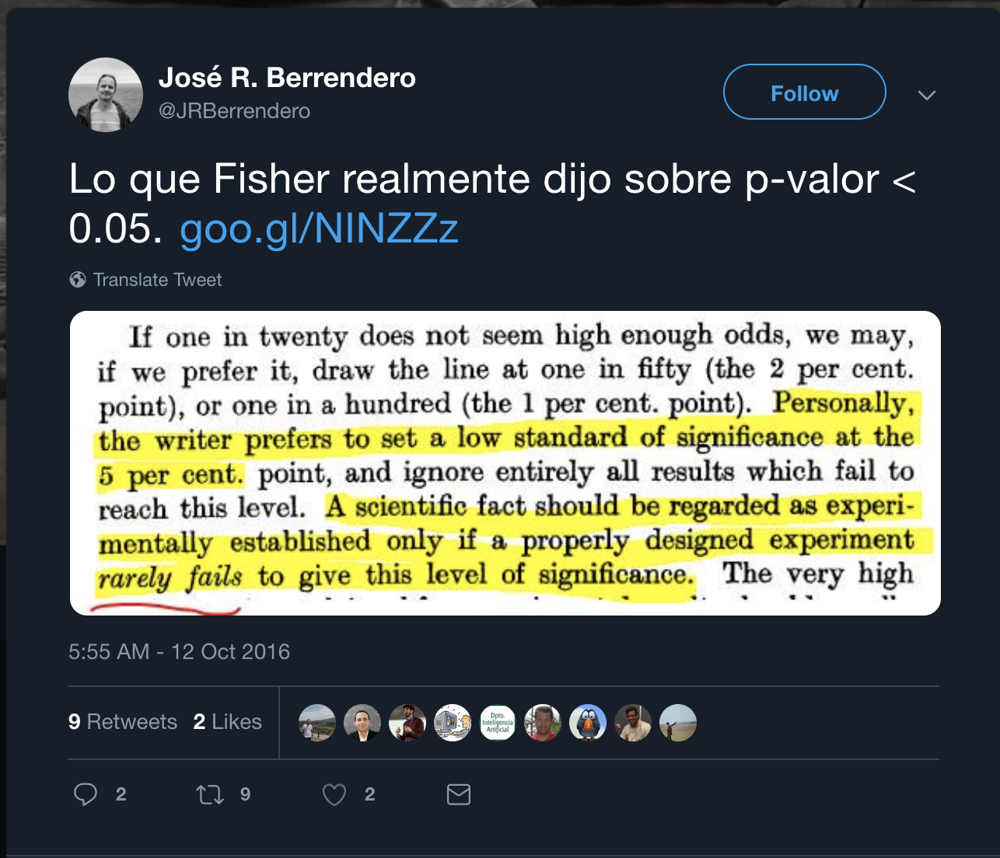

```{r setup, include=FALSE}
knitr::opts_chunk$set(echo = TRUE)
```

class: center, middle

# ¿Qué hemos visto hasta ahora?

Todo sobre estimadores puntuales + pivotes e intervalos de confianza. Bootstrap y una introducción a los contrastes de hipótesis.

# ¿Qué vamos a discutir hoy?

Contrastes de hipótesis: función de potencia, tamaño del contraste, el valor p.

---

# Contrastes de hipótesis
	
Tenemos un parámetro $\theta$ que es desconocido pero podemos decir que pertenece a un espacio paramétrico $\Omega$; este espacio incluye todos los posibles valores que $\theta$ podría tomar. Suponga que dividimos $\Omega$ en dos subconjuntos disjuntos:

$\Omega_0$ y $\Omega_1$ tales que $\Omega_{0} \cap \Omega_{1} = \emptyset$ y $\Omega_{0} \cup \Omega_{1} = \Omega$. 

Si dividimos $\Omega$ de esta manera entonces es de esperar que $\theta$ se encuentre en $\Omega_{0}$ o en $\Omega_{1}$ (no puede estar en los dos al mismo tiempo). 
	
Así, podemos tener:

 * una **hipótesis nula** tal que $H_{0}: \theta \in \Omega_{0}$
 * y una **hipótesis alternativa** tal que $H_{1}: \theta \in \Omega_{1}$. 
 

El procedimiento que sigue consiste en *contrastar* estas hipótesis mediante una *regla de decisión* que favorece una hipótesis sobre la otra al cumplirse cierta condición y viceversa si la condición no se cumple. 

---

# Regiones de rechazo y tipos de errores

<iframe width="560" height="315" src="https://www.youtube.com/embed/Qlrs2gd8JbI" frameborder="0" allow="accelerometer; autoplay; encrypted-media; gyroscope; picture-in-picture" allowfullscreen></iframe>

---


# Regiones de rechazo y tipos de errores


Error Tipo I y Error Tipo II

|		             | $H_0$ cierto  |  $H_0$ falso   |
|:-------------- |:-------------:|:--------------:|
|	Aceptar $H_0$  | Acierto       |  Error Tipo II |
|	Rechazar $H_0$ | Error Tipo I  |  Acierto       |

	
>Definición. Probabilidad de Error Tipo I y Error Tipo II: Para un espacio paramétrico $\Omega$, dividido en dos subconjuntos $\Omega_0$ y $\Omega_1$, de un parámetro $\theta$, se define la probabilidad de cometer Error Tipo I, denotada como $\alpha(\delta)$ como: 

$$\alpha(\delta) = P(\text{rechazar } H_{0} \text{ cuando es cierta}) = P\left( \textbf{X} \in RC_{\delta} | \theta \in \Omega_0 \right) = Potencia\left(\theta | \theta \in \Omega_0 \right)$$

> Por otra parte la probabilidad de cometer Error Tipo II, denotada como $\beta(\delta)$, se define como: 

$$\beta(\delta) = P(\text{no rechazar } H_{0} \text{ cuando es falsa}  ) = P\left( \textbf{X} \in RC_{\delta}^{c} | \theta \in \Omega_1 \right)$$
$$= 1 - P\left( \textbf{X} \in RC_{\delta} | \theta \in \Omega_1 \right) = 1 - Potencia(\theta |\theta \in \Omega_1 )$$
	
---

# Función potencia
	
Dos características que tienen los contrastes: la potencia y el tamaño. El enfoque está en encontrar un "buen" contraste según estas características.  A continuación se define la potencia de la prueba: 
	
> Definición. Función potencia: Sea $X_{1}, X_{2}, ... , X_{n}$ una muestra aleatoria de una población con parámetro desconocido $\theta$ y sea $RC_{\delta}$ la región crítica de un contraste $\delta$ respecto a $\theta$. La **potencia del contraste**, denotada $Potencia(\theta)$, es la probabilidad que el contraste indique rechazar $H_{0}$ para un valor dado de $\theta$ es decir, 
$Potencia(\theta) = P(\textbf{X} \in RC | \theta)$

---

# Función de Potencia

<iframe width="560" height="315" src="https://www.youtube.com/embed/PucB1LgjOsE" frameborder="0" allow="accelerometer; autoplay; encrypted-media; gyroscope; picture-in-picture" allowfullscreen></iframe>


---

# Tamaño del contraste

En el ejemplo anterior podemos observar que solo tenemos un valor para la probabilidad de cada tipo de error. En ese caso:
	
$\alpha(1) = Potencia(1) = 0.023$
	
$\beta(-1) = 1 - Potencia(-1) = 1 - 0.977 = 0.023$
	
Por pura coincidencia ambos errores tienen la misma probabilidad en el ejemplo anterior. A continuación veremos otra forma de describir un contraste.
	
> Definición. Tamaño del contraste. Para un contraste de hipótesis $H_{0}: \theta \in \Omega_{0}$ y $H_{1}: \theta \in \Omega_{1}$ se denomina tamaño del contraste al valor $\alpha_c$ dado por:

$$\alpha_c = Sup(Potencia(\theta|\theta \in \Omega_{0})) = Sup(\alpha(\delta))$$

>	Es decir, el tamaño de un contraste es la máxima probabilidad de cometer un Error Tipo I.

---

# Tamaño del contraste

Ejemplo: Sea $X_{1}, X_{2}, ... , X_{n}$ una muestra aleatoria tal que $X_j \sim N(\mu, 1)$. Se desea contrastar las hipótesis $H_{0}: \mu = 5$ contra la alternativa $H_{1}: \mu > 5$. La región crítica se define como $RC_{\delta} = \left\lbrace \textbf{X} | \overline{X} > c \right\rbrace$. Encuentre el valor de $c$ para que este contraste tenga un tamaño igual a 0.10. 
	
Solución: Note que el contraste se rechaza cuando $\overline{X}$ es mayor que $c$, por lo tanto podemos definir la potencia de la siguiente forma:
	
$\text{Potencia}(\mu) = P(\overline{X} > c | \mu) = P\left( Z > \sqrt{n}(c-\mu) \right)$
	
Sabemos que el tamaño del contraste se define como la máxima probabilidad de cometer Error Tipo I, pero en este caso solo tenemos una probabilidad de Error Tipo I, que sucede cuando $\mu = 5$. Por lo tanto:
	
$\alpha_c = Potencia(5) = P\left( Z > \sqrt{n}(c-5) \right) = 0.10$

---

# Contrastes de hipótesis

Podemos utilizar las tablas para buscar el valor de la normal estándar que acumula a su derecha una probabilidad de 0.10 (que equivale a una probabilidad acumulada a su izquierda de 0.90). Por lo tanto tenemos que 
	
$\sqrt{n}(c-5) = 1.28$ 

$\Rightarrow c = 5 + \frac{1.28}{\sqrt{n}}$
	
Una observación importante de resaltar es que si tenemos una distribución de probabilidad discreta no es posible encontrar un tamaño de contraste para cualquier valor de $c$, ya que las variable aleatorias discretas tienen probabilidades acumuladas a solo ciertos valores. Esto se puede solucionar por medio de contrastes aleatorizados, que dependen del lanzamiento de una moneda con cierta probabilidad de caer escudo, o con bootstrap (que veremos al final de esta sección). 

---

# Contrastes de hipótesis

Otro punto importante de destacar es que en la práctica usualmente utilizamos la hipótesis nula puntual $H_{0}: \theta = \theta_0$ ya que esta no pierde generalidad. Supongamos que se quiere contrastar $H_{0}: \theta \leq \theta_0$ contra $H_{1}: \theta > \theta_0$. En casi todos los casos la función potencia de un contraste es monótona en todo el dominio de $\theta$; en este caso sería una función creciente. Ya que el tamaño se define como la máxima potencia en $\Omega_{0}$ esto va a suceder en su extremo derecho, el cual es $\theta_0$. Esto ocasiona que el contraste tenga el mismo tamaño a que si la hipótesis nula hubiera sido $H_{0}: \theta = \theta_0$. Por lo tanto en la práctica es más común encontrar la hipótesis nula formulada en $\theta_0$, siendo este el valor de $\Omega_{0}$ más próximo a $\Omega_{1}$. 

---

# Valor p

<iframe width="560" height="315" src="https://www.youtube.com/embed/9jW9G8MO4PQ" frameborder="0" allow="accelerometer; autoplay; encrypted-media; gyroscope; picture-in-picture" allowfullscreen></iframe>

---

# Valor p

El Valor p es una herramienta que se puede utilizar para contrastar hipótesis que tiene características que pueden solucionar algunos problemas con los contrastes anteriores. Por ejemplo, no todos los contrastes van a tener un tamaño de contraste exacto (como en los casos donde las variables aleatorias son discretas.) Por otro lado, ni el tamaño ni la potencia están directamente relacionados con los datos observados. El valor p corrige estos problemas. Para propósitos del curso definiremos el valor p como:

> Definición. Valor p. Sea $T = T(X_1, X_2, \dots, X_n)$ un estadístico y considere $H_0: \theta = \theta_0$ contra $H1: \theta < \theta_0$ (o $H1: \theta > \theta_0$). Suponga que el contraste rechaza H0 si $T \leq k$ (o $T > k$). Sea $t = T(x_1, x_2, \dots, x_n$) un valor observado de T. Entonces se define el valor p (denotado pval(t)) como:
$$pval(t) = P(T \leq t|\theta = \theta_0)$$ o 
$$pval(t) = P(T > t|\theta = \theta_0)$$

---

# Valor p

Nótese que de esta manera no hay ningún problema si la distribución de T es discreta o continua, pues la probabilidad puede ser calculada sin ningún problema. Formalmente, el valor p se conoce como la probabilidad, bajo la hipótesis nula, de observar nuestro estadístico de prueba o un valor más extremo. Esto significa que si el valor p es grande entonces nuestro estadístico de prueba es un valor muy común de T y se sitúa en el centro de la distribución, brindando así evidencia a favor de la hipótesis nula. Por otra parte, si el valor p es pequeño entonces el estadístico de prueba es un valor poco común de T, situándose en las colas de su distribución, y por lo tanto brindando evidencia en contra de $H_0$ y a favor de $H_1$. Existe la posibilidad de que el valor de t haya sido un punto extremo de la distribución de T bajo $H_0$, pero esto se considera algo como sumamente improbable.

Como altos valores p dan evidencia a favor de H0 y bajos valores dan evidencia en contra, sería posible idear un contraste de hipótesis que consista en rechazar H0 si pval(t) < α. Si la distribución de T es continua entonces el valor de α sería un tamaño de contraste exacto. En la práctica así es cómo se utiliza el valor p, comparándolo contra el nivel de significancia (tamaño del contraste) y decidiendo si se rechaza o no la hipótesis nula.

---

# Valor p

Ejemplo: Encuentre el valor p para la prueba anterior, suponiendo que $\bar{x} = 5,21$ y $n = 4$.

Solución: Recordemos que el contraste consistía en rechazar $H_0: \mu = 5$ a favor de $H_1:\mu > 5$ si $x > 5 + \frac{1,28}{\sqrt{n}}$. Por lo tanto el valor p consiste en encontrar la siguiente probabilidad:

$$pval(5,21) = P(\bar{X} > 5,21|\mu = 5) = P(Z > \sqrt{4}(5,21 − 5)))$$
$$= P(Z > 0,42) = 0,337$$

Por lo tanto si comparamos este valor contra el tamaño de contraste que utilizamos anteriormente ($0.10$), decimos que no hay suficiente evidencia estadística para rechazar la hipótesis nula de que $\mu = 5$, ya que $pval(5,21) = 0,337 > 0,10 = \alpha_0$. Esta conclusión es consistente con el
contraste que consiste en comparar $\bar{x}$ contra $5 + \frac{1,28}{\sqrt{n}}$. En este caso el valor crítico sería $5.64$, por lo que nuestro estadístico de prueba es menor y entonces no rechazamos la hipótesis nula.

---

# Valor p

Existen algunas malas interpretaciones del valor p que no debemos cometer en la práctica. Por lo tanto concluyo esta discusión con dos advertencias: 

* El valor p no es la probabilidad de que la hipótesis nula sea cierta. La hipótesis nula es un valor de θ fijo y por lo tanto es cierta o no lo es; no existen probabilidades en este ámbito.

* El valor p no es la probabilidad de cometer un Error Tipo I, dado los datos. El cálculo del valor p no tiene nada que ver con la decisión de aceptar o rechazar la hipótesis nula;
es simplemente la probabilidad de una cola de la distribución muestral de T que se puede usar para cuantificar la evidencia de los datos a favor de H0. No obstante, sí se puede
usar el valor p para tomar decisiones, pero entonces obviamente en esos caso no sería la probabilidad de Error Tipo I.

* En algunos casos el valor p se conoce como el "tamaño del contraste observado" pues su cálculo es similar al del tamaño del contraste pero utilizando el estadístico de prueba en lugar del valor crítico. No obstante esta es una interpretación que no me gusta pues tiende a confundir
la interpretación de un valor p con las interpretaciones erróneas mencionadas anteriormente.


---


---
class: middle, inverse

### Pero antes: artículos para el ensayo acerca del valor p

[The ASA's Statement on p-Values: Context, Process, and Purpose de Ronald L. Wasserstein &Nicole A. Lazar](https://amstat.tandfonline.com/doi/full/10.1080/00031305.2016.1154108)

[The American Statistical Association statement on P-values explained, de Lakshmi Narayana Yaddanapudi](https://www.ncbi.nlm.nih.gov/pmc/articles/PMC5187603/)

[The reproducibility of research and the misinterpretation of p-values, de David Colquhoun](https://royalsocietypublishing.org/doi/full/10.1098/rsos.171085)

[An introduction to Second-generation p-values de Jeffrey D. Blume, Lucy D’Agostino McGowan, William D. Dupont, Robert A. Greevy Jr.](https://www.tandfonline.com/doi/full/10.1080/00031305.2018.1537893)

También pueden elegir *cualquiera* de esta edición especial: https://www.tandfonline.com/toc/utas20/73/sup1

---
class: middle, inverse

### Instrucciones para el ensayo:


- Tienen más de 40 artículos a su disposición, pueden repartirlos entre el grupo, pueden leerlos todos o escoger sus preferidos. 

- En grupos que se asignaron aleatoriamente [aquí](https://docs.google.com/spreadsheets/d/152uhams6SDZ6xYrGyzOCW1t8724JP4eyVI-xgN3wpN8/edit?usp=sharing), tendrán que escribir 2 ensayos: uno a favor del uso del valor p y otro en contra del uso del valor p en la práctica de la estadística. La escritura debe usar citas de los artículos recomendados, y deberá tener un argumento sólido y congruente.

- Máximo de 2 páginas por cada ensayo, con letra Arial 11, a espacio 1.5, archivos pdf **solamente**. Grupos de 6 personas.

- Los rubros de calificación serán los similares a los del examen:

    * Originalidad y claridad en los argumentos 2 pt

    * Línea lógica de argumentación 2 pt

    * Uso de referencias, supuestos y no solo opiniones 4 pts

    * Correcto uso de conceptos de inferencia estadística 2 pts

- Fecha de entrega: Viernes 19 de junio a las 7am vía Mediación Virtual. Ese día tendremos una discusión de los ensayos en clase.


---
class: center, middle

# ¿Qué discutimos hoy?

Contrastes de hipótesis: función de potencia, tamaño del contraste, el valor p.

# ¿Qué nos falta para el II Parcial?

Contrastes de hipótesis - contrastes más potentes, uniformemente más potentes, razón de verosimilitud.


Slides creadas via R package [**xaringan**](https://github.com/yihui/xaringan).

