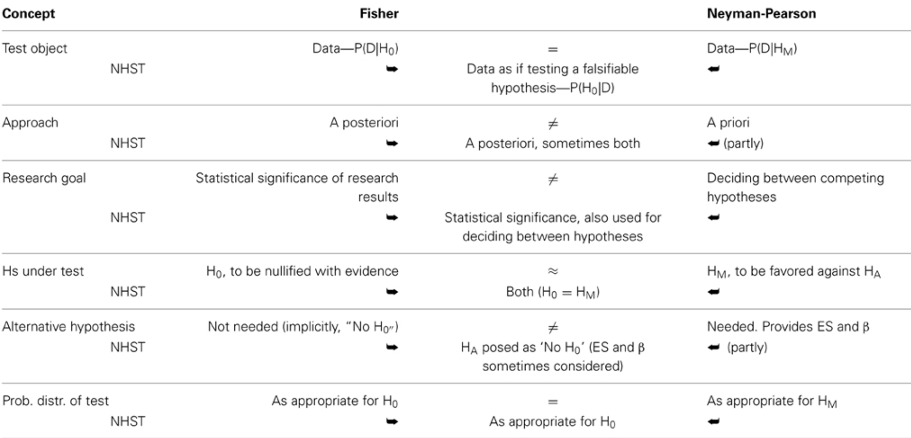
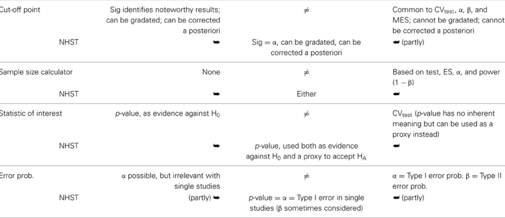
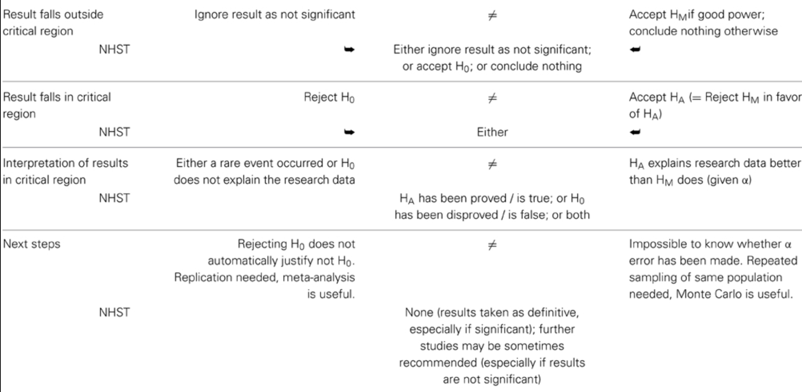

```{r setup, include=FALSE}
knitr::opts_chunk$set(echo = TRUE)
```

class: center, middle

# ¿Qué hemos visto hasta ahora?

Todo sobre estimadores puntuales + pivotes e intervalos de confianza, IC con bootstrap. Contrastes de hipótesis y + bootstrap.

# ¿Qué vamos a discutir hoy?

Un breve repaso de inferencia estadística para entender los errores conceptuales más comunes.

---

# Fisher, Neyman-Pearson, y el híbrido NHST

* Los contrastes de hipótesis que se estudian en los cursos de carrera y de servicio, pueden ser controversiales. 

* La razón de esa controversia tiene que ver con las diferencias entre dos corrientes distintas dentro de la estadística clásica: Fisher vs Neyman-Pearson

* Hoy vamos a repasar este artículo: https://www.frontiersin.org/articles/10.3389/fpsyg.2015.00223/full para aclarar algunas dudas acerca de lo que Uds han aprendido hasta ahora en la carrera de estadística.

---

# Cronología

* Test de significancia: Fisher ayudó a desarrollarlo y lo promovió desde el año 1925.  

* Test de hipótesis estadísticas: desarrollado por Neyman y Pearson (1928)

* Test de significancia de hipótesis nulas (NHST por sus siglas en inglés). Esta propuesta híbrida fue hecha por Lindquist (1940).

* Estas dos corrientes (y un tercer híbrido) pertenecen a la estadística clásica, sin embargo, existen otras corrientes como el contraste de hipótesis de Bayes (Lindley, 1965) y la corriente de teoría de decisión de Wald (1950) que no se discutirán hoy.

---

<!-- # (Paréntesis) -->

<!-- ¿Por qué en estas semanas han están tratando de quitarle el nombre de Fisher a un premio muy prestigioso? -->

<!-- Fisher era eugenista, lo que significa que era parte de un movimiento en el estudio de la genética que abogaba por una raza superior. Los estudios de ese grupo han sido muy cuestionados en la ciencia moderna, por lo que, aunque los descrubrimientos de Fisher fueron seminales y muy importantes para la estadística, la gente que pide el cambio de nombre argumenta que no podemos glorificar a una persona racista, como Fisher.  -->

<!-- Pueden leer más aquí: https://twitter.com/EKTBenn/status/1268869989785796610?s=20 -->

<!-- --- -->

# La propuesta de Fisher 

* *Paso 1:* seleccione una prueba adecuada.

* *Paso 2:* configure la hipótesis nula (H0) / Noten que solo es la hipótesis nula, no la alternativa. 

* *Paso 3:* calcule la probabilidad teórica de los resultados bajo H0 - todo el procedimiento está basado en el supuesto de que la hipótesis nula es cierta.

* *Paso 4:* evalue la importancia estadística de los resultados - ¿el valor p es muy pequeño o muy grande? ¿cuál es el nivel de significancia? Corrección por pruebas múltiples. 

* *Paso 5:* interprete la significación estadística de los resultados

---

# Discusión - Fisher

* Dudar o negar la H0 dado un valor p bajo no necesariamente "apoya" o "prueba" que lo contrario es cierto. 

* Más importante aún, no "apoya" ni "prueba" que cualquier otra cosa que se haya hecho en la investigación tampoco explique los resultados (Macdonald, 1997).

* Para Fisher, un buen control del diseño de la investigación (Fisher, 1955; Johnstone, 1987; Cortina y Dunlap, 1997), especialmente la asignación aleatoria, es fundamental para hacer inferencias razonables basadas en los resultados de las pruebas de significancia (Fisher, 1954; Neyman , 1967).

* Finalmente, consideró los resultados significativos como meros puntos de datos y alentó el uso del metanálisis para avanzar más, combinando resultados significativos y no significativos de proyectos de investigación relacionados (Fisher, 1960; Neyman, 1967).

---

# Puntos destacados (+) - Fisher

* Flexibilidad. Debido a que la mayor parte del trabajo se realiza a posteriori, el enfoque de Fisher es bastante flexible, lo que permite llevar a cabo cualquier cantidad de pruebas.

* Más adecuado para proyectos de investigación ad-hoc o estudios explotarios.

* Inferencial. El procedimiento de Fisher es en gran medida inferencial, desde la muestra hasta la población de referencia, aunque de alcance limitado, principalmente restringido a poblaciones que comparten parámetros similares a los estimados a partir de la muestra (Fisher, 1954, 1955; Macdonald, 2002; Hubbard, 2004).

---

# Puntos destacados (-) - Fisher

* Sin análisis de potencia. Fisher habló de sensibilidad de la prueba, sin embargo, nunca creó un procedimiento matemático para controlar la sensibilidad de una manera predecible (Macdonald, 1997; Hubbard, 2004).

* No hay hipótesis alternativa. Fisher consideró implícitamente hipótesis alternativas, que son la negación de las hipótesis nulas, tanto que para él la tarea principal del investigador, y la definición de un proyecto de investigación bien hecho, fue rechazar sistemáticamente con suficiente evidencia el nulo correspondiente.

---

# La propuesta de Neyman-Pearson 

A priori:

* *Paso 1:* configure el tamaño del efecto esperado en la población.

* *Paso 2:* seleccione una prueba óptima.

* *Paso 3:* configure la hipótesis principal (HM). Error tipo I. Alfa ($\alpha$). La región crítica (CRtest) y el valor crítico (CVtest, Testcrit) de una prueba.

* *Paso 4:* configure la hipótesis alternativa (HA). Error tipo II Beta ($\beta$).

* *Paso 5:* calcule el tamaño de muestra (N) requerido para una buena potencia (1 – $\beta$)

* *Paso 6:* calcule el valor crítico de la prueba.


---

# La propuesta de Neyman-Pearson 

A posteriori:

* *Paso 7:* calcule el valor de la prueba para la investigación (RVtest).

* *Paso 8* decida a favor de la hipótesis principal o alternativa.


---

# Discusión - Neyman-Pearson

* El enfoque de Neyman-Pearson lleva a una decisión entre hipótesis (Neyman y Pearson, 1933; Spielman, 1978). En la práctica, realmente no hace mucha diferencia si acepta HM o HA, según corresponda (Macdonald, 1997). De hecho, aceptar HM o HA es beneficioso ya que evita la confusión con el enfoque de Fisher, que solo puede rechazar H0 (Perezgonzalez, 2014).

* Informar el valor de la prueba de investigación observada es relevante bajo el enfoque de Neyman-Pearson, ya que sirve para comparar el valor observado con el valor crítico a priori.

* También se supone que las hipótesis de Neyman-Pearson son ciertas. Esto significa que HM y HA no pueden ser, al mismo tiempo, falsas, ni demostrarse o falsificarse a posteriori. El único camino a seguir es actuar como si la conclusión a la que llegara la prueba fuera cierta, sujeto a una probabilidad $\alpha$ o $\beta$ de cometer un error de Tipo I o Tipo II, respectivamente (Neyman y Pearson, 1933; Cortina y Dunlap, 1997).

---

# Puntos destacados (+) - Neyman-Pearson

* Mejor potencia. El enfoque de Neyman-Pearson es más poderoso que el de Fisher para probar datos a largo plazo (Williams et al., 2006). 

* Más adecuado para proyectos de muestreo repetido.  Utilizando la misma población y pruebas, como el control de calidad industrial o las pruebas de diagnóstico a gran escala (Fisher, 1955; Spielman, 1973).

* Deductivo. El enfoque es deductivo y bastante mecánico una vez que se han establecido los pasos a priori (Neyman y Pearson, 1933; Neyman, 1942; Fisher, 1955).

---

# Puntos destacados (-) - Neyman-Pearson

* Menos flexible que el enfoque de Fisher. Debido a que la mayor parte del trabajo se realiza a priori, este enfoque es menos flexible para acomodar pruebas no pensadas de antemano y para realizar investigaciones exploratorias (Macdonald, 2002).

* Por defecto se adapta fácilmente al enfoque de Fisher. Como este enfoque parece superficialmente similar al de Fisher, es fácil confundir ambos y olvidar lo que hace que el enfoque de Neyman-Pearson sea único (Lehman, 1993). Si la información proporcionada por la hipótesis alternativa (ES y $\beta$) no se tiene en cuenta para diseñar una investigación con buena potencia, el análisis de datos se basa en la prueba de significancia de Fisher.

---

# Null hypothesis significance testing (NHST) - el método híbrido

* El NHST es el procedimiento más común utilizado para probar datos hoy en día, aunque bajo el supuesto falso de probar hipótesis sustantivas (Carver, 1978; Nickerson, 2000; Hubbard, 2004; Hager, 2013). 

* NHST es, en realidad, una amalgama de las teorías de Fisher y Neyman-Pearson, que se ofrece como un enfoque continuo para las pruebas (Macdonald, 2002; Gigerenzer, 2004). Tampoco es una amalgamación claramente definida y, dependiendo del autor que lo describa o del investigador que la use, puede desviarse más hacia el enfoque de Fisher o hacia el enfoque de Neyman-Pearson.

* Desafortunadamente, si comparamos los enfoques de Fisher y Neyman-Pearson frente a frente, encontramos que son incompatibles en la mayoría de las cuentas (ver tabla en la siguiente filmina). 

* Sin embargo, en general, la mayoría de las amalgamaciones siguen a Neyman-Pearson de manera procesal pero a Fisher filosóficamente (Spielman, 1978; Johnstone, 1986; Cortina y Dunlap, 1997; Hubbard, 2004).

<!-----

# Tabla comparativa




---

# Tabla comparativa (continuación)



---

# Tabla comparativa (continuación)



---

# Ejercicio para pensar

* Hagan una lista de los cursos que han llevado de la carrera de estadística. Identifiquen en cuáles cursos han usado los conceptos de cada tendencia: Fisher, Neyman-Pearson y/o NHST. 

* Otros ejercicios:

* Práctica de contrastes (para hacerla en sus casas): http://math.arizona.edu/~jwatkins/r-composite.pdf

--->

class: center, middle

# ¿Qué discutimos hoy?

Repaso de la inferencia clásica, específicamente las pruebas de hipótesis.

# ¿Qué nos falta para el II Parcial?

Estadística Bayesiana.
