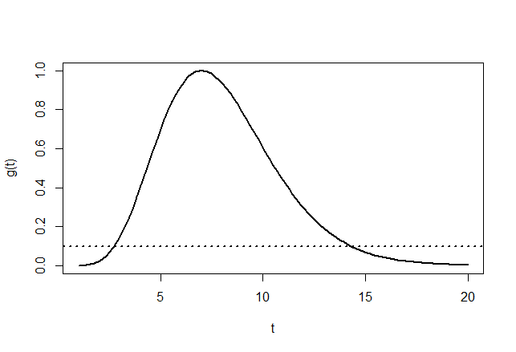
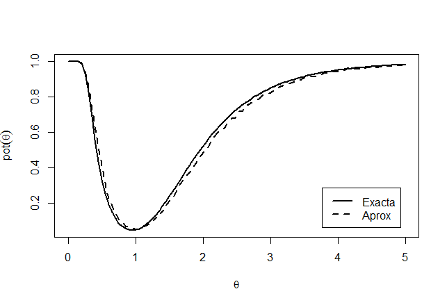

```{r setup, include=FALSE}
knitr::opts_chunk$set(echo = TRUE)
```

class: center, middle

# ¿Qué hemos visto hasta ahora?

Todo sobre estimadores puntuales + pivotes e intervalos de confianza. Bootstrap y contrastes de hipótesis (función de potencia, tamaño del contraste, el valor p, contrastes más potentes, uniformemente más potentes).

# ¿Qué vamos a discutir hoy?

Contrastes de hipótesis: cociente de verosimilitud y razón de verosimilitudes.


---

# Repaso:

_______________________________________________________
> Contraste más potente: Suponga que se desean contrastar las hipótesis simples $H_{0}: \theta = \theta_0$ contra $H_{1}: \theta = \theta_1$ basados en una muestra aleatoria de una población con distribución que depende de $\theta$. Para un valor  $\alpha_0 \in \left] 0,1 \right[$ sea
$\mathbb{T}_{\alpha_0}  =   \left\lbrace  \delta | \alpha(\delta) = \alpha_0 \right\rbrace$
el conjunto de todos los contrastes $\delta$ que tienen tamaño $\alpha_0$. Entonces el contraste de tamaño $\alpha_0$ **más potente**, denotado $\delta^*$, satisface:
* $\delta^* \in \mathbb{T}_{\alpha_0}$
* $\beta(\delta^*) \leq \beta(\delta)$, $\forall \delta \in \mathbb{T}_{\alpha_0}$

_______________________________________________________

---

# Repaso:

_______________________________________________________
> Lema de Neyman-Pearson: Supongamos que se desea contrastar las hipótesis simples $H_{0}: \theta = \theta_0$ contra $H_{1}: \theta = \theta_1$ basados en una muestra aleatoria de una población con distribución que depende de $\theta$. Además, sea $\mathcal{L}(\theta)$ la función de verosimilitud de la muestra para un valor de $\theta$. Para un tamaño dado $\alpha_0$, el contraste que minimiza $\beta(\delta)$ tiene una región crítica determinada por: $RC_{\delta^*} = \left\lbrace \mathbf{X} | \frac{\mathcal{L}(\theta_0)}{\mathcal{L}(\theta_1)} < k \right\rbrace$

_______________________________________________________

---

# Repaso:

_______________________________________________________
> Contraste uniformemente más potente: Un contraste de tamaño $\alpha_0$ es **uniformemente más potente** (UMP) para contrastar $H_{0}:\theta = \theta_0$ contra $H_{1}: \theta \in \Omega_{1}$ si es más potente para $H_{0}:\theta = \theta_0$ contra $H_{1}: \theta = \theta_1$, para todo $\theta_1 \in \Omega_{1}$.

_______________________________________________________

---

# Repaso:

_______________________________________________________
> Cociente de verosimilitudes monótono: Una muestra aleatoria con función de verosimilitud $\mathcal{L}(\theta)$ tiene un **cociente de verosimilitudes monótono** (CVM) en un estadístico $T = T(X_{1}, X_{2}, ... , X_{n})$ si, para $\theta_0 < \theta_1$, el cociente $\frac{\mathcal{L}(\theta_0)}{\mathcal{L}(\theta_1)}$ es una función monótona de $T$. 

_______________________________________________________

---

# Repaso:

_______________________________________________________
> Si la distribución tiene un CVM en el estadístico $T$, entonces el contraste UMP para $H_{0}: \theta = \theta_0$ contra $H_{1}: \theta > \theta_0$ o $H_{1}: \theta < \theta_0$ existe y este se puede expresar en términos de $T$, en lugar del cociente $\frac{\mathcal{L}(\theta_0)}{\mathcal{L}(\theta_1)}$. 

_______________________________________________________

---

# Contraste de razón de verosimilitudes

En la parte anterior encontramos un método para encontrar la región crítica de un contraste cuando se contrastan dos hipótesis simples (o hipótesis compuestas generalizables) sin embargo, el Lema de Neyman-Pearson no es capaz de encontrar una región crítica cuando las hipótesis son compuestas y no se pueden generalizar a manera de encontrar un contraste UMP. 

Una manera de hacer esto es por medio del contraste de razón de verosimilitudes que nos da una forma más general de trabajar con las propiedades de verosimilitud y aún así obtener un buen contraste a partir de él. 

---

# Contraste de razón de verosimilitudes

> Estadístico de la razón de verosimilitudes: Suponga que se tiene una muestra aleatoria $X_{1}, X_{2}, ... , X_{n}$ de una población con vector de parámetros $\Theta = (\theta_1, \theta_2, ... , \theta_k)$ y con función de verosimilitud $\mathcal{L}(\Theta)$. Se desea hacer un contraste de hipótesis sobre uno o más de estos parámetros, de forma que las hipótesis sean compuestas, es decir podemos tener hipótesis $H_{0}: \Theta \in \Omega_{0}$ contra $H_{1}: \Theta \in \Omega_{1}$. Entonces se definen $\mathcal{L}(\hat{\Omega}_{0}) = \max\limits_{\Theta \in \Omega_{0}}\mathcal{L}(\Theta)$ y $\mathcal{L}(\hat{\Omega}) = \max\limits_{\Theta \in \Omega}\mathcal{L}(\Theta)$. Estos corresponden a las funciones de verosimilitud evaluadas en sus correspondientes máximos de verosimilitud. Se define el **estadístico de la razón de verosimilitudes**, denotado $\lambda$, como $\frac{\mathcal{L}(\hat{\Omega}_{0})}{\mathcal{L}(\hat{\Omega})}$. 

De esta definición podemos inferir el uso que se le puede dar a dicho estadístico. Se puede demostrar que $0 < \lambda < 1$. Si $\lambda$ es un valor muy cercano a uno esto significa que la mejor explicación de la verosimilitud está siendo dada por los valores de $\Omega_{0}$, mientras que pasa lo contrario si $\lambda$ se aproxima mucho a cero. Por lo tanto, un buen contraste consistiría en rechazar $H_0$ si $\lambda < k$, donde el $k$ se elije como anteriormente, fijando el tamaño.

---

# Contraste de razón de verosimilitudes

Empezaremos mostrando la técnica con un ejemplo sencillo que consiste de solo un parámetro desconocido. Bajo este esquema podemos definir el estadístico $\lambda$ como $\lambda = \frac{\mathcal{L}(\theta_0)}{\mathcal{L}(\hat{\theta})}$, donde $\theta_0$ es el valor especificado en la hipótesis nula y $\hat{\theta}$ es el EMV de $\theta$. 

Ejemplo: Sea $X_{1}, X_{2}, ... , X_{n}$ una muestra aleatoria tal que $X_{j} \sim N(\mu,\sigma^2)$ donde $\mu$ es desconocido y $\sigma^2$ es conocido. Se desean contrastar las siguientes hipótesis: 

$$H_{0}: \mu = \mu_0 \text{ contra } H_{1}: \mu \neq \mu_0$$ 

Obtenga un contraste con un nivel de significancia de $\alpha_0$.

---

# Contraste de razón de verosimilitudes


Solución: Lo primero que se puede notar es que la hipótesis alterna es compuesta y no existe un contraste UMP para todo $\mu \neq \mu_0$, por lo que no podemos usar el Lema de Neyman-Pearson y deberemos usar la razón de verosimilitudes. Sabemos de antemano que $\mathcal{L}(\mu) = (2\pi)^{-\frac{n}{2}} (\sigma^2)^{-\frac{n}{2}} e^{-\frac{\sum(x_{j} -\mu)^2}{2\sigma^2}}$ Por lo tanto:

$\mathcal{L}(\hat{\Omega}_0) = \mathcal{L}(\mu_0) = (2\pi)^{-\frac{n}{2}} (\sigma^2)^{-\frac{n}{2}} e^{-\frac{\sum(X_{j} -\mu_0)^2}{2\sigma^2}} = (2\pi)^{-\frac{n}{2}} (\sigma^2)^{-\frac{n}{2}} e^{-\frac{ \sum{X_{j}^{2}} - 2n\mu_{0} \overline{X} + n\mu_{0}^2 }{2\sigma^2}}$

También sabemos, de temas anteriores del curso, que el estimador de máxima verosimilitud para $\mu$ es $\hat{\mu} = \overline{X}$. Evaluando esto en la verosimilitud de todo $\Omega$ obtenemos:

$\mathcal{L}(\hat{\Omega}) = \mathcal{L}(\hat{\mu}) =  \mathcal{L}(\overline{X}) = (2\pi)^{-\frac{n}{2}} (\sigma^2)^{-\frac{n}{2}} e^{-\frac{ \sum{X_{j}^{2}} - 2n\overline{X} \cdot \overline{X} + n\overline{X}^2 }{2\sigma^2}} = (2\pi)^{-\frac{n}{2}} (\sigma^2)^{-\frac{n}{2}} e^{-\frac{ \sum{X_{j}^{2}} - n\overline{X}^2 }{2\sigma^2}}$

---

# Contraste de razón de verosimilitudes


De esta manera tenemos:

$\lambda = \frac{\mathcal{L}(\mu_0)}{\mathcal{L}(\hat{\mu})} = \frac{(2\pi)^{-\frac{n}{2}} (\sigma^2)^{-\frac{n}{2}} e^{-\frac{ \sum{X_{j}^{2}} - 2n\mu_{0} \overline{X} + n\mu_{0}^2 }{2\sigma^2}}}{(2\pi)^{-\frac{n}{2}} (\sigma^2)^{-\frac{n}{2}} e^{-\frac{ \sum{X_{j}^{2}} - n\overline{X}^2 }{2\sigma^2}}} = e^{\frac{-n\left( \overline{X} - \mu_0\right) ^2}{2\sigma^2}}$

Sabemos que el contraste consiste en rechazar $H_0$ si $\lambda < k$, es decir 

$e^{\frac{-n\left( \overline{X} - \mu_0\right) ^2}{2\sigma^2}} < k$

$\Rightarrow \frac{-n\left( \overline{X} - \mu_0\right) ^2}{2\sigma^2} < \ln(k)$

$\Rightarrow \frac{n\left( \overline{X} - \mu_0\right) ^2}{\sigma^2} > -2\ln(k) = k^{\prime}$

---

# Contraste de razón de verosimilitudes

Nótese que cuando $H_0$ es cierto entonces $\frac{n\left( \overline{X} - \mu_0\right) ^2}{\sigma^2} \sim \chi^{2}(1)$. Por lo tanto el valor de $k^{\prime}$ es el valor de la tabla de la ji-cuadrada con un grado de libertad que acumula una probabilidad de $\alpha_0$ a su derecha, es decir $k^{\prime} = \chi^{2}_{1,\alpha_0}$. Por lo tanto el contraste consiste en rechazar la hipótesis nula cuando $\frac{n\left( \overline{X} - \mu_0\right) ^2}{\sigma^2} > \chi^{2}_{1,\alpha_0}$. 

Observen que si le sacamos la raíz cuadrada a $\frac{n\left( \overline{X} - \mu_0\right) ^2}{\sigma^2}$ esta va a ser positiva si $\overline{X} > \mu_0$ o negativa si $\overline{X} < \mu_0$. Dada la hipótesis alterna, nosotros sabemos que $\overline{X}$ es tanto menor como mayor a $\mu_0$, por lo que podríamos decir que rechazamos $H_0$ si $\frac{\sqrt{n}\left( \overline{X} - \mu_0\right)}{\sigma} > c$ o $\frac{\sqrt{n}\left( \overline{X} - \mu_0\right)}{\sigma} < -c$. 

---

# Contraste de razón de verosimilitudes

Si $H_0$ es cierta entonces $\frac{\sqrt{n}\left( \overline{X} - \mu_0\right)}{\sigma} \sim N(0,1)$. Si queremos encontrar el valor de $c$ lo podemos despejar igual que anteriormente, por medio del tamaño fijo:

$\alpha_0 = P\left( \frac{\sqrt{n}\left( \overline{X} - \mu_0\right)}{\sigma} > c  \right) +  P\left( \frac{\sqrt{n}\left( \overline{X} - \mu_0\right)}{\sigma} < -c  \right)$

Como el valor que estamos intentando encontrar es el mismo en valor absoluto eso significa que:
$P\left( \frac{\sqrt{n}\left( \overline{X} - \mu_0\right)}{\sigma} > c  \right) = P\left( \frac{\sqrt{n}\left( \overline{X} - \mu_0\right)}{\sigma} < -c  \right) = \frac{\alpha_0}{2}$

Esto quiere decir que $c = z_{1-\frac{\alpha_0}{2}}$. Entonces el contraste anterior es equivalente a rechazar $H_0$ si $\frac{\sqrt{n}\left( \overline{X} - \mu_0\right)}{\sigma} > z_{1-\frac{\alpha_0}{2}}$ o $\frac{\sqrt{n}\left( \overline{X} - \mu_0\right)}{\sigma} < -z_{1-\frac{\alpha_0}{2}}$ por lo que podemos ver que esta es la prueba que normalmente se utiliza en la práctica. 

---

# Contraste de razón de verosimilitudes


Ahora procedamos a generalizar este ejemplo: 

Ejemplo: Sea $X_{1}, X_{2}, ... , X_{n}$ una muestra aleatoria tal que $X_{j} \sim N(\mu,\sigma^2)$ donde $\mu$ y $\sigma^2$ son desconocidos. Se desean contrastar las siguientes hipótesis: 

$$H_{0}: \mu = \mu_0 \text{ contra } H_{1}: \mu \neq \mu_0$$ 

Obtenga un contraste con un nivel de significancia de $\alpha_0$. 

Solución: A diferencia del caso pasado, ahora ambas hipótesis son compuestas. En este caso tenemos que $\Theta = (\mu, \sigma^2)$, a diferencia del caso anterior en donde solo teníamos un parámetro desconocido. Por lo tanto vamos a requerir los EMV de cada parámetro:

$\hat{\mu} = \overline{X}$

$\hat{\sigma}^2 =\frac{\sum(x_{j} -\overline{X})^2}{n}$

---

# Contraste de razón de verosimilitudes

Sin embargo, si definimos $\Theta_{0}$ como el vector de parámetros definidos por $H_0$ tendríamos que $\Theta_0 = (\mu_0 , \sigma^2)$. Por lo tanto, la verosimilitud definida para $\Theta_{0}$ es:

$\mathcal{L}(\Theta_0) = (2\pi)^{-\frac{n}{2}} (\sigma^2)^{-\frac{n}{2}} e^{-\frac{\sum(X_{j} -\mu_0)^2}{2\sigma^2}}$

Nótese que $\sigma^2$ sigue siendo desconocido, por lo que vamos a tener que estimarlo. Resulta que su estimador máximo verosimil viene dado por $\hat{\sigma}^{2}_{0} = \frac{\sum(x_{j} -\mu_0)^2}{n}$. Ahora procedamos a obtener las funciones de verosimilitud evaluadas en sus respectivos máximos verosímiles:

$\mathcal{L}(\hat{\Omega}_0) = (2\pi)^{-\frac{n}{2}} (\hat{\sigma}^{2}_{0})^{-\frac{n}{2}} e^{-\frac{\sum(x_{j} -\mu_0)^2}{2\hat{\sigma}^{2}_{0}}} = (2\pi)^{-\frac{n}{2}} \left( \frac{\sum(x_{j} -\mu_0)^2}{n}\right) ^{-\frac{n}{2}} e^{-\frac{n\sum(x_{j} -\mu_0)^2}{2\sum(x_{j} -\mu_0)^2}}$

$= (2\pi)^{-\frac{n}{2}} \left( \frac{\sum(x_{j} -\mu_0)^2}{n}\right) ^{-\frac{n}{2}} e^{-\frac{n}{2}}$


$\mathcal{L}(\hat{\Omega}) = (2\pi)^{-\frac{n}{2}} (\hat{\sigma}^2)^{-\frac{n}{2}} e^{-\frac{\sum(x_{j} -\overline{X})^2}{2\hat{\sigma}^2}} = (2\pi)^{-\frac{n}{2}} \left( \frac{\sum(x_{j} -\overline{X})^2}{n}\right) ^{-\frac{n}{2}} e^{-\frac{n\sum(x_{j} -\overline{X})^2}{2\sum(x_{j} -\overline{X})^2}}= (2\pi)^{-\frac{n}{2}} \left( \frac{\sum(x_{j} -\overline{X} )^2}{n}\right) ^{-\frac{n}{2}} e^{-\frac{n}{2}}$

---

# Contraste de razón de verosimilitudes

Por lo tanto, el estadístico de la razón de verosimilitudes sería:

$\lambda = \frac{(2\pi)^{-\frac{n}{2}} \left( \frac{\sum(x_{j} -\mu_0)^2}{n}\right) ^{-\frac{n}{2}} e^{-\frac{n}{2}}}{(2\pi)^{-\frac{n}{2}} \left( \frac{\sum(x_{j} -\overline{X} )^2}{n}\right) ^{-\frac{n}{2}} e^{-\frac{n}{2}}} = \left( \frac{\sum(x_{j} -\overline{X} )^2}{\sum(x_{j} -\mu_0)^2} \right)^{\frac{n}{2}} < k$

Por lo tanto podemos decir que rechazamos la hipótesis nula si $\left( \frac{\sum(x_{j} -\overline{X} )^2}{\sum(x_{j} -\mu_0)^2} \right)^{\frac{n}{2}} < k$. No obstante, podemos hacer ciertos desarrollos matemáticos a esta desigualdad para llegar a un estadístico con distribución conocida. 

$\left( \frac{\sum(x_{j} -\overline{X} )^2}{\sum(x_{j} -\mu_0)^2} \right)^{\frac{n}{2}} < k$
$\Rightarrow  \left( \frac{\sum(x_{j} -\overline{X} )^2}{\sum(x_{j} -\overline{X})^2 + n(\overline{X} - \mu_0)^2} \right)^{\frac{n}{2}} < k$
$\Rightarrow  \frac{\sum(x_{j} -\overline{X} )^2}{\sum(x_{j} -\overline{X})^2 + n(\overline{X} - \mu_0)^2}  < k^{\frac{2}{n}}$
$\Rightarrow  \frac{1}{  \frac{\sum(x_{j} -\overline{X})^2 + n(\overline{X} - \mu_0)^2}{\sum(x_{j} -\overline{X} )^2}   } < k^{\frac{2}{n}}$ 
$\Rightarrow  \frac{1}{ 1 + \frac{n(\overline{X} - \mu_0)^2}{\sum(x_{j} -\overline{X} )^2}   } < k^{\frac{2}{n}}$ 
$\Rightarrow  \frac{n(\overline{X} - \mu_0)^2}{\sum(x_{j} -\overline{X} )^2} >   k^{-\frac{2}{n}} - 1$
$\Rightarrow  \frac{n(\overline{X} - \mu_0)^2}{ \frac{1}{n-1} \sum(x_{j} -\overline{X} )^2} >  (n-1) \left( k^{-\frac{2}{n}} - 1\right)$
$\Rightarrow  \frac{n(\overline{X} - \mu_0)^2}{ S^2} >  (n-1) \left( k^{-\frac{2}{n}} - 1\right) = k^{\prime}$

---

# Contraste de razón de verosimilitudes

De esta forma llegamos a una distribución conocida. Hemos demostrado en el curso anterior que $\frac{n(\overline{X} - \mu_0)^2}{ S^2} \sim F(1,n-1)$. Por lo tanto, utilizando el nivel de significancia $\alpha_0$ obtenemos que $k^{\prime} = F_{1,n-1,\alpha_0}$. Es decir, rechazamos la hipótesis nula si $\frac{n(\overline{X} - \mu_0)^2}{ S^2} > F_{1,n-1,\alpha_0}$. 
Si sacamos la raíz cuadrada del contraste anterior obtenemos que vamos a rechazar $H_0$ si $\frac{\sqrt{n}(\overline{X} - \mu_0)}{S} > c$ o si $\frac{\sqrt{n}(\overline{X} - \mu_0)}{S} < -c$ donde $c = \sqrt{F_{1,n-1,\alpha_0}}$. No obstante podemos reconocer la distribución de $\frac{\sqrt{n}(\overline{X} - \mu_0)}{S}$ la cual es una t-Student con $n-1$ grados de libertad. Por lo tanto, equivale decir que $c=t_{n-1,\alpha_0}$. Esta región crítica corresponde la prueba T utilizada en la práctica para este problema. 

El método de la razón de verosimilitudes tiene un inconveniente y es que en muchas ocasiones es imposible generar un estadístico con distribución conocida a partir de $\lambda$. Sin embargo, podemos hacer uso del Teorema de Wilks que veremos a continuación. 

---

# Contraste de razón de verosimilitudes

> **Teorema de Wilks:**	Suponga que $X_{1}, X_{2}, ... , X_{n}$ tiene una función de verosimilitud $\mathcal{L}(\Theta)$ y se tienen las hipótesis $H_{0}: \Theta \in \Omega_0$ contra $H_{1}: \Theta \in \Omega_1$. Sea $\Theta$ el vector de parámetros y $\Theta_0$ el vector de parámetros definidos en $\Omega_0$, de forma que podemos definir $d = \dim(\Theta)$ y $d_0 = \dim(\Theta_0)$. Si $n \to +\infty$ entonces
	$G=-2\ln(\lambda)  \xrightarrow{\text{d}} \chi^{2}_{(d-d_0)}$
	 
El resultado de este teorema es inmediato pues podemos ver que para cualquier contraste de tamaño $\alpha_0$ vamos a poder rechazar la hipótesis nula si $G=-2\ln(\lambda) > \chi^{2}_{d-d_{0},\alpha_0}$. De esta forma tenemos una región crítica genérica que dependerá del tamaño del contraste y de $d$ y $d_0$. Empecemos haciendo un ejemplo con un solo parámetro desconocido donde podemos encontrar tanto el contraste exacto como el aproximado por medio del Teorema de Wilks. 

---

# Contraste de razón de verosimilitudes

Ejemplo: Sea $X_{1}, X_{2}, ... , X_{n}$ una muestra aleatoria tal que $X_{j} \sim Exp(\theta)$ y suponga que se desean contrastar las hipótesis $H_{0}: \theta = \theta_0$ contra $H_{1}: \theta \neq \theta_0$. Encuentre el contraste de razón de verosimilitudes para un tamaño de $\alpha_0$. 

Solución: Empecemos definiendo $\Theta$ y $\Theta_0$. Tenemos que $\Theta = \left\lbrace \theta \right\rbrace$ y que $\Theta_{0} = \left\lbrace \theta_0 \right\rbrace$. Por lo tanto $\dim(\Theta) = 1$ y $\dim(\Theta_0) = 0$. Sigamos obteniendo la verosimilitud para este problema:

$\mathcal{L}(\Theta) = \mathcal{L}(\theta) = \theta^{-n} e^{-\frac{\sum x_j}{\theta}} =  \theta^{-n} e^{-\frac{n \overline{x}}{\theta}}$

De este resultado podemos demostrar fácilmente que el EMV de $\theta$ es $\overline{X}$. Por lo tanto tenemos las siguientes verosimilitudes evaluadas en sus máximos verosímiles:

$\mathcal{L}(\theta_0) = \theta_{0}^{-n} e^{-\frac{n \overline{x}}{\theta_0}}$
$\mathcal{L}(\hat{\theta}) = \mathcal{L}(\overline{X}) = \overline{X}^{-n} e^{-n}$

---

# Contraste de razón de verosimilitudes

Por lo tanto tenemos que el estadístico de la razón de verosimilitudes es

$\lambda = \frac{\mathcal{L}(\theta_0)}{\mathcal{L}(\hat{\theta})} = \frac{\theta_{0}^{-n} e^{-\frac{n \overline{x}}{\theta_0}}}{\overline{X}^{-n} e^{-n}} = \left( \frac{\overline{X}}{\theta_0}  \right)^{n} e^{-n\left( \frac{\overline{X}}{\theta_0} - 1 \right) }$

Si aplicamos el teorema de Wilks tenemos la siguiente estadística:

$G = -2\ln(\lambda) = -2n\left[  \ln(\overline{X}) - \ln(\theta_0) + 1 - \frac{\overline{X}}{\theta_0} \right]$

Por lo tanto, vamos a rechazar la hipótesis nula si $G > \chi^{2}_{1,\alpha_0}$. 

---

# Contraste de razón de verosimilitudes

Sin embargo, para este contraste podemos encontrar una región crítica exacta, sin necesidad de aplicar el Teorema de Wilks. Sea $T = \frac{n\overline{X}}{\theta_0}$, de forma que 

$\lambda = g(T) = n^{-n} T^{n} e^{-(T-n)}$

Recuerde que el contraste de la razón de verosimilitudes consiste en rechazar la hipótesis nula si $\lambda < k$ es decir, si $g(T) < k$. En la siguiente figura podemos observar la gráfica de $g(T)$ para $T >0$. La línea punteada en el gráfico corresponde al valor teórico de $k$. Nótese que $g(T) < k$ si $T < k_1$ o si $T > k_2$, donde $k_1$ y $k_2$ se eligen utilizando el tamaño del contraste. Por lo tanto, vamos a rechazar la hipótesis nula si $T < k_1$ o $T > k_2$. 

---

# Contraste de razón de verosimilitudes

Figura suponiendo $n=7$, $\alpha_0 = 0.05$ y $\theta_{0} = 1$




---

# Contraste de razón de verosimilitudes


Para obtener los valores $k_1$ y $k_2$ los despejamos de la siguiente ecuación:

$P\left( T < k_1 | \theta_0 \right) = P\left( T > k_2 | \theta_0 \right) = \frac{\alpha_0 }{2}$

Sabemos que bajo $H_0$ cierto  $T \sim Gamma(n,1)$, por lo tanto $W = 2T \sim \chi^{2}(2n)$. Por lo tanto la ecuación anterior equivale a

$P\left( W < k_{1}^{\prime} | \theta_0 \right) = P\left( W > k_{2}^{\prime} | \theta_0 \right) = \frac{\alpha_0 }{2}$

Por lo tanto $k_{1}^{\prime} = \chi^{2}_{2n,1-\frac{\alpha_0 }{2}}$ y $k_{2}^{\prime} = \chi^{2}_{2n,\frac{\alpha_0 }{2}}$. Es decir, vamos a rechazar la hipótesis nula si $\frac{2n\overline{X}}{\theta_0} < \chi^{2}_{2n,1-\frac{\alpha_0 }{2}}$ o si $\frac{2n\overline{X}}{\theta_0} > \chi^{2}_{2n,\frac{\alpha_0 }{2}}$. 


---

# Contraste de razón de verosimilitudes



---

# Contraste de razón de verosimilitudes

En la Figura de la potencia podemos ver una comparación de la potencia exacta y aproximada para este ejemplo, utilizando $n=7$, $\alpha_0 = 0.05$ y $\theta_{0} = 1$. Nótese como la prueba aproximada tiene una perdida en potencia para $\theta > 1$. 


En la próxima clase, veremos un ejemplo de la aplicación del Teorema de Wilks para un problema con más de un parámetro desconocido.


---
class: center, middle

# ¿Qué discutimos hoy?

Contrastes de hipótesis: cociente y razón de verosimilitud.

# ¿Qué nos falta para el II Parcial?

Contrastes de hipótesis - bootstrap. Estadística Bayesiana.


Slides creadas via R package [**xaringan**](https://github.com/yihui/xaringan).

