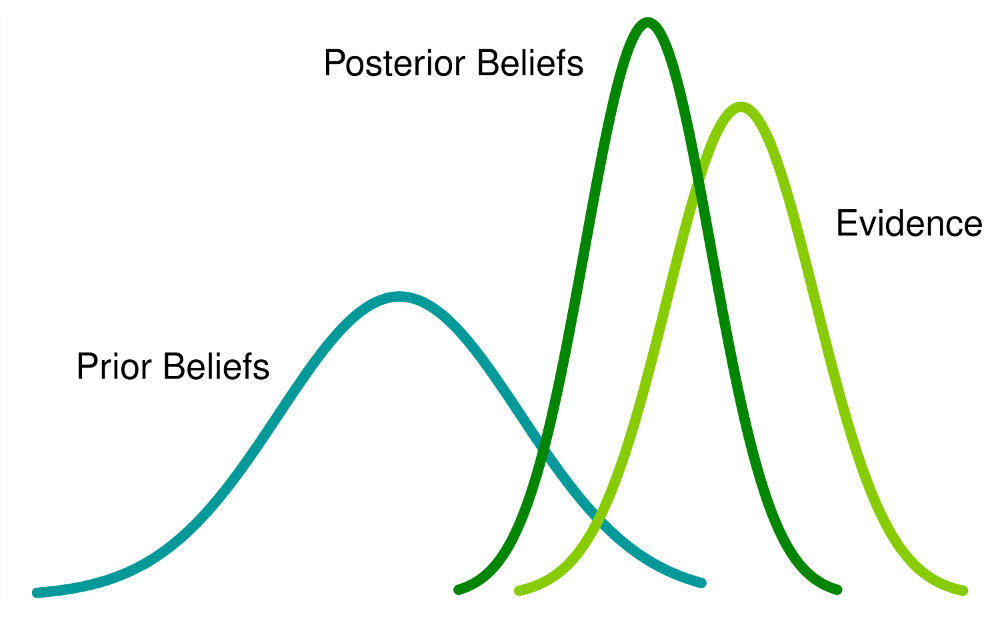

```{r setup, include=FALSE}
knitr::opts_chunk$set(echo = TRUE)
```

class: center, middle

# ¿Qué hemos visto hasta ahora?

Inferencia para estadística clásica: estimadores puntuales, estimadores por intervalo y contrastes de hipótesis, además de bootstrap para cada caso.

# ¿Qué vamos a discutir hoy?

Introducción a la Estadística Bayesiana: filosofía, historia y un poco de cálculo.


---

## Un poco de historia


Para ver figura completa, haga click [aquí](http://www.statslife.org.uk/images/pdf/timeline-of-statistics.pdf).

---

## Un poco de historia

La estimación de parámetros tuvo un camino largo:

* Bayes (1763): lo propuesto por Bayes era complicado y Legendre y Gaus (1804-1809) dijeron: "minimicemos el error al cuadrado" lo cual fue más sencillo pero no era algo general y no se basaba en probabilidad. 

* Fisher (1922-1925) dijo 'maximicemos la verosimilitud'. 

* Savage y De Finetti (1950-1970) consideraron que la probabilidad era algo subjetivo, y lo propusieron a la comunidad científica, pero no fue muy bien recibido. 

* Un tiempo después, Gelfand y Smith (1990) propusieron la forma de encontrar numéricamente distribuciones marginales, y a partir de esto la estadística Bayesiana se convirtió en una herramienta de uso común entre todas las personas que practican la estadística.

---

## Un poco de historia

¿Hubo resistencia? Claro que si. El teorema de Bayes era aceptado como una herramienta general de probabilidad, pero no para modelar datos. En los años 90s se presentaron muchas situaciones en las que los resultados Bayesianos eran desestimados de entrada.


Cita completa, [aquí](https://books.google.co.cr/books?id=T3FQDwAAQBAJ&pg=PA13&lpg=PA13&dq=%22all+fisher+said+about+bayesian+analysis%22&source=bl&ots=vsnwy9Sd4V&sig=ACfU3U0e-jP_R0sc0b_sC2p_pFoWQJ7vRA&hl=en&sa=X&ved=2ahUKEwiW-rLV_LLiAhUGnKwKHbfxBKoQ6AEwAHoECAUQAQ#v=onepage&q=%22all%20fisher%20said%20about%20bayesian%20analysis%22&f=false)

---

## ¿Qué es estadística Bayesiana?

Serie de vídeos recomendados: https://www.youtube.com/watch?v=4WVelCswXo4


* Hasta el momento hemos visto las distintas formas de hacer estadística inferencial desde un punto de vista denominado *frecuentista*. 

* Hay varias maneras en que podemos interpretar la probabilidad. Las probabilidades frecuentistas establecen que la probabilidad de un evento $A$ se define como la cantidad de veces que sucede $A$ de un número infinito de ensayos. Es decir: 
	
$$P(A) = \lim_{n \to +\infty} \frac{n_{A}}{n}$$
	
---

## ¿Qué es estadística Bayesiana?

Por ejemplo, supóngase que se desean contrastar las hipótesis $$H_{0}: \theta = \theta_{0}$$ contra $$H_{1}: \theta \neq \theta_{0}$$ 

a un nivel de significancia de $0.05$. 

* Desde un punto de vista frecuentista si obtenemos una gran cantidad de muestras del mismo tamaño, provenientes de una población en donde $\theta = \theta_{0}$, y obtenemos la cantidad de muestras donde se rechaza $H_{0}$, esta fracción debe ser muy cercana a $0.05$. 

* De igual manera, suponga que obtenemos un intervalo de confianza del $95\%$ para estimar $\theta$. Si obtenemos una gran cantidad de muestras, todas de la misma distribución con el mismo valor de $\theta$, entonces esperamos que la fracción de intervalos de confianza generados a partir de las muestras que incluyan el valor de $\theta$ sea de aproximadamente $0.95$. 

* Todos estos son ejemplos de aplicaciones de probabilidades frecuentistas. 
	
---

## ¿Qué es estadística Bayesiana?

No obstante, sabemos que esta *no es la única interpretación de probabilidad que existe*. Existe otro enfoque de probabilidad que está muy relacionado a la interpretación de incertidumbre; esta es la interpretación subjetiva de la probabilidad. 

Imaginemos que el día se encuentra nublado y alguien pregunta si irá a llover hoy. Uno podría decir que seguro sí llueve hoy, con una probabilidad del $90\%$. En este caso se le esté atribuyendo a la incertidumbre sobre si hoy lloverá una probabilidad como forma de *medir* dicha incertidumbre. Es importante resaltar que este es un evento al cual es imposible calcularle una probabilidad desde el punto de vista frecuentista. 

Para poder hacer esto sería necesario repetir el día de hoy una infinita cantidad de veces y ver en qué fracción de esas veces llovió. Por lo tanto, no todos los eventos tienen probabilidades definidas siempre de manera frecuentista. 
	
---

## ¿Qué es estadística Bayesiana?

La idea de medir la incertidumbre por medio de probabilidades es una muy intuitiva que se ha explorado desde hace mucho tiempo. ¿Cuál será la probabilidad de pasar el curso? ¿Me caeré de la bicicleta al salir hoy de mi casa? ¿Cuál es la probabilidad de que vaya hoy al cine? Estas interrogantes, y muchas más, son muy comunes todos los días y ocasionalmente intentamos contestarlas por medio de probabilidades. 

Un estadístico Bayesiano argumentaría que la manera más natural de medir la incertidumbre es por medio de las probabilidades; y en este caso, esto es solo posible mediante la interpretación subjetiva de la probabilidad. 
	
Al igual que la probabilidad frecuentista, la probabilidad subjetiva se rige por ciertos axiomas probabilísticos. No los trataremos con mucho detalle en este texto ni el curso, pero es importante saber que deben seguir cierta lógica. Por ejemplo, si decimos que la probabilidad de que hoy llueva es de $0.80$ entonces debe cumplirse que la probabilidad de que hoy no llueva sea de $0.20$. Esto es completamente equivalente a las probabilidades frecuentistas. 
	
---

## ¿Qué es estadística Bayesiana?
	
Entonces, ¿cómo podríamos utilizar la probabilidad subjetiva para medir la incertidumbre? Supongamos que nos interesa hacer inferencia estadística sobre un parámetro desconocido $\theta$, el cual digamos que representa la proporción poblacional de desempleados en el país. 

Aunque no sepamos con exactitud el valor exacto de $\theta$ sí vamos a tener alguna idea de por dónde puede estar. Para empezar, sabemos que al ser una proporción entonces tiene que estar entre 0 y 1. También sabemos que no es un valor muy alto, puesto que no vemos que el desempleo sea algo tan común en el país, por lo que podemos fácilmente suponer que valores de $0.5$ en adelante son extremadamente poco probables; inclusive hasta podríamos casi que descartar valores de $0.25$ en adelante. 

También podríamos pensar en descartar como probables valores muy pequeños de $\theta$, como $0.02$ o $0.03$. Por estudios que se han hecho anteriormente tenemos una idea de que este valor debe andar cerca de $0.10$, por lo que podríamos pensar que es más probable encontrar valores cercanos a $0.10$. 
---

## ¿Qué es estadística Bayesiana?

Toda esta información es posible medirla mediante una distribución Beta. Podríamos decir que la incertidumbre alrededor de $\theta$ se distribuye:

$$Beta(\alpha = 10, \beta = 90)$$

denotado como $\theta \sim Beta(10,90)$. Esta distribución está centrada en $0.10$ y tiene una varianza de $8.91\cdot 10^{-4}$, es decir muy poco probable. Podemos apreciar de siguiente figura como este modelo para la incertidumbre alrededor de $\theta$ parece cumplir con el conocimiento que teníamos de dicho parámetro. En estadística Bayesiana este modelo lleva el nombre de la **distribución a priori**.

---

## ¿Qué es estadística Bayesiana?


```{r}
plot(seq(0,1,0.01),dbeta(seq(0,1,0.01),10,90), xlab="Theta",ylab="Beta(10,90)", type="l")
```	

---

## ¿Qué es estadística Bayesiana?

Hasta el momento hemos estado discutiendo sobre el papel que juega la probabilidad subjetiva en el modelaje probabilístico de la incertidumbre sin embargo, no hemos hecho mención del teorema de Bayes o por qué esta rama de la estadística lleva el nombre de "Bayesiana". 

Para el propósito de estadística inferencial el Teorema de Bayes proporciona una guía para poder combinar información subjetiva con evidencia empírica de manera que podamos obtener de vuelta una versión modificada de nuestro conocimiento inicial, llamada la **distribución a priori**. 

---

## ¿Qué es estadística Bayesiana?


Para ver cómo el teorema de Bayes sirve para esto, primero debemos recordar qué es lo que nos dice dicho teorema. Recordemos que el teorema de Bayes establece que para dos eventos $A$ y $B$ se cumple

$$P(A|B) = \frac{P(B|A)P(A)}{P(B)}$$

Con nuestro objetivo inferencial en mente entonces vamos a tener que el evento $A$ representa la incertidumbre sobre $\theta$ mientras que el evento $B$ representa la información empírica brindada por los datos y las probabilidades de estos eventos están representadas por funciones de densidad (o probabilidad en el caso que los datos o el parámetro sea discreto). Por lo tanto, en notación Bayesiana podemos reescribir el Teorema de Bayes de la siguiente forma:

$$\pi(\theta|x) = \frac{\mathcal{L}(\theta|x)\pi(\theta)}{f(x)}$$

---

## ¿Qué es estadística Bayesiana?


donde:

* $\pi(\theta)$ representa la distribución *a priori*.

* $\pi(\theta | x)$ representa la distribución *a posteriori*.

* $\mathcal{L}(\theta)$ representa la función de verosimilitud de la muestra aleatoria.

* $f(x)$ es la función de densidad/probabilidad de los datos, llamada a veces la constante Bayesiana o constante normalizadora.

Podemos ver que por medio del teorema de Bayes estamos combinando nuestro conocimiento inicial $(\pi(\theta))$ y la información empírica de los datos $(\mathcal{L}(\theta|x))$ para obtener una información modificada de nuestras creencias iniciales $(\pi(\theta|x))$.

---

## ¿Qué es estadística Bayesiana?


{width=70%}

---

## ¿Qué es estadística Bayesiana?

Para entender mejor lo que significa esa constante normalizadora es buena idea retomar el Teorema de la Probabilidad Total. Este decía que si tenemos $k$ eventos mutuamente excluyentes $A_1 , A_2 , ... , A_k$ que tienen una intersección no nula con un evento $B$ entonces se cumple

$$P(B) = P(B|A_1)P(A_1) + P(B|A_2)P(A_2) + ... + P(B|A_k)P(A_k)$$

De esta forma podríamos re-escribir el teorema de Bayes de la siguiente forma, para cualquier evento $A_i$, $i = 1, ... , k$

$$P(A_i |B) = \frac{P(B|A_i)P(A_i)}{\sum_{i=1}^{k}P(B|A_i)P(A_i)}$$

---

## ¿Qué es estadística Bayesiana?


Desde el punto de vista Bayesiano, el evento $A_i$ representa un posible valor de $\theta$, asumiendo que $\theta$ sea discreto. Por lo tanto la constante normalizadora sería

$$f(x) = \sum_{i}^{k} \mathcal{L}(\theta_i|x)\pi(\theta_i)$$

En el caso donde $\theta$ sea continua entonces cambiamos la sumatoria por una integral que abarque todo el dominio de $\theta$

$$f(x) = \int_{-\infty}^{+\infty} \mathcal{L}(\theta|x)\pi(\theta) d\theta$$

---

## Ejemplo sencillo


* Vamos a asumir que nuestro parámetro desconocido solo puede tomar ciertos valores para ejemplificar los conceptos básicos que acabamos de ver.

* $\theta$ es el número promedio de mascotas que tienen las personas en un edificio de apartamentos. 

* Supongamos que $\theta$ solo puede tomar tres valores: 2, 2.5 y 3. De antemano vamos a creer que el valor más probable de esos tres es 2 (es decir, lo más probable es que las personas tengan en promedio 2 mascotas) ya que los apartamentos no son muy grandes. 

* Para propósitos del ejemplo diremos que $P(\theta = 2) = 0.50$ mientras que los otros dos tienen probabilidades de $0.25$.

* Podríamos pensar que el número de mascotas por apartamento sigue una distribución Poisson con media $\theta$. Se preguntó en 5 apartamentos escogidos al azar cuántas mascotas tenían y los resultados fueron 1,4,3,2,3. Con base en esta información, actualice la información previa.

---

## Ejemplo sencillo

Para llegar a la distribución de probabilidad a posteriori recordemos lo que nos dice el Teorema de Bayes para cuando el parámetro es discreto:

$$\pi(\theta_i |x) = \frac{\mathcal{L}(\theta_i |x)\pi(\theta_i)}{\sum_{i}^{3} \mathcal{L}(\theta_i|x)\pi(\theta_i)}$$

Nótese que necesitamos varios componentes para poder actualizar la información para cada uno de los tres valores de $\theta$. Ya tenemos la función de probabilidad a priori pero todavía necesitamos la verosimilitud de una muestra aleatoria Poisson con $n = 5$, la cual viene dada por

$$\mathcal{L}(\theta_i|x) = \prod_{j=1}^{5} \frac{\theta_{i}^{x_j} e^{-\theta_i} }{x_{j}!} = \frac{ \theta_{i}^{\sum_{j=1}^{5}x_j} e^{-5\theta_i} }{\prod_{j=1}^{5} x_{j}! }$$

---

## Ejemplo sencillo

Para el caso de la muestra que observamos tenemos que $\sum_{j=1}^{5}x_j = 13$ y $\prod_{j=1}^{5} x_{j}! = 1728$, por lo tanto

$$\mathcal{L}(\theta_i|x) =  \frac{ \theta_{i}^{13} e^{-5\theta_i} }{1728}$$

Ya con esta expresión podemos hacer una tabla donde vamos encontrando cada parte que necesitamos hasta llegar a la distribución a posteriori de $\theta$:

---

## Ejemplo sencillo

|i |$$\theta_i$$|$$\pi(\theta_i)$$|$$\mathcal{L}(\theta_i\shortmid x)$$|$$\mathcal{L}(\theta_i\shortmid x)\pi(\theta_i)$$| $$\pi(\theta_i\shortmid x)$$|
|--|------------|-----------------|------------------------------------|--------------------------------------|--------------------------| 
|1 | 2          | 0.50            | $$2.15 \cdot 10^{-4}$$             | $$10.76\cdot 10^{-5}$$               | 0.416                     |
|2 | 2.5        | 0.25            | $$3.21 \cdot 10^{-4}$$             | $$8.03\cdot 10^{-5}$$                | 0.311                     |
|3 | 3          | 0.25            | $$2.82 \cdot 10^{-4}$$             | $$7.06\cdot 10^{-5}$$                | 0.273                     |


Nótese que para este caso tenemos que $f(x) = \sum_{i}^{3} \mathcal{L}(\theta_i|x)\pi(\theta_i) = 10.76\cdot 10^{-5} + 8.03\cdot 10^{-5} + 7.06\cdot 10^{-5} = 2.58\cdot10^{-4}$. La probabilidad a posteriori se obtuvo dividiendo cada uno de los valores de esa suma entre el total.

---

## Ejemplo sencillo

Relación entre el análisis Bayesiano y el frecuentista:

* Supongamos que queremos estimar el valor de $\theta$ por medio de su estimador de máxima verosimilitud. Viendo la tabla vemos que la mayor verosimilitud sucede para $\theta = 2.5$ por lo que ese sería su estimador máximo verosímil. 

* Sin embargo, si vemos cuál es el valor de $\theta$ más probable, tanto a priori como a posteriori, podemos ver que sería el valor $\theta = 2$.

* ¿Cuál fue el aporte Bayesiano al estudio? Podemos ver que al inicio teníamos una fuerte creencia de que es muy probable que los apartamentos tuvieran en promedio 2 mascotas, sin embargo al introducir los datos y observar que estos decían que era más probable tener en promedio 2.5 mascotas nuestras creencias se modificaron. 

* Ya no consideramos tan probable como antes que el número promedio de mascotas sea de 2 por apartamento e incluso aumentaron las otras dos probabilidades, siendo el mayor aumento para la probabilidad de que $\theta = 2.5$. Parece que los datos nos dieron una evidencia a favor de $\theta = 2.5$, aunque haya sido leve.

---

## Ejemplo sencillo

Un resultado importante de destacar del ejemplo es que pudimos haber conocido cuál valor de $\theta$ hubiera tenido la mayor probabilidad solo a partir del valor de $\mathcal{L}(\theta| x)\pi(\theta)$. Como cada uno de esos valores los dividimos entre la misma constante para obtener $\pi(\theta| x)$ entonces podemos decir que $\pi(\theta| x)$ es proporcional a $\mathcal{L}(\theta| x)\pi(\theta)$, denotado $\pi(\theta| x) \propto \mathcal{L}(\theta| x)\pi(\theta)$. Este es un resultado general para todo análisis Bayesiano que nos será de mucha utilidad en los ejemplos posteriores cuando $\theta$ sea continua.

Otro punto importante es qué hubiera pasado si hubiéramos asignado probabilidades iguales a priori para cada valor de $\theta$. Esto se llama utilizar una *priori no informativa* pues no está influyendo mucho en los valores que pueda tomar $\theta$ es decir, deja que los datos encuentren los valores más probables de $\theta$. En este caso vean que si usamos una priori no informativa entonces tendríamos que $\pi(\theta| x) \propto \mathcal{L}(\theta| x)$ ya que $\pi(\theta)$ es constante para cualquier valor de $\theta$. Es decir, nuestro análisis Bayesiano hubiera llegado a la misma conclusión frecuentista ya que la mayor probabilidad a posteriori es para el valor de $\theta$ que tenga la mayor verosimilitud. Este resultado es general cuando se vaya a utilizar una priori no informativa.

---

## Ejemplo sencillo

Por último hay unos puntos importantes de mencionar del análisis Bayesiano. Entre más informativa sea la priori, más se va a parecer la posteriori a esta. Por otro lado, si tenemos una gran cantidad de datos entonces la posteriori va a ser más similar a lo que aporta la verosimilitud. En otras palabras, ``con muchos datos, estos hablan por si solos'' - resultado análogo a la estadística frecuentista.

---


---

class: center, middle

# ¿Qué discutimos hoy?

Introducción a la Estadística Bayesiana.

# ¿Qué nos falta para terminar el curso?

Estadística Bayesiana: cálculo, previas, inferencia (estimación puntual, intervalos de credibilidad y contrastes de hipótesis).

