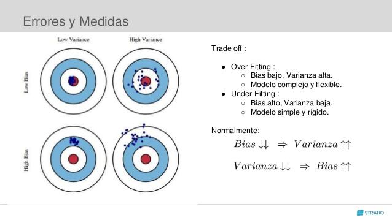

```{r setup, include=FALSE}
options(htmltools.dir.version = FALSE)
```

 


## ¿Qué vamos a discutir hoy?

* Redefinición del Teorema del límite central


* Definición de estimadores, algunos ejemplos.

* Repaso de distribuciones muestrales y definiciones de estadísticos de orden.

* ECM y propiedades de los estimadores (introducción). 

* Práctica en grupos.

---

# Teorema del límite central

Recuerde que:

Si $X_1,\ldots, X_n$ es una muestra aleatoria de tamaño $n$, y la distribución tiene media $\mu$ y varianza $\theta=\sigma^2<\infty$. Entonces se cumple que 

$$Z_{n} = \frac{\overline{X}-\mu}{\frac{\sqrt{\theta}}{\sqrt{n}}} \stackrel{d}{\longrightarrow} N\left(0,1\right) \quad si\quad n \rightarrow \infty$$
o lo que es equivalente 
$$\overline{X} \xrightarrow{\text{d}} N\left(\mu, \frac{\theta}{n}\right) \quad si\quad n \rightarrow \infty.$$

---

# Teorema del límite central

Esta la fórmula del teorema se puede reescribir como, 

$$\sqrt{n}(\overline{X}-\mu) \stackrel{d}{\longrightarrow} N\left(0,\theta \right) \quad si\quad n \rightarrow \infty$$

---
# Teorema del límite central


*Realmente que pasa si $X_1, X_2, ..., X_n$ no son normales, pero $n$ es grande?*

$$\sqrt{n}(\overline{X}-\mu) \stackrel{d}{\longrightarrow} N\left(0, V_{\infty}(\theta)\right)  \quad si\quad n \rightarrow \infty$$
 
 donde  existe una secuencia de funciones de varianza tal que, 
 

$$V_n(\theta)\xrightarrow[n\to \infty]{}V_{\infty}(\theta)<\infty$$
---

# Método Delta 


Si $X_1,X_2,\dots$ es una sucesión de variables aleatorias y con alguna distribución continua. Sea $\theta\in \mathbb R$ y $\{a_n\}$ sucesión de números positivos tal que $a_n \nearrow\infty$.
Suponga que $a_n(\hat{\theta}-\theta) \xrightarrow{d} N(0,\sigma^{2})$. 

Si $g$ es una función tal que $g^{\prime}(\theta)\ne 0$, entonces

$$a_n\left[g(\hat{\theta})-g(\theta)\right] \xrightarrow{d} N\left(0,\sigma^2 \left(g^{\prime}(\theta)\right)^{2}\right)$$

---

# Método Delta 

**Ejemplo**. $X_1,X_2,\dots$ i.i.d. de variables con media $\mu$ y varianza $\sigma^2$. Sea $g$ una función tal que $g'(\mu)\neq 0$. Por el T.L.C, 


$$ \sqrt{n}(\overline{X}_{n} -\mu)\xrightarrow{d}N(0,\sigma^{2})$$


Si $g(\mu) = \dfrac 1\mu$ con $\mu\neq0$, ¿Cuál es su varianza asintótica?

Entonces por el método Delta $\sqrt{n}\left[g(\bar X_n)-g(\mu)\right]\xrightarrow{d}N\left(0,\sigma^2 \left(g^{\prime}(\mu)\right)^{2}\right)$

Para la función $g$ seleccionada se tiene que  $g'(\mu) = -\dfrac{1}{\mu^2}$. Entonces por el método Delta

$$ \sqrt{n}\bigg[\dfrac{1}{\overline{X}_n}-\dfrac 1\mu\bigg]\xrightarrow{d}N\left(0,\dfrac{\sigma ^2}{\mu ^4}\right) $$


La varianza asintótica es $\dfrac{\sigma^2}{\mu ^4}$.
---
# Estabilización de la varianza 

Es posible definir la función $g$ de modo que la varianza no dependa del parámetro desconocido. 

\begin{equation*}
g(\mu)=\int_{a}^{\mu} \frac{d x}{s(x)^{1 / 2}}
\end{equation*}

donde $s(x)$ es toda la expresión de la varianza y $a$ es cualquier valor que haga la integral finita y fácil de calcular. 


---

# Estabilización de la varianza 

*Ejemplo:*

Suponga que $X_1, X_2, ..., X_n$ es una muestra aleatoria Poisson con parámetro $\theta$. Sea $\overline{X}$ la media muestral. 

Sabemos que $\mu = \sigma ^2 =\theta$. 

$$n^{1 / 2}\left(\bar{X}_{n}-\theta\right) \stackrel{d}{\longrightarrow} N(0,\theta)$$

**OJO: el paramétro $\theta$ es desconocido!**

La varianza asintótica es $\theta$. 


---

# Estabilización de la varianza 

Entonces la

\begin{equation*}
g(\theta)=\int_{0}^{\theta} \frac{d x}{x^{1 / 2}}=2 \theta^{1 / 2}
\end{equation*}

Aplicando el método Delta, se tiene que 

$$g'(\theta) = 2\frac{1}{2} \frac{1}{\theta ^{1 / 2}} = \frac{1}{\theta ^{1 / 2}} $$

Por lo que obtenemos 

\begin{align*}
n^{1 / 2}\left(g(\bar{X}_{n})-g(\theta)\right)  
&\stackrel{d}{\longrightarrow} N\left(0,\theta \left(\frac{1}{\theta ^{1 / 2}} \right)^{2} \right) \\  
n^{1 / 2}\left(2(\bar{X}_{n})^{1/2}-2(\theta)^{1/2}\right)  
&\stackrel{d}{\longrightarrow} N(0,1) 
\end{align*}


**Después de la transformación, la distribución asintótica (normal) no depende del paramétro.**
---
<!-- ## Algunos conceptos básicos previos -->
	
<!-- a. Muestra Aleatoria -->

<!-- Sean $X_{1}, X_{2}, ... , X_{n}$ un conjunto de variables aleatorias (v.a.) independientes e idénticamente distribuidas; este conjunto se denomina muestra aleatoria de Luna población infinita. -->

<!-- b. Estadísticos -->

<!-- Es una función de la muestra aleatoria, $T=f\left(X_{1}, X_{2}, ... , X_{n}\right)$. -->

<!-- NOTA: Un estadístico es a su vez una variable aleatoria y como tal tiene su propia distribución, denominada distribución muestral, con sus parámetros correspondientes.  -->

<!-- c. Estimadores -->

<!-- Cuando un estadístico, llámese $\hat{\theta}$ (theta sombrero), se utiliza para aproximar el valor de un parámetro $\theta$ entonces se acostumbra llamar a ese estadístico con el nombre de estimador. -->


<!-- --- -->

<!-- ## Estimadores puntuales -->

<!-- Cuando un estadístico, llámese $\hat{\theta}$, se utiliza para aproximar el valor de un parámetro $\theta$ entonces se acostumbra llamar a ese estadístico con el nombre de *estimador*. Existen dos tipos: estimadores puntuales y estimadores de intervalo. Los segundos los dejaremos para el tema II. -->

<!-- Ejemplos de estimadores puntuales: -->

<!-- 1. $\bar{X}$ es estimador de $\mu$ -->

<!-- 2. $S^2$ es estimador de $\sigma^2$ -->

<!-- 3. $\hat{p}$ es estimador de $p$ -->

<!-- 4. $\hat{\theta} = \frac{X_{1}+X_{n}}{2}$ es estimador de $\mu$ -->


<!-- --- -->

## Estimadores


Se pueden tener varios estimadores para un mismo parámetro, entonces la pregunta es, ¿cómo encontramos el mejor estimador?

Este buen estimador debe cumplir las siguientes propiedades:

1. Insesgamiento

2. Eficiencia

3. Consistencia

4. Suficiencia

Antes de entrar en este tema, recordemos 5 teoremas que explican las distribuciones muestrales de las medias y las variancias en poblaciones normales, además de las definiciones de estadísticos de orden.

---

## Distribuciones de medias y variancias muestrales en poblaciones normales

> **Teorema 1.1.** Si $\bar{X}_n$ es la media muestral de una muestra aleatoria de tamaño $n$ de una distribución normal de media $\mu$ y variancia $\sigma^2$, entonces $\bar{X}_n$ tiene una distribución normal con media $\mu$ y variancia $\sigma^2/n$, es decir, $\bar{X}_n \thicksim N(\mu,\sigma^2/n)$

Aplicación más común: valores de la tabla z (normal estándar).

### Ejemplo: 

Si $X$ es una variable aleatoria con distribución normal con media 15 y variancia 16. Se toman muestras aleatorias de tamaño 9. Calcular $P(12 < \bar{X}_n < 17)$.

$$ P(12 < \bar{X}_n < 17) = P\left(\frac{ 12-15 }{ 4/3 }<Z<\frac{ 17-15 }{ 4/3 }\right)$$
    $$ \ \ \ \ \ \ \ \ \ \ \ \ \ \ \ \ \ \ \ \ \ \ \ \ \ \ \ \ \ \ \ \ \ = P(-2.25 < Z <1.5) = 0.9210$$


---

## Repaso


> **Teorema 1.2.** Si $X_1, X_2, ..., X_n$ es una muestra aleatoria con distribución normal con media $\mu$ y variancia $\sigma^2$, entonces:

> $a$. $\bar{X}$ y $S^2$ son estocásticamente independientes.

> $b$. La variable $U = \frac{(n-1)S^2}{\sigma^2}$ tiene distribución $\chi^2$ con $n-1$ grados de libertad.

> $c$. La densidad de $S^2$ es la densidad gamma.

La prueba de este teorema está fuera de los contenidos de este curso.

**Nota:** 
Se puede usar para probar que $Var(S^2) = \frac{2\sigma^4}{n-1}$ cuando asumimos que $X_1, X_2, ..., X_n$ es una muestra aleatoria con distribución normal con media $\mu$ y variancia $\sigma^2$.

---

## Repaso
$$\begin{eqnarray*}Var \left ( \frac{(n-1)S^2}{\sigma^2} \right )&=& 2(n-1)\\ \frac{(n-1)^2}{\sigma^4} \cdot Var(S^2)  &=& 2(n-1) \\ Var(S^2) &=& \frac{2\sigma^4(n-1)}{(n-1)^2} \\ Var(S^2) &=& \frac{2\sigma^4}{n-1}\end{eqnarray*}$$

---

# Repaso

> **Teorema 1.3.** Si $X_1, X_2, ..., X_n$ es una muestra aleatoria con distribución normal con media $\mu$ y variancia $\sigma^2$, entonces la variable aleatoria: $t = \frac{ (\bar{ X }-\mu) } { S/\sqrt{ n } }$ se distribuye como una $t$ de Student con $n-1$ grados de libertad.

**Prueba**: 

Por el TLC sabemos que $\frac{\bar{X}-\mu}{\sigma/\sqrt{n}}$ se distribuye como una $N(0,1)$. Por teorema 1.2 sabemos que $U = \frac{(n-1)S^2}{\sigma^2}\sim \chi^2_{n-1}$. Del mismo teorema, sabemos que $\bar{X}$ y $S^2$ son independientes, y por los teorema (vistos en la clase de contínuos), sabemos que la definición de una variable $t$ de Student es $Y = \frac{N(0,1)}{\sqrt{\chi^2/k}}$. Por todo lo anterior:

$$
\frac{ \frac{ \bar{X}-\mu } { \sigma/\sqrt{ n } } } { \sqrt{ \frac{ (n-1)S^2 } { \sigma^2 }/(n-1) } }=\frac{ \bar{ X }-\mu } { S/\sqrt{ n } }
$$

es una $t$ de Student con $n-1$ grados de libertad.

---

# Repaso


> **Teorema 1.4.** Si $X_1, X_2, ..., X_m$ es una muestra aleatoria con distribución normal con media $\mu_X$ y variancia $\sigma^2_X$. Sea $Y_1, Y_2, ..., Y_n$ es una muestra aleatoria con distribución normal con media $\mu_Y$ y variancia $\sigma^2_Y$. Si ambas poblaciones son independientes entonces: $\frac{S^2_X/\sigma^2_X}{S^2_Y/\sigma^2_Y}$ tiene una distribución $F_{m-1, n-1}$.

**Prueba:** 

Por teorema sabemos que $U = \frac{(n-1)S^2}{\sigma^2}$ tiene distribución $\chi^2$ con $n-1$ grados de libertad. Usando la definición de la distribución F podemos reescribir la división como la división de dos variables distribuidas como $\chi^2$ con distintos grados de libertad:

$$ \frac{ \frac{ (m-1)S^2_X } { \sigma^2_X } /(m-1)} { \frac{ (n-1)S^2_Y } { \sigma^2_Y }/(n-1) } =  \frac{ S^2_X/\sigma^2_X } { S^2_Y/\sigma^2_Y }
$$

---

# Repaso


> **Teorema 1.5.** Si $X_1, X_2, ..., X_n$ es una muestra aleatoria con distribución normal con media $\mu_X$ y variancia $\sigma^2$. Sea $Y_1, Y_2, ..., Y_m$ es una muestra aleatoria con distribución normal con media $\mu_Y$ y variancia $\sigma^2$. Si ambas poblaciones son independientes entonces:

$$ \frac{ (\bar{ X }-\bar{ Y })-(\mu_X-\mu_Y) } { S_p \sqrt{ \frac{1}{n}+\frac{1}{m} } }$$

se distribuye como una $t$ de Student con $n+m-2$ grados de libertad, donde

$$ S_p = \sqrt{ \frac{ (n-1)S^2_X+(m-1)S^2_Y } { n+m-2 } }.$$
---

# Repaso

**Prueba:** 

Se sabe que $\frac{(\bar{X}-\bar{Y})-(\mu_X-\mu_Y)}{\sigma \sqrt{\frac{1}{n}+\frac{1}{m}}} \sim N(0,1)$. Como $\bar{X} \sim N(\mu_X,\sigma^2/n)$ y $\bar{Y} \sim N(\mu_Y,\sigma^2/m)$ y por lo tanto, $(\bar{X}-\bar{Y}) \sim N(\mu_X-\mu_Y,\sigma^2/n+\sigma^2/m)$. 

Además, $\frac{(n-1)S^2_X}{\sigma^2}+\frac{(m-1)S^2_Y}{\sigma^2}$ es una $\chi^2_{(n+m-2)}$ por teorema. 

Por definición de una variable $t$ de student, el cociente entre la $N(0,1)$ de la parte a) y la raíz cuadrada de la parte b), del teorema 1.2, dividida entre sus grados de libertad, es una $t$ de student con $n+m-2$ grados de libertad. Se se calcula el cociente y se simplifica, se obtiene la variable aleatoria del Teorema.

---
# Repaso
$$\begin{eqnarray*} \frac{\frac{(\bar{X}-\bar{Y})-(\mu_X-\mu_Y)}{\sigma\sqrt{\frac{1}{n}+\frac{1}{m}}}}{\sqrt{\frac{\frac{(n-1)S^2_X+(m-1)S^2_Y}{\sigma^2}}{n+m-2}}} &=& \frac{\frac{(\bar{X}-\bar{Y})-(\mu_X-\mu_Y)}{\sigma\sqrt{\frac{1}{n}+\frac{1}{m}}}}{\frac{1}{\sigma}\sqrt{\frac{(n-1)S^2_X+(m-1)S^2_Y}{n+m-2}}}\\ &=& \frac{(\bar{X}-\bar{Y})-(\mu_X-\mu_Y)}{\sqrt{\frac{(n-1)S^2_X+(m-1)S^2_Y}{n+m-2}}\cdot\sqrt{\frac{1}{n}+\frac{1}{m}}} \\  \\ &=& \frac{(\bar{X}-\bar{Y})-(\mu_X-\mu_Y)}{S_p\sqrt{\frac{1}{n}+\frac{1}{m}}} \end{eqnarray*}$$


---

# Repaso

## Estadísticos de orden:

* Supongamos que se tiene una muestra aleatoria de tamaño $n$ de una población infinita que tiene una función de densidad $f(x)$ y función de distribución $F(x)$. 

* Si los valores de estas variables aleatorias se ordenan de manera que al valor más bajo de las $x$ se le asigna la variable $X_{(1)}$, al siguiente valor de $x$ se le asigna la variable $X_{(2)}$ y de esta forma se continúa hasta que al mayor valor de $x$ se le asigna la variable $X_{(n)}$, esto genera un ordenamiento de la muestra aleatoria $X_1, X_2, ..., X_n$ de manera que $X_{(1)} < X_{(2)} < ... < X_{(n)}$. 

* Estas variables denotan los denominados estadísticos de orden.  De este análisis surge la siguiente pregunta: ¿Cuál es la distribución del estadístico $X_{(1)}$?

---

# Repaso

## Distribución del mínimo $X_{(1)}$

> Sean las variables aleatorias $X_{1},X_{2},...,X_{n}$ independientes e idénticamente distribuidas con función de distribución $F_X(x)$ y función de densidad $f_X(x)$. Sea también la variable $X_{(1)}$ definida por: $X_{(1)}=\min(X_{1},X_{2},...,X_{n})$, Entonces, la función de distribución del mínimo de la muestra está dada por: $F_{X_{(1)}}(x)=1-[1-F_X(x)]^{n}$, y su función de densidad: $f_{X_{(1)}}(x)=n[1-F_X(x)]^{n-1}f_X(x)$

---

# Repaso

## Distribución del mínimo $X_{(1)}$
$F_{X_{(1)}}(x) = P(X_{(1)}\leq x)$ 

$\ \ \ \ \ \ \ \ =P(\min(X_{1},...,X_{n})\leq x)$ 

$\ \ \ \ \ \ \ \ =1-P(\min(X_{1},...,X_{n})>x)$ (Complemento)  

$\ \ \ \ \ \ \ \ =1-P(X_{1}>x,X_{2}>x,...,X_{n}>x)$  

$\ \ \ \ \ \ \ \ =1-P(X_{1}>x)\cdot P(X_{2}>x) \cdots  P(X_{n}>x)$ (Independencia) 

$\ \ \ \ \ \ \ \ =1-[P(X_{1}>x)]^{n}$ (Distribución idéntica)  

$\ \ \ \ \ \ \ \ =1-[1-F_X(x)]^{n}$ 

Del mismo modo, la función de densidad de $X_{(1)}$ sería:

$f_{X_{(1)}}(x)=F_{X_{(1)}}(x)'=(1-[1-F_X(x)]^{n})'= n[1-F_X(x)]^{n-1}f_X(x)$

---

# Repaso

## Distribución del máximo $X_{(n)}$

> Sean las variables aleatorias $X_{1},X_{2},...,X_{n}$ independientes e idénticamente distribuidas con función de distribución $F_X(x)$ y función de densidad $f_X(x)$. Sea también la variable $X_{(n)}$ definida por: $X_{(n)}=\max(X_{1},X_{2},...,X_{n})$, Entonces, la función de distribución del máximo de la muestra está dada por: $F_{X_{(n)}}(x)=[F_X(x)]^{n}$, y su función de densidad: $f_{X_{(n)}}(x)=n[F_X(x)]^{n-1}f_X(x)$
---

# Repaso

## Distribución del máximo $X_{(n)}$
$F_{X_{(n)}}(x) = P(X_{(n)}\leq x)$ 

$\ \ \ \ \ \ \ \ =P(\max(X_{1},...,X_{n})\leq x)$ 

$\ \ \ \ \ \ \ \ =P(X_{1}\leq x,X_{2}\leq x,...,X_{n}\leq x)$  

$\ \ \ \ \ \ \ \ =P(X_{1}\leq x)\cdot P(X_{2}\leq x) \cdots  P(X_{n}\leq x)$ (Independencia) 

$\ \ \ \ \ \ \ \ =[P(X_{1}\leq x)]^{n}$ (Distribución idéntica)  

$\ \ \ \ \ \ \ \ =[F_{X}(x)]^{n}$ 

Del mismo modo, la función de densidad de $X_{(n)}$ sería:

$f_{X_{(n)}}(x)=F_{X_{(n)}}(x)'=([F_X(x)]^{n})'= n[F_X(x)]^{n-1}f_X(x)$


---

# Repaso


> **Teorema 1.6.** Sea $X_1, X_2, ..., X_n$ una muestra aleatoria de una población infinita con función de densidad $f_X(x)$ y función de distribución $F_X(x)$.  Si $X_{(k)}$ representa el $k$-ésimo estadístico de orden, entonces la función de densidad viene dada por:

$$f_{X_{(k)}}(x)= \frac{ n! } { (k-1)!(n-k)! }[F_X(x)]^{ k-1 }[1-F_X(x)]^{ n-k }f_X(x)$$

**Nota:** 

En particular se tiene que $X_{(1)} = \min\{X_1, X_2, ..., X_n\}$ y $X_{(n)} = \max\{X_1, X_2, ..., X_n\}$. Además si $n = 2m + 1$, la mediana de la muestra corresponde al estadístico de orden $X_{(m+1)}$.  Si $n=2m$, la mediana es $\frac{1}{2}(X_{m}+X_{m+1})$.


> **Teorema 1.7.** Para $n$ grande, la distribución de muestreo de la mediana para muestras aleatorias de tamaño $2n + 1$ es aproximadamente normal con media $\mu$ (mediana poblacional) y variancia $\frac{1}{8n[f(\mu)]^2}$.

---

## Insesgados + Eficientes + Consistente + Suficientes




Figura 1. Sesgo y Variancia. Fuente: https://www.slideshare.net/Stratio/lunchlearn-combinacin-de-modelos

---

### Ejercicios
1. Suponga que $X_1, X_2, ..., X_n$ es una muestra aleatoria exponencial con paramétro $\theta$. Se sabe que la esperanza es $1/\theta$ y varianza $1/\theta ^2$. Encuentre una función $g(\theta)$ de modo que la convergencia en distribución de $\overline{X}$ no depende de $\theta$. 
2. Se desea estimar la media $\mu$ de una variable aleatoria $X$. Para ello se toman $10$ datos y se calcula su media muestral $\bar{X}$ y la varianza de dichos datos $\sigma^2_X$. Comente si son verdaderas o falsas las siguientes afirmaciones:

    a) Por el teorema central del límite sabemos que $\mu$ será una variable aleatoria normal.
      
    b) La media muestral con un conjunto de datos es un número y no una variable aleatoria.
      
    c) La media muestral $\bar{X}$ tiene siempre una distribución muestral normal.
      
    d) Para disminuir la varianza de $\bar{X}$ a la mitad habría que tomar al menos 100 datos.
      
    e) Como la media muestral es un estimador insesgado, tenemos asegurado que $\bar{X} = \mu$


<!-- # ¿Qué vimos hoy? -->

<!-- Definición de estimadores, algunos ejemplos. -->

<!-- Repaso de distribuciones muestrales y definiciones de estadísticos de orden. -->

<!-- ECM y propiedades de los estimadores (introducción). -->

<!-- # La próxima semana: definiciones y ejemplos. -->