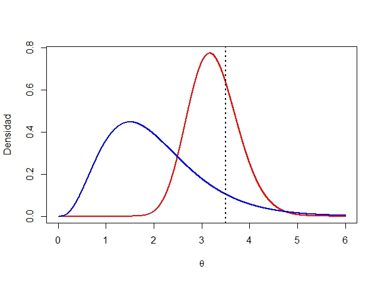

```{r setup, include=FALSE}
knitr::opts_chunk$set(echo = TRUE, tidy = "styler" )
```
class: center, middle

# ¿Qué hemos visto hasta ahora?

Introducción a la Estadística Bayesiana: filosofía, historia y un poco de cálculo.

# ¿Qué vamos a discutir hoy?

Distribuciones previas

---

## Aclaración de parametrización

Para facilitar algunos cálculos en este tema estaremos usando una parametrización alterna de la Gamma (y por ende de la ji-cuadrado y la Exponencial). Anteriormente si teníamos una $Gamma(\alpha,\beta)$ su función de densidad venía dada por 
	
$$f_{X}(x) = \frac{x^{\alpha - 1} e^{-\frac{x}{\beta}}  }{\beta^{\alpha} \Gamma(\alpha) } \quad si \quad x > 0$$
	
Con la nueva parametrización que vamos a estar utilizando, la función de densidad vendría dada de la siguiente manera

$$f_{X}(x) = \frac{ \beta^{\alpha} x^{\alpha - 1} e^{-\beta x}  }{ \Gamma(\alpha) } \quad si \quad x > 0$$
	
Noten que la única diferencia es que el $\beta$ de la nueva parametrización, llamémoslo $\beta^{\prime}$ por un momento, es el inverso multiplicativo del beta de la parametrización vieja. Es decir, $\beta^{\prime} = \frac{1}{\beta}$. Por lo tanto, para la nueva parametrización de la Gamma tenemos que $E(X) = \frac{\alpha}{\beta}$ y $Var(X) = \frac{\alpha}{\beta^2}$.
			
			
---

## Densidades previas conjugadas y estimadores de Bayes
    
### Distribución previa (distribución a priori)

Suponga que tenemos un modelo estadístico con parámetro $\theta$. Su $\theta$ es aleatorio entonces su densidad (antes de observar cualquier muestra) se llama **densidad previa**: $\pi$.

**Ejemplo**: $X_1,\dots, X_n \sim \text{Exp}(\theta)$ y $\theta$ es aleatorio tal que $\theta \sim \Gamma(\stackrel{\alpha}{1},\stackrel{\beta}{2})$ entonces

$$ \pi(\theta) = \dfrac{1}{\Gamma(\alpha)}\beta^\alpha\theta^{\alpha-1}e^{\beta\theta} = 2e^{-2\theta}, \quad \theta > 0$$

---

**Ejemplo**: Sea $\theta$ la probabilidad de obtener cara al tirar una moneda.

En este caso antes de modelar exactamente el $\theta$, lo importante es modelar el tipo de moneda. Es decir, supongamos que tenemos dos opciones

- *Moneda justa:* $\theta = \dfrac{1}{2}$ con probabilidad previa $0.8$ $(\pi(\frac{1}{2}) = 0.8)$.

- *Moneda con solo una cara:* $\theta = 1$  con probabilidad previa $0.2$ $(\pi(1) = 0.2)$.

En este ejemplo si tuviéramos 100 monedas con probabilidad previa $\pi$ entonces 20 tendrían solo una cara y 80 serían monedas normales. 

---

**Notas**:

- $\pi$ está definida en $\Omega$ (espacio paramétrico).

- $\pi$ es definida antes de obtener la muestra.

**Ejemplo** (Componentes eléctricos) Supoga que se quiere conocer el tiempo de
vida de cierto componente eléctrico. Sabemos que este tiempo se puede modelar
con una distribución exponencial con parámetro $\theta$ desconocido.
Este parámetro asumimos que tiene una distribución previa Gamma.

Un experto en componentes eléctricos conoce mucho de su área y sabe
que el parámetro $\theta$ tiene las siguientes características: 

$$
\mathbb{E}[\theta] = 0.0002, \quad \sqrt{\text{Var}(\theta)} = 0.0001.
$$

Como sabemos que la previa  $\pi$ es Gamma, podemos deducir lo siguiente:

$$
 \mathbb{E}[\theta] = \dfrac{\alpha}{\beta}, \text{Var}(\theta) = \dfrac{\alpha}{\beta^2}
$$

$$\implies \begin{cases}\dfrac{\alpha}{\beta} = 2\times 10^{-4}\\\sqrt{\dfrac{\alpha}{\beta^2}} = 1 \times 10^{-4}\end{cases} \implies \beta = 20000, \alpha = 4$$

---

**Notación**:

- $X = (X_1,\dots, X_n)$: vector que contiene la muestra aleatoria.

- Densidad conjunta de $X$: $f_\theta(x)$.

- Densidad de $X$ condicional en $\theta$: $f_n(x|\theta)$.

**Supuesto**: $X$ viene de una muestra aleatoria  si y solo si $X$ es condicionalmente independiente dado $\theta$.

**Consecuencia**: $$f_n(X|\theta) = f(X_1|\theta)\cdot f(X_2|\theta)\cdots f(X_n|\theta)$$

**Ejemplo**

Si $X = (X_1,\dots, X_n)$ es una muestra tal que $X_i\sim \text{Exp}(\theta)$,

\begin{align*}
f_n(X|\theta) &= \begin{cases}\prod_{i=1}^n \theta e^{-\theta X_i} & \text{si } X_i>0\\
0 & \text{si no}
\end{cases}  \\
&= \begin{cases}\theta^n e^{-\theta\sum_{i=1}^n X_i} & X_i > 0  \\ 0 & \text{si no}\end{cases}
\end{align*}

---
## Densidad posterior

**Definición**. Considere un modelo estadístico con parámetro $\theta$ y muestra
aleatoria $X_1,\dots, X_n$. La densidad condicional de $\theta$ dado
$X_1,\dots,X_n$ se llama *densidad posterior*: $\pi(\theta|X)$


**Teorema**. Bajo las condiciones anteriores: 

$$
\pi(\theta|X) =
\dfrac{f(X_1|\theta)\cdots f(X_n|\theta)\pi(\theta)}{g_n(X)} 
$$

para $\theta \in \Omega$, donde $g_n$ es una constante de
normalización.

*Prueba*:

\begin{align*}
\pi(\theta|X) & = \dfrac{\pi(\theta,X)}{\text{marginal de X}} = \dfrac{\pi(\theta,X)}{\int \pi(\theta,X)\;d\theta}= \dfrac{P(X|\theta)\cdot \pi(\theta)}{\int \pi(\theta,X)\;d\theta}\\
& \dfrac{f_n(X|\theta)\cdot \pi(\theta)}{g_n(X)} = \dfrac{f(X_1|\theta)\cdots f(X_n|\theta)\pi(\theta)}{g_n(X)}
\end{align*}

Del ejemplo anterior, 

$$f_n(X|\theta) = \theta^n e^{-\theta y}, y = \sum{X_i} \text{ (estadístico})$$

---

- Numerador:

$$f_n(X|\theta)\pi(\theta) = \underbrace{\theta^n e^{-\theta y}}_{f_n(X|\theta)} \cdot \underbrace{\dfrac{200000^4}{3!}\theta^3e^{-20000\cdot\theta}}_{\pi(\theta)} = \dfrac{20000^4}{3!}\theta^{n+3}e^{(20000+y)\theta}$$

- Denominador:

$$g_n(x) = \int_{0}^{+\infty}\theta^{n+3}e^{-(20000+y)\theta}\;d\theta = \dfrac{\Gamma(n+4)}{(20000+y)^{n+4}}$$

Entonces la posterior corresponde a
$$\pi(\theta|X) = \dfrac{\theta^{n+3}e^{-(20000+y)\theta}}{\Gamma(n+4)} (20000+y)^{n+4}$$
que es una $\Gamma(n+4,20000+y)$.

Con 5 observaciones (horas): 2911, 3403, 3237, 3509, 3118.
$$y = \sum_{i=1}^{5}X_i = 16178, \quad n= 5$$
por lo que $\theta|X \sim \Gamma(9,36178)$


---


```{r 02-distribuciones-previas-posteriores-1, echo=F, warning=FALSE, out.width="60%"}
library(ggplot2)
library(tidyr)
rango <- seq(0,1e6,by = 6)
previa <- dgamma(rango, shape = 4, scale = 20000)
posterior <- dgamma(rango,shape = 9,scale = 36178)
densidades <- data.frame(rango = rango, Previa = previa, Posterior = posterior) 
densidades <- gather(densidades, key = "Densidad", value = "valor", -rango)
ggplot(data=densidades, aes(x=rango, y=valor*100, color = Densidad)) + 
  geom_line() + xlab("") + theme_minimal()+ theme(axis.title.y=element_blank(),
                                                  axis.text.y=element_blank(),
                                                  axis.ticks.y=element_blank())
```

Es sensible al tamaño de la muestra (una muestra grande implica un efecto de la previa menor).

**Hiperparámetros**: parámetros de la previa o posterior.

---
## Proceso de modelación de parámetros. 

De ahora en adelante vamos a entender un modelo como el conjunto de los datos $X_1, \ldots, X_n,$ la función de densidad $f$ y el parámetro de la densidad
$\theta$. Estos dos últimos resumen el comportamiento de los datos.

Ahora para identificar este modelo se hace por partes,

1. La información previa $\pi(\theta)$ es la información extra o basado en la
   experiencia que tengo del modelo. 
2. Los datos es la información observada. La función de densidad $f$ filtra y
   mejora la información de la previa. 
3. La densidad posterior es la "mezcla" entre la información y los datos
   observados. Es una versión más informada de la distribución del parámetro. 

---
## Función de verosimilitud

Bajo el modelo estadístico anterior a $f_n(X|\theta)$ se le llama **verosimilitud** o **función de verosimilitud**.

**Observación**. En el caso de una función de verosimilitud, el argumento es $\theta$.

**Ejemplo**.

Sea $\theta$ la proporción de aparatos defectuosos, con $\theta \in [0,1]$

$$X_i = \begin{cases}0 & \text{falló} \\ 1 & \text{no falló} \end{cases}$$

$\{X_i\}_{i=1}^n$ es una muestra aleatoria y $X_i \sim Ber(\theta)$.

- **Verosimilitud**

$$f_n(X|\theta) = \prod_{i=1}^n f(X_i|\theta) = \begin{cases}\theta^{\sum X_i}(1-\theta)^{n-\sum X_i} & X_i = 0,1~ \forall i \\ 0 & \text{si no}\end{cases}$$
---

- **Previa**:
$$\pi(\theta) = 1_{\{0\leq\theta\leq 1\}}$$

- **Posterior**:

Por el teorema de Bayes,
\begin{align*}
\pi(\theta|X) \propto \theta^y (1-\theta)^{n-y}\cdot 1  \\
&= \theta^{\overbrace{y+1}^{\alpha}-1}(1-\theta)^{\overbrace{n-y+1}^{\beta}-1}
&\implies \theta|X \sim \text{Beta}(y+1,n-y+1)
\end{align*}

- **Predicción**. 

*Supuesto*: los datos son secuenciales. Calculamos la distribución posterior
secuencialmente:

\begin{align}
\pi(\theta|X_1) & \propto \pi(\theta) f(X_1|\theta)\\
\pi(\theta|X_1,X_2) &\propto \pi(\theta) f(X_1,X_2|\theta) \\
&= \pi(\theta) f(X_1|\theta) f(X_2|\theta) \text{ (por independencia condicional)}
\\ & = \pi(\theta|X_1)f(X_2|\theta)\\
\vdots &  \\
\pi(\theta|X_1,\dots,X_n) & \propto f(X_n|\theta)\pi(\theta|X_1,\dots, X_{n-1})
\end{align}

Bajo independencia condicional no hay diferencia en la posterior si los datos son secuenciales.


---
Luego,

$$\begin{align} g_n(X) & = \int_{\Omega} f(X_n|\theta) \pi(\theta|X_1,\dots, X_{n-1})~d\theta \\ & = P(X_n|X_1,\dots,X_{n-1}) \text{ (Predicción para }X_n) \end{align}$$
**Ejemplo**.

Continuando con el ejemplo de los artefactos, $P(X_6>3000|X_1,X_2,X_3,X_4,X_5)$.
Se necesita calcular $f(X_6|X)$. Dado que 
$$\pi(\theta|X) = 2.6\times 10^{36}\theta^8 e^{-36178\theta}$$

se tiene 

$$f(X_6|X) = 2.6 \times 10^{36} \int_{0}^\infty \underbrace{\theta e^{-\theta X_6}}_{\text{Densidad de } X_6} \theta^8 e^{-36178\theta}~d\theta= \dfrac{9.55 \times 10^{41}}{(X_6+36178)^{10}}$$ 

Entonces, 

$$P(X_6>3000)=\int_{3000}^{\infty} \dfrac{9.55\times10^{41}}{(X_6+36178)^{10}}\; dX_6 =
0.4882$$


---

```{r}
func<-function(x){9.55*10^41/(x+36178)^10}
integrate(func,lower=3000,upper=Inf)
```

La vida mediana se calcula como $\dfrac{1}{2} = P(X_6>u|X)$.


La vida media se calcula como $E(X_6|X) = \int_{0}^{\infty} x_6 f(x_6|X) dx_6$.


```{r}
func<-function(x){x*9.55*10^41/(x+36178)^10}
integrate(func,lower=0,upper=Inf)
```


---
## Retomando el ejemplo de la clase anterior

|i |$$\theta_i$$|$$\pi(\theta_i)$$|$$\mathcal{L}(\theta_i\shortmid x)$$|$$\mathcal{L}(\theta_i\shortmid x)\pi(\theta_i)$$| $$\pi(\theta_i\shortmid x)$$|
|--|------------|-----------------|------------------------------------|--------------------------------------|--------------------------| 
|1 | 2          | 0.50            | $$2.15 \cdot 10^{-4}$$             | $$10.76\cdot 10^{-5}$$               | 0.416                     |
|2 | 2.5        | 0.25            | $$3.21 \cdot 10^{-4}$$             | $$8.03\cdot 10^{-5}$$                | 0.311                     |
|3 | 3          | 0.25            | $$2.82 \cdot 10^{-4}$$             | $$7.06\cdot 10^{-5}$$                | 0.273                     |

* ¿Cuál fue el aporte Bayesiano al estudio? 

* ¿Qué hubiera pasado si hubiéramos asignado probabilidades iguales a previa para cada valor de $\theta$? Esto se llama utilizar una *previa no informativa* pues no está influyendo mucho en los valores que pueda tomar $\theta$.

---
## Distribuciones previas

* Supongamos ahora que $\theta$ ya no toma solo ciertos valores, sino que puede tomar cualquier valor mayor a cero. Ya no vamos a poder usar una distribución de probabilidad como previa sino que más bien necesitamos una función de densidad. Podríamos usar una previa no informativa, de manera que $\theta \sim Unif(0,B)$ donde $B$ va a representar un valor arbitrario muy grande. 

* Ahora vamos a suponer que tenemos una muestra aleatoria $X_1 , X_2 , ... , X_n$ tal que $X_j \sim Poisson(\theta)$, por lo que se cumple que $\mathcal{L}(\theta|x) = \frac{ \theta^{\sum_{j=1}^{n}x_j} e^{-n\theta} }{\prod_{j=1}^{n} x_{j}! }$. Para llegar a cuál sería la función de densidad a posteriori podemos utilizar el Teorema de Bayes:
	
$$\pi(\theta |x) = \frac{\mathcal{L}(\theta |x)\pi(\theta)}{\int_{0}^{+\infty} \mathcal{L}(\theta|x)\pi(\theta)}$$

---

## Distribuciones previas


Y dada la distribución a previa que escogimos entonces tenemos lo siguiente:
	
$$\mathcal{L}(\theta |x)\pi(\theta) = \frac{ \theta^{\sum_{j=1}^{n}x_j} e^{-n\theta} }{\prod_{j=1}^{n} x_{j}!} \cdot \frac{1}{B}$$
	
Este es el numerador de la expresión del Teorema de Bayes, pero por lo expresado anteriormente, para encontrar la posteriori, sabemos que $\pi(\theta| x) \propto \mathcal{L}(\theta| x)\pi(\theta)$. 

Esto quiere decir que debemos encontrar el núcleo (o la parte variable) de esta expresión e identificar a qué función de densidad conocida pertenece. Por lo tanto,
	
$$\pi(\theta| x) \propto \mathcal{L}(\theta |x)\pi(\theta)$$

$$\Rightarrow \pi(\theta| x) \propto \frac{ \theta^{\sum x_j} e^{-n\theta} }{\prod x_{j}! } \cdot \frac{1}{B} \propto \theta^{n\bar{x}} e^{-n\theta}$$
	

---

## Distribuciones previas

$$\Rightarrow \pi(\theta| x) \propto \frac{ \theta^{\sum x_j} e^{-n\theta} }{\prod x_{j}! } \cdot \frac{1}{B} \propto \theta^{n\bar{x}} e^{-n\theta}$$

Este es el núcleo de una distribución Gamma con $\alpha = n\bar{x} + 1$ y $\beta = n$. Por lo tanto, podemos decir que la distribución a posteriori para $\theta$ es una $Gamma(n\bar{x} + 1, n)$, denotado como $\theta|x \sim Gamma(n\bar{x} + 1, n)$. Nótese como dato curioso que esta es una distribución centrada en $\frac{n\bar{x} + 1}{n} = \bar{x} + \frac{1}{n}$, el cual es un valor muy cercano a $\bar{x}$, especialmente con un $n$ muy grande. 

Nosotros ya sabíamos que $\bar{x}$ es el estimador de máxima verosimilitud para $\theta$, por lo tanto si no tenemos mucha información sobre $\theta$ a previa entonces tendría sentido basar nuestro conocimiento posterior alrededor de su estimador máximo verosímil. Esto nuevamente representa como el análisis Bayesiano con previas no informativas es muy similar al análisis frecuentista. 
	
---

## Distribuciones previas

Siguiendo con el mismo ejemplo, supongamos que tenemos más información sobre nuestro parámetro $\theta$, ¿cómo podríamos simularla? Sabemos que $\theta$, al ser la media de una población Poisson, debe ser mayor a cero. Ya utilizamos la distribución Uniforme como una previa no informativa, por lo que sería contraproducente usarla cuando tenemos más información. Podríamos utilizar una distribución Gamma (o alguna de sus variaciones) ya que esta es para valores mayores que cero y además se pueden escoger parámetros $\alpha$ y $\beta$ de manera que satisfagan nuestro conocimiento inicial sobre $\theta$. 

Este $\alpha$ y $\beta$ llevan el nombre de **hiperparámetros** y podríamos definirlos como los parámetros de la distribución de un parámetro. Siguiendo el ejemplo podemos decir que inicialmente $\theta \sim Gamma(\alpha, \beta)$. Es decir,
	
$$\pi(\theta) = \frac{ \beta^{\alpha} \theta^{\alpha - 1} e^{-\beta \theta}  }{ \Gamma(\alpha) }$$
	
---

## Distribuciones previas

Podemos proceder a encontrar la distribución posterior:
	
$$\pi(\theta|x) =  \frac{\mathcal{L}(\theta |x)\pi(\theta)}{\int_{0}^{+\infty} \mathcal{L}(\theta|x)\pi(\theta)} \propto \mathcal{L}(\theta |x)\pi(\theta) = \frac{ \theta^{n\bar{x}} e^{-n\theta} }{\prod x_{j}! } \cdot \frac{ \beta^{\alpha} \theta^{\alpha - 1} e^{-\beta \theta}  }{ \Gamma(\alpha) }$$
	
$$\propto \theta^{n\bar{x}} e^{-n\theta} \cdot \theta^{\alpha - 1} e^{-\beta \theta} = \theta^{n\bar{x} + \alpha - 1} e^{-\theta(n + \beta)}$$

Este es el núcleo de una Gamma con parámetros $n\bar{x} + \alpha$ y $n + \beta$. Por lo tanto concluimos que $\theta|x \sim Gamma(n\bar{x} + \alpha , n + \beta)$. Solo con propósitos de comparación podemos observar que esta distribución tiene media $\frac{n\bar{x} + \alpha}{n + \beta}$ la cual la podemos reescribir como $\frac{n\bar{x} + \beta\left( \frac{\alpha}{\beta}\right)  }{n + \beta}$. Podemos ver que esta tiene la forma de un promedio ponderado de la media muestral $\bar{x}$ y de la media a previa $\frac{\alpha}{\beta}$. Entre mayor sea el tamaño de la muestra, mayor influencia van a tener los datos sobre la información posterior, mientras que si el $\beta$ es más grande, entonces mayor influencia va a tener la previa sobre la posteriori. 


---

## Distribuciones previas




Función de densidad a previa Gamma con $\alpha = 4$ y $\beta = 2$ (azul) y a posteriori (roja), utilizando $n=10$ y $\bar{x} = 3.5$ (línea punteada) para una muestra aleatoria de una población Poisson( $\theta$ ).

---

## Distribuciones previas


En la figura anterior podemos observar la diferencia entre la función de densidad a previa (utilizando $\alpha = 4$ y $\beta = 2$) y la función de densidad a posteriori si hubiésemos obtenido una muestra de tamaño 10 cuyo promedio fuera de $3.5$. Podemos ver que antes de observar los datos la previa nos indicaba que la media era de 2. Cuando observamos los datos la media muestral era de $3.5$ por lo que nuestro conocimiento a posteriori se "modificó" para representar esta nueva información. Noten como la función de densidad a posteriori tiene una media más cercana al valor observado en la muestra y como valores alrededor de $3.5$ se volvieron más probables que antes. 
	

---

## Distribuciones previas


En estadística Bayesiana es posible modelar los hiperparámetros de la distribución de un parámetro. Por ejemplo, yo podría trata el $\alpha$ de este ejemplo como un parámetro desconocido al cual le puedo modelar la incertidumbre por medio de una distribución a previa, supongamos que por medio de otra Gamma con hiperparámetros $\alpha^{\prime}$ y $\beta^{\prime}$. Esto ocasiona que tengamos distintas etapas de previas en nuestro modelo:
	
$$X_1 , X_2 , ... , X_n \text{ t.q. }X_j \sim Poisson(\theta)$$
$$\theta|\alpha \sim Gamma(\alpha, \beta)$$
$$\alpha \sim Gamma(\alpha^{\prime}, \beta^{\prime})$$
	
---

## Distribuciones previas


Este tipo de modelo se denomina un **modelo Bayesiano jerárquico** y es el tipo de modelo más utilizando en la práctica pues tiene varias ventajas sobre algunos análisis frecuentistas. Sin embargo presentan un problema y es que en muy pocas ocasiones se puede llegar a un modelo a posteriori conocido por lo que se necesitan de simulaciones numéricas para poder hacer el análisis Bayesiano. 
	
Aunque existen muchos métodos hoy en día el más popular sigue siendo el método de cadenas de Markov Monte Carlo (MCMC) mediante muestreo de Gibbs. Dependiendo de la complejidad del modelo este requiere de mucha potencia computacional, por lo que estos modelos no eran muy utilizados en los inicios de la Estadística Bayesiana. Fue hasta la década de los 90s, donde la población en general tuvo mayor acceso a computadoras más poderosas, donde las técnicas Bayesianas empezaron a cobrar una mayor relevancia. 
	
Hasta el momento hemos hecho la selección de la previa un poco intuitivamente, sin embargo en la práctica la selección de la previa puede deberse a varios factores. 


---

## Selección de distribuciones previas
	
1. Previas informativas
2. Previas no informativas

---

class: center, middle

## ¿Qué discutimos hoy?

Estadística Bayesiana, Distribuciones previas (a priori).

## ¿Qué nos falta para terminar el curso?

Tipos de distribuciones previas, estadística Bayesiana: inferencia (estimación puntual, intervalos de credibilidad y factor de Bayes).


