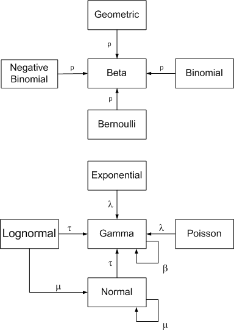

```{r setup, include=FALSE}
knitr::opts_chunk$set(echo = TRUE, tidy = "styler" )
```
class: center, middle

# ¿Qué hemos visto hasta ahora?

Introducción a la Estadística Bayesiana: filosofía, historia y un poco de cálculo. Distribuciones previas (a priori).

# ¿Qué vamos a discutir hoy?

Más distribuciones previas (informativa, no informativa).

---

## Estadística Bayesiana

El **teorema de Bayes** establece que para dos eventos $A$ y $B$ se cumple

$$P(A|B) = \frac{P(B|A)P(A)}{P(B)}$$

**Estadística Bayesiana** considera $\theta$ como un evento aleatorio y el evento $X$ como la información empírica brindada por los datos:

$$\pi(\theta|x) = \frac{\mathcal{L}(\theta|x)\pi(\theta)}{f(x)}$$
**Teorema**. Bajo las condiciones anteriores: 

$$
\pi(\theta|X) =
\dfrac{f(X_1|\theta)\cdots f(X_n|\theta)\pi(\theta)}{g_n(X)} 
$$

para $\theta \in \Omega$, donde $g_n$ es una constante de normalización.


---

## Selección de distribuciones previas
	
### Previas informativas
	
Una forma de seleccionar una previa es utilizando una previa informativa. Claramente, para poder hacer uso de esta debemos tener bastante conocimiento sobre el fenómeno de interés que estamos estudiando (como en el ejemplo que hicimos al inicio sobre la proporción de desempleo en el país). Para ello es imperativo tener información de varios expertos para poder llegar a construir el modelo estadístico que mejor represente esa información. Es importante destacar algo del uso de previas muy informativas; entre más informativa sea la previa que estamos utilizando entonces más datos se necesitan para tratar de observar algo nuevo. Imaginen que están casi $100\%$ seguros sobre cuánto debería ser el valor de cierto parámetro desconocido. Para que ustedes piensen cambien de opinión entonces van a requerir de una gran cantidad de evidencia que apunte a lo contrario. Eso es lo que pasa si se usa una previa muy informativa; la posterior se va a parecer mucho a esta y solo podrá cambiar si existen muchos datos que apuntan a lo contrario. 
	

---
## Familias conjugadas

**Definición**. Sea $X_1,\dots, X_n$ i.i.d. condicional dado $\theta$ con
densidad $f(X|\theta)$. Sea $\psi$ la familia de posibles densidades previas
sobre $\Omega$. Si, sin importar los datos, la posterior pertenece a $\psi$,
entonces decimos que $\psi$ es una familia conjugada de previas.

**Ejemplos**:

* La familia Beta es familia conjugada para muestras según una Bernoulli.
*  La familia Gama es familia conjugada para muestras exponenciales.
* Para el caso Poisson, si $X_1,\dots,X_n\sim Poi(\lambda)$,entonces la familia
  Gamma es familia conjugada.

La función de densidad de una Poisson es $P(X_i = k) = e^{-\lambda}\dfrac{\lambda^k}{k!}$. La verosimilitud corresponde a 
$$f_n(X|\lambda) = \prod_{i=1}^{n}e^{-\lambda}\dfrac{\lambda^{X_i}}{X_i!} = \dfrac{e^{-n\lambda}\lambda^Y}{\prod_{i=1}^n X_i!}~~~ \text{ donde } Y=\sum_{i=1}^n X_i.$$
La previa de $\lambda$ está definida por $\pi(\lambda)\propto\lambda^{\alpha-1}e^{-\beta\lambda}$. Por lo tanto, la posterior es
$$ \pi(\lambda|X) \propto \lambda^{Y+\alpha-1}e^{-(\beta+n)\lambda} \implies
 \lambda|X \sim \Gamma(Y+\alpha,\beta+n)$$ 

---
* En el caso normal, si $X_1,\dots,X_n\sim N(\theta,\sigma^2)$,entonces la familia normal es conjugada si $\sigma^2$ es conocido.

Si $\theta \sim N(\mu_0,V_0^2) \implies \theta|X \sim N(\mu_1, V_1^2)$ donde,
$$\mu_1 = \dfrac{\sigma^2\mu_0 + nV_0^2 \bar X_n}{\sigma^2 + nV_0^2}  = \dfrac{\sigma^2}{\sigma^2 + nV_0^2}\mu_0 + \dfrac{nV_0^2}{\sigma^2 + nV_0^2}\bar X_n$$

Combina de manera ponderada la previa y la de los datos.

**Ejemplo**

Considere una verosimilitud Poisson $(\lambda)$ y una previa

$$\pi(\lambda) = \begin{cases}2e^{-2\lambda} & \lambda> 0 \\ 0 & \lambda \leq 0\end{cases} \quad \lambda \sim \Gamma(1,2)$$

Supongamos que es una muestra aleatoria de tamaño $n$. ¿Cuál es el número de observciones para reducir la varianza, a lo sumo, a 0.01?

Por teorema de Bayes, la posterior $\lambda|x \sim \Gamma(y+1,n+2)$. Luego, la varianza de la Gamma es

$$\dfrac{\alpha}{\beta^2} = \dfrac{\sum x_i + 1}{(n+2)^2} \leq 0.01 \implies \dfrac{1}{(n+2)^2} \leq \dfrac{\sum x_i + 1}{(n+2)^2} \leq 0.01 \implies 100 \leq (n+2)^2 \implies n\geq 8$$

---
**Teorema**. Si $X_1,\dots,X_n \sim N(\theta, \sigma^2)$ con $\sigma^2$ conocido y la previa es $\theta \sim N(\mu_0,V_0^2)$, entonces $\theta|X\sim N(\mu_1,V_1^2)$ donde
$$ \mu_1 =  \dfrac{\sigma^2\mu_0 + nV_0^2 \bar X_n}{\sigma^2 + nV_0^2}, \quad V_1^2 = \dfrac{\sigma^2V_0^2}{\sigma^2 + nV_0^2}$$
*Prueba*:

* **Verosimilitud**:

$$f_n(X|\theta) \propto \exp\left[- \dfrac{1}{2\sigma^2} \sum_{i=1}^{n}(X_i-\theta)^2\right]$$
Luego, 
\begin{align*}
\sum_{i=1}^n (X_i-\theta)^2 & = \sum_{i=1}^n (X_i-\bar X + \bar X - \theta)^2 \\
& = n(\bar X + \theta)^2 + \sum_{i=1}^n (X_i-\bar X)^2 + \underbrace{2 \sum_{i=1}^n (X_i-\bar X)(\bar X - \theta)}_{= 0 \text{ pues } \sum Xi = n\bar X)}
\end{align*}

Entonces
$$ f_n(X|\theta) \propto \exp\left[-\dfrac{n}{2\sigma ^2}(\bar X - \theta )^2\right].$$

---
* **Previa**:

$$ \pi(\theta) \propto \exp\left[-\dfrac{1}{2V_0^2}(\theta - \mu_0)^2\right].$$

* **Posterior**:

$$ \pi(\theta|X) \propto \exp\left[-\dfrac{n}{2\sigma ^2}(\bar X - \theta )^2-\dfrac{1}{2V_0^2}(\theta - \mu_0)^2\right].$$

Con $\mu_1$ y $V_1^2$ definidos anteriormente, se puede comprobar la siguiente identidad:

$$-\dfrac{n}{\sigma ^2}(\bar X - \theta )^2-\dfrac{1}{V_0^2}(\theta - \mu_0)^2= \dfrac{1}{V_1^2}(\theta-\mu_1)^2 + \underbrace{\dfrac{n}{\sigma^2 + nV_0^2}(\bar X_n- \mu_0)^2}_{\text{Constante con respecto a }\theta}$$
Por lo tanto, $$\pi(\theta|X) \propto \exp\left[-\dfrac{n}{2V_1^2}(\theta -\mu_1)^2\right]$$


---
*Media posterior*:

$$\mu_1 = \underbrace{\dfrac{\sigma^2}{\sigma^2 + nV_0^2}}_{W_1}\mu_0 + \underbrace{\dfrac{nV_0^2}{\sigma^2 + nV_0^2}}_{W_2}
\bar X_n$$

**Afirmaciones**:

1) Si $V_0^2$ y $\sigma^2$ son fijos, entonces $W_1 \xrightarrow[n\to \infty]{}0$ (la importancia de la media empírica crece conforme aumenta $n$).

2) Si $V_0^2$ y $n$ son fijos, entonces $W_2 \xrightarrow[\sigma^2\to \infty]{}0$ (la importancia de la media empírica decrece conforme la muestra es menos precisa).

3) Si $\sigma^2$ y $n$ son fijos, entonces $W_2 \xrightarrow[V_0^2\to \infty]{}1$ (la importancia de la media empírica crece conforma la previa es menos precisa).

---

**Ejemplo (determinación de n)**

Sean $X_1,\dots, X_n \sim N(\theta,1)$ y $\theta\sim N(\mu_0,4)$. Sabemos que $$V_1^2 = \dfrac{\sigma^2V_0^2}{\sigma^2 + nV_0^2}. $$
Buscamos que $V_1\leq 0.01$, entonces
$$ \dfrac{4}{4n+1}\leq 0.01 \implies n\geq 99.75 \text{ (al menos 100 observaciones)}$$


---

## Selección de distribuciones previas

### Previas conjugadas

Un tipo de previas informativas que son sumamente convenientes de utilizar son las **previas conjugadas**. Se dice que una previa es conjugada si la distribución de la posteriori pertenece a la misma familia que la distribución de la previa. El ejemplo anterior donde utilizamos una previa Gamma y terminamos con una posteriori Gamma es un ejemplo de una previa conjugada. Este tipo de previas son muy convenientes pues nos aseguran que vamos a tener una distribución a posteriori conocida, lo único que cambiaría son los parámetros de la distribución. Sin embargo, esto no quiere decir que la Gamma siempre vaya a ser una previa conjugada; esto solo va a pasar si los datos son Poisson. Por lo tanto, una parte importante que permite que la previa sea o no sea conjugada es la distribución de la población. 

---

## Distribuciones conjugadas conocidas


Distribución             | previa conjugada                  |
-------------------------|-----------------------------------|
$$\text{Bernoulli}(p)$$    | $$p \sim Beta(\alpha,\beta)$$  |
$$\text{Binomial}(n,p)$$   | $$p \sim Beta(\alpha,\beta)$$  |
$$\text{Binomial Negativa}(n,p)$$| $$p \sim Beta(\alpha,\beta)$$|
$$\text{Poisson}(\lambda)$$      | $$\lambda \sim Gamma(\alpha,\beta)$$|
$$\text{Exponencial}(\theta)$$| $$\theta \sim Gamma(\alpha,\beta)$$|
$$\text{Normal}(\mu,\sigma^2)$$| $$\mu \sim N(\mu_0,\sigma^{2}_{0}) \quad \text{ y } \quad \sigma^{2} \sim GammaInversa(\alpha,\beta)$$|

---


## Distribuciones conjugadas conocidas


```{r echo=FALSE, out.width = "40%"}

```


https://en.wikipedia.org/wiki/Conjugate_prior

https://www.johndcook.com/blog/conjugate_prior_diagram/
	


---

## Previas no informativas
	
Este tipo de previa es posiblemente el más utilizado en la práctica. Con modelos relativamente simples utilizar una previa no informativa por lo general brinda resultados muy similares a los resultados frecuentistas, mientras que con modelos jerárquicos más complejos los resultados sí pueden ser más distintos. No obstante, la mayoría del tiempo en que se quiere hacer inferencia sobre parámetros desconocidos no se tiene mucha información al respecto, aparte de un posible rango en donde se puedan encontrar; por esto es más atractivo utilizar una previa no informativa. Diremos que una previa es no informativa si le da la libertad a los datos de encontrar los mejores valores de los parámetros. 
	
Por mucho tiempo se tuvo la idea de que las previas no informativas eran exclusivamente las uniformes, pues asignaban probabilidades iguales a cualquier parámetro. Sin embargo, hay quienes criticaron esto, como Fisher, diciendo que no es posible que la uniforme sea siempre no informativa. 

---

## Previas no informativas
	

El argumento de Fisher era algo así:
	
>	Supongamos que tenemos un parámetro desconocido $\theta$ que representa la probabilidad de éxito de un experimento Bernoulli. Supongamos que no sabemos nada de $\theta$ entonces decimos que $\theta \sim Unif(0,1)$. Ahora, si no sabemos nada de $\theta$ entonces tampoco sabemos nada de $\lambda = -\ln(\theta)$, por lo que también podríamos preferir una previa uniforme para $\lambda$. Sería lógico pensar que, mediante las técnicas de transformaciones, la transformación aplicada a la previa de $\theta$ llegue a la previa de $\lambda$. Sin embargo hay un problema lógico pues si aplicamos las técnicas de transformación a la previa de $\theta$ no vamos a llegar a la misma previa de $\theta$. Esto sugiere que una distribución uniforme no es un buen ejemplo de una previa no informativa. 

---

## Previas no informativas
	
Un tipo de previa no informativa es la **previa de Jeffreys**. Estas hacen uso de la Información de Fisher, previamente utilizada en el Tema 1. Por lo tanto, si tenemos una muestra aleatoria $X_1 , X_2 , ... , X_n$ de una población con función de densidad $f_{X}(x|\theta)$ entonces la información de Fisher se define como:
	
$$I(\theta) = -E\left[ \frac{\partial^{2} \ln(f_{X}(x|\theta)) }{\partial \theta^{2}} \right]$$
	
Por lo tanto, la previa de Jeffreys se define como:
	
$$\pi_{J}(\theta) = c\sqrt{I(\theta)}$$
	
Donde $c$ es una constante positiva mayor a cero que asegura que esta función de densidad integra a uno. Como $c$ es constante entonces podemos decir que $\pi_{J}(\theta) \propto \sqrt{I(\theta)}$, por lo que muchas veces no nos importa el valor de $c$ para encontrar la distribución a posteriori a partir de la previa de Jeffreys. 

---

## Previas no informativas
	
Ejemplo: Sea $X_1 , X_2 , ... , X_n$ una muestra aleatoria tal que $X_j \sim N(\mu,1)$. Encuentre la previa de Jeffreys para $\mu$. 
	
Solución: Recordemos la función de densidad de una Normal:
	
$$f_{X}(x|\mu) = \sqrt{2\pi} e^{-\frac{(x-\mu)^{2}}{2}}$$
	
Por lo que el logaritmo natural de esta sería:
	
$$\ln(f_{X}(x|\mu))  = \frac{1}{2}\ln(2\pi) - \frac{(x-\mu)^{2}}{2}$$
	
Derivamos dos veces con respecto a $\mu$:
	
$$\frac{\partial \ln(f_{X}(x|\mu)) }{\partial \mu} = x - \mu$$
	
$$\Rightarrow \frac{\partial^{2} \ln(f_{X}(x|\mu)) }{\partial \mu^{2}} = -1$$
	
	
	
---

## Previas no informativas
	

Finalmente obtenemos
	
$$I(\mu) = 1$$
	
Por lo tanto, podemos concluir que $\pi_{J}(\theta) \propto 1$, es decir, es proporcional a una constante. Por lo tanto, la previa de Jeffreys para estimar a $\mu$ sería una distribución Uniforme, escogida en un rango bastante amplio. 

Hay un par de puntos importantes de destacar cuando se usa la previa de Jeffreys. El primero de ellos es que no siempre se va a llegar a una función de densidad propia (es decir, una función de densidad que integre a 1 en su dominio). Por lo general se ignora este problema si la posteriori si es propia. Por lo tanto, siempre que se vaya a utilizar una previa impropia hay que revisar que la posteriori sea propia, si no los resultados no tendrían sentido. El segundo punto es un poco más filosófico y trata con el hecho de que las previas se deben elegir antes de ver los datos. La previa de Jeffreys usa la distribución de los datos para encontrar una previa lo que contradice lo que muchos dicen sobre el planteamiento de la previa. 


---

## Densidades previas impropias

**Definición**. Sea $\pi$ una función positiva cuyo dominio está en $\Omega$. Suponga que $\int\pi(\theta)\;d\theta = \infty$. Entonces decimos que $\pi$ es una **densidad impropia**.

**Ejemplo**: $\theta \sim \text{Unif}(\mathbb{R})$, $\lambda \sim \text{Unif}(0,\infty)$.

Una técnica para seleccionar distribuciones impropia es sustituir los hiperparámetros previos por 0.

---

## Densidades previas impropias


**Ejemplo**:

Se presenta el número de soldados prusianos muertos por una patada de caballo (280 conteos, unidades de combate en 20 años).

| Unidades | Ocurrencias |  
|----------|-------------|
| 144      | 0           |   
|    91    | 1           |  
|    32    | 2           |   
|       11 | 3           |  
|         2| 4           |  

* Muestra de Poisson: $X_1 = 0, X_2 = 1, X_3 = 1,\dots, X_{280} = 0 \sim \text{Poi}(\lambda)$.

* Previa: $\lambda \sim \Gamma(\alpha, \beta)$.

* Posterior: $\lambda|X \sim \Gamma(y+\alpha, n+\beta) = \Gamma(196 + \alpha, 280 + \beta)$.

---

Sustituyendo, $\alpha=\beta = 0$
\begin{align*}
\pi(\lambda) &= \dfrac{1}{\Gamma(\alpha)}\beta^\alpha\lambda^{\alpha-1}e^{\beta\lambda}  \\
& \propto \lambda^{\alpha-1}e^{-\lambda\beta} \\
&=\dfrac{1}{\lambda}
\end{align*}
donde $\displaystyle\int_{0}^{\infty}\dfrac{1}{\lambda} d\lambda = \infty$. 

Por teorema de Bayes, $$\theta|X \sim \Gamma(196,280)$$
	
	
---
## Funciones de pérdida

**Definición**. Sean $X_1,\dots, X_n$ datos observables cuyo modelo está indexado por $\theta\in\Omega$. Un estimador de $\theta$ es cualquier estadístico $\delta(X_1,\dots, X_n)$.

**Notación**:

* Estimador $\to \delta(X_1,\dots,X_n)$.
* Estimación o estimado: $\delta(X_1,\dots,X_n)(\omega) = \delta(\overbrace{x_1,\dots,x_n}^{datos})$

**Definición**. Una **función de pérdida** es una función de dos variables:
$$L(\theta,a), \quad \theta \in\Omega$$
con $a$ un número real.

---
## Funciones de pérdida
**Interpretación**: es lo que pierde un analista cuando el parámetro es $\theta$ y el estimador es $a$.

Asuma que $\theta$ tiene una previa. La pérdida esperada es
$$ \mathbb{E}[L(\theta,a)] = \int_{\Omega}L(\theta, a) \pi(\theta)\;d\theta$$
la cual es una función de $a$, que a su vez es función de $X_1,\dots,X_n$. Asuma que $a$ se selecciona el minimizar esta esperanza. A ese estimador $a = \delta^*(X_1,\dots, X_n)$ se le llama **estimador bayesiano**, si ponderamos los parámetros con respecto a la posterior.

$$\mathbb{E}[L(\theta, \delta^*)|X] = \int_{\Omega}L(\theta, a) \pi(\theta)\;d\theta = \min_a \mathbb{E}[L(\theta|a)|X].$$

---

### Función de pérdida cuadrática

$$L(\theta, a) = (\theta-a)^2$$

En el caso en que $\theta$ es real y $\mathbb{E}[\theta|X]$ es finita, entonces
$$ \delta^*(X_1,\dots, X_n) = \mathbb{E}[\theta|X] \text{ cuando } L(\theta,a) = (\theta-a)^2. $$

**Ejemplo**: $X_1,\dots, X_n \sim \text{Ber}(\theta)$, $\theta \sim \text{Beta}(\alpha,\beta) \implies \theta|X \sim \text{Beta}(\alpha+y,\beta+n-y)$.

El estimador de $\theta$ es
$$ \delta^*(X_1,\dots, X_n) = \dfrac{\alpha+y}{\alpha + \beta + n} = \overbrace{\dfrac{\alpha}{\alpha + \beta} }^{\text{Esperanza previa}}\cdot \dfrac{\alpha +\beta}{\alpha +\beta + n} + \overbrace{\dfrac{y}{n}}^{\bar X}\cdot \dfrac{n}{\alpha +\beta + n}.$$
	
---
### Función de pérdida absoluta

$$L(\theta,a) = |\theta-a|$$

La pérdida esperada es
$$f(a) = \mathbb{E}[L(\theta,a)|X] = \int_{-\infty}^{+\infty}|\theta-a|\pi(\theta|X)\;d\theta = \int_{a}^{+\infty}(\theta-a)\pi(\theta|X)\;d\theta + \int_{-\infty}^{a}(a-\theta)\pi(\theta|X)\;d\theta$$

Usando el teorema fundamental del cálculo,
$$F_{\pi}(a|X) = \int_{-\infty}^{\hat a}\pi(\theta|X)\;d\theta = \dfrac12 \Leftrightarrow \hat a= \operatorname*{argmin}_a f(a)$$

La **mediana** es el punto de $X_{0.5}$ tal que $F(X_{0.5}) = \dfrac{1}{2}$.

---

**Corolario**. Bajo la función de pérdida absoluta, el estimador bayesiano es la mediana posterior.

**Ejemplo**: Bernoulli.
$$\dfrac{1}{\text{Beta}(\alpha+y, \beta+n-y)}\int_{-\infty}^{X_{0.5}}\theta^{\alpha+y-1} (1-\theta)^{\beta+n-y-1}\;d\theta = \dfrac12$$
Resuelva para $X_{0.5}$.	

### Otras funciones de pérdida

* $L(\theta,a) = |\theta-a|^k$, $k\ne 1,2$, $0<k<1$.

* $L(\theta,a) = \lambda(\theta)|\theta-a|^2$ $(\lambda(\theta)$ penaliza la magnitud del parámetro).

* $L(\theta,a)=\begin{cases}3(\theta-a)^2 & \theta\leq a \text{ (sobreestima)}\\ (\theta-a)^2&\theta\geq a \text{ (subestima)} \end{cases}$


---

## Efecto de muestras grandes

**Ejemplo**: ítemes malos (proporción: $\theta$), $\theta \in [0,1]$. Función de pérdida cuadrática. El tamaño de muestra son $n=100$ ítemes, de los cuales $y=10$ están malos.

$$ X_1,\dots,X_n\sim \text{Ber}(\theta)$$

* Primer previa. $\alpha = \beta = 1$ (Beta). El estimador bayesiano corresponde a

$$ \mathbb{E}[\theta|X] = \dfrac{\alpha+y}{\alpha+\beta+n} = \dfrac{1+10}{2+100} = 0.108$$

* Segunda previa. $\alpha =1, \beta=2 \implies \pi(\theta) = 2e^{-2\theta}, \theta >0$.

$$ \mathbb{E}[\theta|X] = \dfrac{1+10}{1+2+100} = \dfrac{11}{103}=0.107$$

La media es $\bar X_n = \dfrac{10}{100} = 0.1$.


---
## Consistencia

**Definición**. Un estimador de $\theta$, $\delta(X_1,\dots, X_n)$ es consistente si  $$\delta(X_1,\dots, X_n)\xrightarrow[n\to \infty]{\mathbb{P}}\theta.$$

Bajo pérdida cuadrática, $\mathbb{E}[\theta|X] = W_1\mathbb{E}[\theta] + W_2\bar X_n = \delta^*$. Sabemos, por ley de grandes números, que $\bar X_n \xrightarrow[n\to \infty]{\mathbb{P}}\theta$. Además, $W_1\xrightarrow[n\to \infty]{}0$ y  $W_2\xrightarrow[n\to \infty]{}1$. 

En los ejemplos que hemos analizado 
$$\delta^* \xrightarrow[n\to \infty]{\mathbb{P}}\theta$$
**Teorema**. Bajo condiciones generales, los estimadores bayesianos son consistentes.

**Estimador**. Si $X_1,\dots, X_n$ es una muestra en un modelo indexado por $\theta$, $\theta \in \Omega$ ( $k$-dimensiones), sea

$$h:\Omega \to H \subset \mathbb{R}^d.$$
Sea $\psi = h(\theta)$. Un **estimador** de $\psi$ es un estadístico $\delta^*(X_1,\dots, X_n) \in H$. A $\delta^*(X_1,\dots, X_n)$ estimador de $\psi$ se puede evaluar y construir estimadores nuevos.

---
## Consistencia

**Ejemplo**. $X_1,\dots, X_n \sim \text{Exp}(\theta)$, $\theta|X \sim \Gamma(\alpha,\beta) = \Gamma (4,8.6)$. La característica de interés es $\psi = \dfrac{1}\theta$, el valor esperado del tiempo de fallo.

Es estimador se calcula de la siguiente manera:

\begin{align*}
\delta^*(x) = \mathbb{E}[\psi|x] & = \int_{0}^\infty \dfrac{1}\theta\pi(\theta|x)\;d\theta\\
& = \int_{0}^\infty \dfrac{1}\theta \dfrac{8.6^4}{\Gamma(4)} \theta^3e^{-8.6\theta}\;d\theta\\
&=\dfrac{8.6^4}{6} \underbrace{\int_{0}^\infty \theta^2 e^{-8.6\theta}\;d\theta}_{\frac{\Gamma(3)}{8.6^3}}\\
& = \dfrac{8.6^4}{6}\dfrac{2}{8.6^3} = 2.867 \text{ unidades de tiempo.}
\end{align*}

Por otro lado, vea que $\mathbb{E}(\theta|X) = \dfrac{4}{8.6}$. El estimador *plug-in* correspondería a
$$\dfrac{1}{\mathbb{E}(\theta|X)} = \dfrac{8.6}{4} = 2.15.$$

---
### Distribución previa 

En nuestro ejemplo se tenía que $\mathbb E [\theta] = 0.0002$ y $\mathrm{Var}(\theta) = 0.001$. Suponiendo que $\theta$ es gamma se puede resolver el sistema de ecuaciones obtenemos que $\beta=20000$ y $\alpha=4$. 

```{r message=FALSE, warning=FALSE}
library(tidyverse)
```

---

```{r 02-distribuciones-previas-posteriores-3, out.width="40%"}
alpha_previa <- 4
beta_previa <- 20000
ggplot(data = data.frame(x = c(0, 1e6)), aes(x)) +
  stat_function(fun = dgamma, args = list(shape = alpha_previa, scale = beta_previa )) +
  ylab("") +
  scale_y_continuous(breaks = NULL)+
  theme_minimal()
```

---
### Distribución conjunta 

Asumiendo que tenemos algunos datos $X_1, ..., X_n$, asumimos que estos son exponencial recordando que $\mathbb E [X] = 1/\theta$, entonces una aproximación de esta densidad es 

```{r 02-distribuciones-previas-posteriores-4 , out.width="30%"}
x  <- c(2911, 3403, 3237, 3509, 3118)

theta <- 1 / mean(x)

ggplot(data = data.frame(x = c(0, 1e5)), aes(x)) +
  stat_function(fun = dexp, args = list(rate = theta)) +
  ylab("") +
  scale_y_continuous(breaks = NULL) +
  theme_minimal()
```


---
### Distribución posterior 

Según los contenidos del curso, se puede estimar los parámetros de la densidad posterior de la forma 

```{r 02-distribuciones-previas-posteriores-5 }
(y  <- sum(x))
(n <- length(x))
(alpha_posterior <- n + alpha_previa)
(beta_posterior <- beta_previa + y)
```

---

```{r 02-distribuciones-previas-posteriores-6a,eval=FALSE}
ggplot(data = data.frame(x = c(0, 7.5e5)), aes(x)) +
  stat_function(
    fun = dgamma,
    args = list(shape = alpha_previa, scale = beta_previa),
    aes(color = "Previa")
  ) +
  stat_function(
    fun = dgamma,
    args = list(shape = alpha_posterior, scale = beta_posterior),
    aes(color = "Posterior")
  ) +
  stat_function(
    fun = dexp,
    args = list(rate = theta),
    aes(color = "Verosimilitud")
  ) +
  ylim(0, 1.5e-5) +
  theme_minimal()
```

---

```{r 02-distribuciones-previas-posteriores-6b, warning=FALSE, echo=FALSE}
ggplot(data = data.frame(x = c(0, 7.5e5)), aes(x)) +
  stat_function(
    fun = dgamma,
    args = list(shape = alpha_previa, scale = beta_previa),
    aes(color = "Previa")
  ) +
  stat_function(
    fun = dgamma,
    args = list(shape = alpha_posterior, scale = beta_posterior),
    aes(color = "Posterior")
  ) +
  stat_function(
    fun = dexp,
    args = list(rate = theta),
    aes(color = "Verosimilitud")
  ) +
  ylim(0, 1.5e-5) +
  theme_minimal()
```

---
### Agregando nuevos datos 

Si tenemos un 6to dato, y queremos ver cual es su distribución posterior. Lo primero es estimar la densidad posterior de este 6to dato, pero asumiendo que la previa es la densidad que obtuvimos en el caso anterior. 

Suponga que $X_6 = 3000$

```{r 02-distribuciones-previas-posteriores-7a, eval=FALSE}
(alpha_previa <- alpha_posterior)
(beta_previa <- beta_posterior)
(alpha_posterior <- alpha_previa + 1)
(beta_posterior <- beta_previa + 3000)
ggplot(data = data.frame(x = c(0, 1e6)), aes(x)) +
  stat_function(fun = dgamma,args = list(shape = 4, scale = 20000),
    aes(color = "Previa #1")
  ) +
  stat_function(fun = dgamma,args = list(shape = alpha_previa, scale = beta_previa),
    aes(color = "Previa #2")
  ) +
  stat_function(fun = dgamma,args = list(shape = alpha_posterior, scale = beta_posterior),
    aes(color = "Posterior")
  ) + ylim(0, 1.5e-5) + theme_minimal()
```

---
```{r 02-distribuciones-previas-posteriores-7b,echo=FALSE}
alpha_previa <- alpha_posterior
beta_previa <- beta_posterior
alpha_posterior <- alpha_previa + 1
beta_posterior <- beta_previa + 3000

ggplot(data = data.frame(x = c(0, 1e6)), aes(x)) +
  stat_function(
    fun = dgamma,
    args = list(shape = 4, scale = 20000),
    aes(color = "Previa #1")
  ) +
  stat_function(
    fun = dgamma,
    args = list(shape = alpha_previa, scale = beta_previa),
    aes(color = "Previa #2")
  ) +
  stat_function(
    fun = dgamma,
    args = list(shape = alpha_posterior, scale = beta_posterior),
    aes(color = "Posterior")
  ) +
  ylim(0, 1.5e-5) +
  theme_minimal()
```

---
### Familias conjugadas normales


Si tenemos pocos datos, la información previa es la que "prevalece". 

```{r 02-distribuciones-previas-posteriores-8a }
x <- rnorm(n=3, mean = 10, sd = 1)
(mu <- mean(x))
(sigma <- sd(x))
(n <- length(x))
(mu_previa<- 0)
(sigma_previa <- 1)
(mu_posterior <- ((sigma^2) / (sigma^2 + n * sigma_previa^2)) * mu_previa + ((n * sigma_previa^2) / (sigma^2 + n * sigma_previa^2)) * mu)
(sigma2_posterior <- (sigma^2 * sigma_previa^2) / (sigma^2 + n * sigma_previa^2))
```

---

```{r 02-distribuciones-previas-posteriores-8b, out.width="40%"}
ggplot(data = data.frame(x = c(-5, 15)), aes(x)) +
  stat_function(fun = dnorm,
                args = list(mean = mu_previa, sd = sigma_previa),
                aes(color = "Previa")) +
  stat_function(fun = dnorm,
                args = list(mean = mu_posterior, sd = sqrt(sigma2_posterior)),
                aes(color = "Posterior")) +
  stat_function(fun = dnorm,
                args = list(mean = mu, sd = sigma),
                aes(color = "Verosimilitud")) +
  theme_minimal()
```

---

Con más datos, la distribución se ajusta a esto y le quita importancia a la información previa. 

```{r 02-distribuciones-previas-posteriores-9a }
x <- rnorm(n = 100, mean = 10, sd = 1)
(mu <- mean(x))
(sigma <- sd(x))
(n <- length(x))
(mu_previa <- 0)
(sigma_previa <- 1)
```

---

```{r 02-distribuciones-previas-posteriores-9b }
(mu_posterior <- ((sigma^2) /
  (sigma^2 + n * sigma_previa^2)) * mu_previa +
  ((n * sigma_previa^2) /
    (sigma^2 + n * sigma_previa^2)) * mu)
(sigma2_posterior <- (sigma^2 * sigma_previa^2) / (sigma^2 + n * sigma_previa^2))
```

---

```{r 02-distribuciones-previas-posteriores-9c, out.width="40%"}
ggplot(data = data.frame(x = c(-5, 15)), aes(x)) +
  stat_function(fun = dnorm,args = list(mean = mu_previa, sd = sigma_previa),
    aes(color = "Previa")
  ) +
  stat_function(
    fun = dnorm,args = list(mean = mu_posterior, sd = sqrt(sigma2_posterior)),
    aes(color = "Posterior")
  ) +
  stat_function(fun = dnorm, args = list(mean = mu, sd = sigma),
    aes(color = "Verosimilitud")
  ) +
  theme_minimal()
```

---
Si los datos por si solo son muy variable, la posterior tiende a parecerse a la distribución previa en lugar que a la verosimilitud.

```{r 02-distribuciones-previas-posteriores-10a}
x <- rnorm(n = 10, mean = 10, sd = 5)
(mu <- mean(x))
(sigma <- sd(x))
(n <- length(x))
(mu_previa <- 0)
(sigma_previa <- 1)
```

---
```{r 02-distribuciones-previas-posteriores-10b}
(mu_posterior <- ((sigma^2) /
  (sigma^2 + n * sigma_previa^2)) * mu_previa +
  ((n * sigma_previa^2) /
    (sigma^2 + n * sigma_previa^2)) * mu)
(sigma2_posterior <- (sigma^2 * sigma_previa^2) / (sigma^2 + n * sigma_previa^2))
```

```{r 02-distribuciones-previas-posteriores-10c,eval=FALSE}
ggplot(data = data.frame(x = c(-5, 15)), aes(x)) +
  stat_function(fun = dnorm,args = list(mean = mu_previa, sd = sigma_previa),
    aes(color = "Previa") ) +
  stat_function(
    fun = dnorm,args = list(mean = mu_posterior, sd = sqrt(sigma2_posterior)),
    aes(color = "Posterior")) +
  stat_function(
    fun = dnorm,args = list(mean = mu, sd = sigma),
    aes(color = "Verosimilitud")) +
  theme_minimal()
```

---
```{r 02-distribuciones-previas-posteriores-10d, echo=FALSE}
ggplot(data = data.frame(x = c(-5, 15)), aes(x)) +
  stat_function(
    fun = dnorm,
    args = list(mean = mu_previa, sd = sigma_previa),
    aes(color = "Previa")
  ) +
  stat_function(
    fun = dnorm,
    args = list(mean = mu_posterior, sd = sqrt(sigma2_posterior)),
    aes(color = "Posterior")
  ) +
  stat_function(
    fun = dnorm,
    args = list(mean = mu, sd = sigma),
    aes(color = "Verosimilitud")
  ) +
  theme_minimal()
```


---
### Funciones de pérdida

Lo más importante acá es que dependiendo de la función de pérdida podemos construir una estimador para $\theta$. En el caso de los componentes electrónicos recordemos que la posterior nos daba

```{r 02-distribuciones-previas-posteriores-11 }
alpha <- 9
beta <- 36178
```

- **Pérdida cuadrática:** Recordemos que la media de una gamma es $\alpha/\beta$ entonces 

```{r 02-distribuciones-previas-posteriores-12 }
(theta <- alpha/beta)
```

Y por lo tanto el tiempo promedio del componente electrónico es $1/\theta$=`r 1/theta`.

- **Pérdidad absoluta:** La distribución Gamma no tiene una forma cerrada para la mediana, por que se puede aproximar así, 

```{r 02-distribuciones-previas-posteriores-13 }
m <- rgamma(n = 1000, scale = beta, shape = alpha)
(theta <- median (m))
```

---
### Funciones de pérdida

```{r, echo=FALSE}
options(scipen=999)
```

Y por lo tanto el tiempo promedio del componente electrónico es $1/\theta=$ `r round(1/theta,8)`.

**OJO: En este caso la pérdida cuadrática ajusta mejor ya que la distribución que la pérdida absoluta ya que la distribución NO es simétrica. En el caso simétrico los resultados serían muy similares.** 

---

### Caso concreto

Suponga que se que quiere averiguar si los estudiantes de cierto colegio duermen más de 8 horas o menos de 8 horas. 

Para esto primero cargaremos el siguiente paquete, 

```{r 02-distribuciones-previas-posteriores-14}
library(LearnBayes)
```
Suponga que se hace una encuesta a 27 estudiantes y se encuentra que 11 dicen que duermen más de 8 horas diarias y el resto no. Nuestro objetivo es encontrar inferencias sobre la proporción $p$ de estudiantes que duermen al menos 8 horas diarias. El modelo más adecuado es  
$$f(x \vert p) \propto p^s (1-p)^f$$
donde $s$ es la cantidad de estudiantes que duermen más de 8 horas y $f$ los que duermen menos de 8 horas. 

---

Una primera aproximación para la previa es usar una distribución discreta. En este caso, el investigador asigna una probabilidad a cierta cantidad de horas de sueño, según su experiencia. Así, por ejemplo:

```{r 02-distribuciones-previas-posteriores-15, out.width="50%"}
p <- seq(0.05, 0.95, by = 0.1)
prior <- c(1, 5.2, 8, 7.2, 4.6, 2.1, 0.7, 0.1, 0, 0)
prior <- prior/sum(prior)
plot(p, prior, type = "h", ylab="Probabilidad Previa")
```

---
El paquete `LearnBayes` tiene la función `pdisc` que estima la distribución posterior para una previa discreta binomial. Recuerde que el valor 11 representa la cantidad de estudiantes con más de 8 horas de sueño y 16 lo que no duermen esa cantidad. 


```{r 02-distribuciones-previas-posteriores-16}
data <- c(11, 16)
post <- pdisc(p, prior, data)
round(cbind(p, prior, post),2)
```

---

Y podemos ver la diferencia entre la previa (negro) y la posterior (roja), 

```{r 02-distribuciones-previas-posteriores-17,out.width="60%"}
 
plot(p, post, type = "h", col = "red")
lines(p + 0.01, prior , type = "h")

```

¿Qué se puede deducir de estos resultados?

---

**Ejercicio:** Suponga que se tiene la base de datos `studentdata`. Realice los cálculos anteriores con esos datos, 

```{r 02-distribuciones-previas-posteriores-18,out.width="30%"}
data("studentdata")
horas_sueno <- studentdata$WakeUp - studentdata$ToSleep
horas_sueno <- na.omit(horas_sueno)
summary(horas_sueno)
hist(horas_sueno,main = "")
 
```

---
Ahora supongamos que se tiene quiere ajustar una previa continua a este modelo. Para esto usaremos una distribución Beta con parámetros $\alpha$ y $\beta$, de la forma 

$$pi(p\vert \alpha, \beta) \propto p^{1-\alpha} (1-p)^{1-\beta}.$$

El ajuste de los paramétros de la Beta depende mucho de la información previa que se tenga del modelo. Una forma fácil de estimarlo es a través de cuantiles con los cuales se puede reescribir estos parámetros. Para una explicación detallada revisar https://stats.stackexchange.com/a/237849


En particular, suponga que se cree que el $50\%$ de las observaciones la proporción será menor que 0.3 y que el $90\%$ será menor que 0.5. 

Para esto ajustaremos los siguientes parámetros 

```{r 02-distribuciones-previas-posteriores-19}
quantile2 <- list(p = .9, x = .5)
quantile1 <- list(p = .5, x = .3)
(ab <- beta.select(quantile1, quantile2))
 a <- ab[1]
 b <- ab[2]
 s <- 11
 f <- 16
```

---

En este caso se obtendra la distribución posterior Beta con paramétros $\alpha + s$ y $\beta + f$, 

```{r 02-distribuciones-previas-posteriores-20, out.width="50%"}
curve(dbeta(x,a + s,b + f), from = 0, to = 1, 
       xlab = "p", ylab = "Densidad",lty = 1, lwd = 4)
curve(dbeta(x,s + 1, f + 1), add=TRUE, lty = 2, lwd = 4)
curve(dbeta(x, a, b), add = TRUE, lty = 3, lwd = 4)
legend(.7, 4, c("Previa","Verosimilitud","Posterior"),
     lty = c(3,2,1), lwd = c(3,3,3))
```

---

class: center, middle

## ¿Qué discutimos hoy?

Distribuciones previas (a priori).

## ¿Qué nos falta para terminar el curso?

Estadística Bayesiana: inferencia (estimación puntual, intervalos de credibilidad y factor de Bayes).


