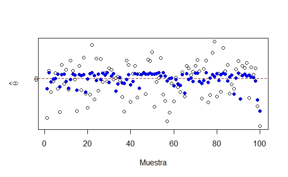

```{r setup, include=FALSE}
knitr::opts_chunk$set(echo = TRUE)
```


# ¿Qué vamos a discutir hoy?

* Mapa de recursos ¿dónde encuentro qué?
* ¿Qué podemos esperar de estos 50 mins de clase?


* Definición 1.2 Error y sesgo (ejemplo)
* Definición 1.3 Estimadores asintóticamente insesgados
* Definición 1.4 ECM (demostración y ejemplo)
* Eficiencia (ejemplo y motivación)
* Definición 2.1 Eficiencia relativa
* Teorema 2.1 (Cramer-Rao)

---
 
# Vídeos

Temas anteriores a esta clase (para repaso):

* [Población y muestra](https://youtu.be/JLNaZ1TxS_8)
* [¿Qué es la estadística inferencial?](https://youtu.be/N_Bnk9Wq7E4)
* [¿Qué es la estimación puntual?](https://youtu.be/-9who67ocEQ)
* [Muestras aleatorias, estadísticas y estimadores](https://youtu.be/muIrBvecff8)
* [Insesgamiento](https://youtu.be/-VQvT1ZV8dc)


Temas para esta clase:

* [Insesgamiento asintótico](https://youtu.be/zuuNAjb-fx8)
* [Sesgo y error cuadrático medio](https://youtu.be/ya03V8ySoBI)
* [Eficiencia](https://youtu.be/GD4lUmIo9_g)
* [Información de Fisher](https://youtu.be/7O-an8MOL7g)
* [Cota inferior de Cramér-Rao](https://youtu.be/e8BhHJKB5Ks)
* [Comentarios sobre la cota inferior de Cramér-Rao](https://youtu.be/q0NI2tftYWg)
* [Primer ejemplo sobre la cota inferior de Cramér-Rao](https://youtu.be/YW1ZG1Hgg_k)
* [Segundo ejemplo sobre la cota inferior de Cramér-Rao](https://youtu.be/faFsaP1YE4U)


---
 
# Mapa de recursos

* Vídeos: links se postearán en las presentaciones, pero también estarán disponibles antes de la clase en Mediación y en el repo de Github.
* Material resumen de Mauricio: está en Slack y en Mediación Virtual.
* Diapositivas: en el repo de Github.
* Ejercicios recomendados: en Mediación Virtual y en las diapositivas.
* Horas consulta: vía Slack, o zoom de ser necesario. Ver horario en el programa modificado.

---
 
# ¿Qué podemos esperar de estos 50 mins de clase?

* Énfasis en demostraciones o ejercicios que NO están en los vídeos.
* Las dudas se harán por escrito (puede ser antes de clase) y se resolverán en la próxima clase o si no hay tiempo, entonces en horas consulta.
* Son solo 50 mins, por lo que no podemos esperar lo mismo que en la clase presencial. 
* ¿Por qué se hace así? porque las clases sincrónicas son las de más difícil acceso para poblaciones vulnerables, por lo que en esta clase daremos recursos asincrónicos (vídeos, material escrito, ejercicios y prácticas) para reemplazar las clases que ya conocíamos.

---

# Sesgo y Variancia

> **Definición 1.6.** Error y Sesgo. La diferencia entre un estimador $\hat{\theta}$ y el parámetro que estima $\theta$ se considera ERROR en la estimación $error = \hat{\theta} - \theta$

No obstante, si $\hat{\theta}$ es insesgado se tiene que el valor esperado del error es cero: $E\left(error\right) = E\left(\hat{\theta} - \theta\right) = E(\hat{\theta}) - \theta = 0$. Esto significa que las estimaciones varian alrededor de $\theta$ en igual proporción para diferentes muestras.


Sin embargo, si $E(\hat{\theta}) \neq \theta$ se dice que hay un SESGO en la estimación. Este sesgo se ve representado por el valor
		
$$B(\hat{\theta}) =  E(\hat{\theta}) - \theta$$
	
---

# Sesgo y Variancia

**Ejemplo:** Encuentre el sesgo para los ejemplos anteriores. 

**Solución:**
	
a. Sabemos que $E(X_{\left(n\right)}) = \frac{n\theta}{n+1}$, por lo que tenemos 

$$B(\hat{\theta}) = E(X_{\left(n\right)}) - \theta = \frac{n\theta}{n+1} - \theta = \frac{-\theta}{n+1}$$
		
Podemos notar como el sesgo es *negativo*. Esto significa que $X_{\left(n\right)}$ está sub-estimando el valor real de $\theta$, lo cual es de esperar con el máximo muestral.
		
b. En este caso obtuvimos que $E(X_{\left(1\right)}) = \frac{2n\beta}{2n-1}$, por lo tanto 
		
$$B(X_{\left(1\right)}) = E(X_{\left(1\right)}) - \beta = \frac{2n\beta}{2n-1} - \beta = \frac{\beta}{2n-1}$$
		
En este caso el sesgo es *positivo*, indicando que el estimador está sobre-estimando el valor real de $\beta$, lo cual es usual al utilizar el mínimo muestral.

---

# Estimadores asintóticamente insesgados

> **Definición 1.7.** Estimadores asintóticamente insesgados. Algunos estimadores, aunque no son insesgados, cumplen que $\displaystyle \lim_{n \to +\infty}{B(\hat{\theta})} =0$, es decir, el sesgo tiende a cero cuando n tiende a infinito. A estos estimadores se les llama asintóticamente insesgados. 

**Ejemplo.** Determine si los estimadores de los últimos dos ejemplos son asintóticamente insesgados para sus respectivos parámetros.
	
**Solución:** 
	
a. $\displaystyle\lim_{n \to +\infty}{B(X_{\left(n\right)})} = \lim_{n \to +\infty}{\frac{-\theta}{n+1}} = 0$

b. $\displaystyle\lim_{n \to +\infty}{B(X_{\left(1\right)})} = \lim_{n \to +\infty}{\frac{\beta}{2n-1}} = 0$

Se cumple que ambos estimadores son asintóticamente insesgados para sus respectivos parámetros.
	
**NOTA:** También se cumple que un estimador $\hat{\theta}$ es asintóticamente insesgado para $\theta$ si $\displaystyle\lim_{n\rightarrow\infty}{E(\hat{\theta})} = \theta$.
	
---

# Sesgo y ECM

**NOTA:** Si un estimador $\hat{\theta}$ es insesgado para $\theta$ se cumple que $ECM(\hat{\theta}) = Var(\hat{\theta})$. 
	
```{r echo=F, out.width = '100%', fig.height = 4, warnings=FALSE}
library(tidyr)
library(ggplot2)
library(gridExtra)
set.seed(88100)
estimator1 <- function(samples){
  mean(x_samples)
}

S <- 100
mu <- 1
sdev <- 1
x           <- seq(-3,3, by=0.1)
prob        <- dnorm(x, mean = mu, sd = sdev)

# Estimate once
x_samples   <- rnorm(n = S, mean = mu, sd = sdev)
theta_hat1   <- estimator1(x_samples)

df.pdf <- data.frame(x = x, prob = prob)
df <- data.frame(x = x_samples, prob = runif(S)/100)
p1 <- ggplot(df, aes(x = x, y = prob)) + 
  geom_point() +
  geom_line(data = df.pdf, aes(x=x, y=prob))+
  geom_vline(aes(xintercept = theta_hat1), linetype = 2) + ylim(c(0,0.5))+
  theme_bw() + 
  geom_vline(aes(xintercept = 1), linetype = 1, color="red") + ggtitle("n = 100 \n Puntos muestrales para una \n población infinita, y su media \n estimada. La curva muestra la \n distribución  poblacional, \n con media = 1 (en rojo).")

estimator2 <- function(samples){
  log(mean(x_samples))
}

S <- 100
mu <- 1
sdev <- 1
x           <- seq(-3,3, by=0.1)
prob        <- dnorm(x, mean = mu, sd = sdev)

# Estimate once
x_samples   <- rnorm(n = S, mean = mu, sd = sdev)
theta_hat2   <- estimator2(x_samples)

df.pdf <- data.frame(x = x, prob = prob)
df <- data.frame(x = x_samples, prob = runif(S)/100)
p2 <-ggplot(df, aes(x = x, y = prob)) + 
  geom_point() +
  geom_line(data = df.pdf, aes(x=x, y=prob))+
  geom_vline(aes(xintercept = theta_hat2), linetype = 2) + geom_vline(aes(xintercept = 1), linetype = 1, color="red") +
  ylim(c(0,0.5))+
  theme_bw()+ ggtitle("n = 100 \n Puntos muestrales para una \n población infinita, y su log media \n estimada. La curva muestra la \n distribución  poblacional, \n con media = 1 (en rojo).")

grid.arrange(p1, p2, nrow = 1)
```

---

# Sesgo asintótico

```{r out.width = '100%', fig.height = 4, echo=FALSE}
# Estimate many times to analyze bias
n_reps <- 10000
theta_hat_samples <- rep(NA, n_reps)
for(xp in 1:n_reps){
  x_samples   <- rnorm(n = S, mean = mu, sd = sdev)
  theta_hat   <- estimator1(x_samples)
  theta_hat_samples[xp]  <- theta_hat
}

# Empirical bias
bias <- cumsum(theta_hat_samples) / seq_along(theta_hat_samples) - mu
df.bias <- data.frame(bias = bias, repetitions = 1:length(bias))
p3<-ggplot(df.bias, aes(x=repetitions, y = bias)) + geom_line() + theme_bw()

# Estimate many times to analyze bias
n_reps <- 10000
theta_hat_samples <- rep(NA, n_reps)
for(xp in 1:n_reps){
  x_samples   <- rnorm(n = S, mean = mu, sd = sdev)
  theta_hat   <- estimator2(x_samples)
  theta_hat_samples[xp]  <- theta_hat
}

# Empirical bias
bias <- cumsum(theta_hat_samples) / seq_along(theta_hat_samples) - log(mu)
df.bias <- data.frame(bias = bias, repetitions = 1:length(bias))
p4<-ggplot(df.bias, aes(x=repetitions, y = bias)) + geom_line() + theme_bw()

grid.arrange(p3, p4, nrow = 1)
```
---

# Error Cuadrático Medio (ECM)

> **Definicion 1.8.** Error cuadrático medio. Supongamos que $\hat{\theta}$ es un estimador de un parámetro $\theta$, se define el **error cuadrático medio** de $\hat{\theta}$, denotado por $ECM(\hat{\theta}) = E\left[\left(\hat{\theta}-\theta\right)^2\right]$

> **Teorema 1.22.** Si $\hat{\theta}$ es un estimador de $\theta$, entonces $ECM(\hat{\theta}) = Var(\hat{\theta}) + \left[B(\hat{\theta})\right]^2$

**Prueba:** $ECM(\hat{\theta}) = E\left[\left(\hat{\theta}-\theta\right)^2\right] = E\left[\left(\left[\hat{\theta} - E(\hat{\theta})\right] + \left[E(\hat{\theta}) - \theta \right]\right)^2\right]$
$= E\left[\left(\left[\hat{\theta} - E(\hat{\theta})\right] + B(\hat{\theta})\right)^2\right]$
$= E\left[\left(\hat{\theta} - E(\hat{\theta})\right)^{2} + 2\left(\hat{\theta} - E(\hat{\theta})\right)B(\hat{\theta}) +B(\hat{\theta})^{2}\right]$
$= E\left[\left(\hat{\theta} - E(\hat{\theta})\right)^{2}\right] + 2B(\hat{\theta}) E\left(\hat{\theta} - E(\hat{\theta})\right) + B(\hat{\theta})^{2}$
$= Var(\hat{\theta}) +  2B(\hat{\theta}) \cdot 0 + B(\hat{\theta})^{2} = Var(\hat{\theta}) +  B(\hat{\theta})^{2}$
	
---

# Error Cuadrático Medio

**Ejemplo:** 

Si $X_{1}, X_{2}, ... , X_{n}$ es una muestra aleatoria tal que $X_{j} \sim Pareto \left(2,\beta\right)$ y $X_{\left(1\right)}$ es un estimador de $\beta$, determine el error cuadrático medio de $X_{\left(1\right)}$. 
	
**Solución:** 

Se demostró que $X_{(1)} \sim Pareto\left(2n,\beta\right)$ y que $B\left(X_{\left(1\right)}\right) = \frac{\beta}{2n-1}$. También sabemos que $Var\left(X_{\left(1\right)}\right) = \frac{2n\beta^{2}}{\left(2n-1\right)^{2}\left(2n-2\right)}$. Por lo tanto,
	
$ECM(X_{\left(1\right)}) = Var(X_{\left(1\right)}) +  B(X_{\left(1\right)})^{2}$ 

$~~~~~~~~~~~~~~~~~~~~~=\frac{2n\beta^{2}}{\left(2n-1\right)^{2}\left(2n-2\right)} + \frac{\beta^2}{\left(2n-1\right)^2} = \frac{4n\beta^{2} - 2\beta^{2}}{\left(2n-1\right)^{2}\left(2n-2\right)} = \frac{\beta^2}{\left(2n-1\right)\left(n-1\right)}$

---

# Eficiencia
	
La eficiencia de un estimador está relacionada con la variabilidad de dicho estimador, la cual se ve representada por el error cuadrático medio. Empezaremos con un ejemplo que compare la variabilidad entre dos estimadores: 
	
**Ejemplo:** Sea $X_{1}, X_{2}, ... , X_{n}$ una muestra aleatoria tal que 
	
$F_{X}(x) = \begin{cases} 0 \quad si \quad x < 0 \\ \left(\frac{x}{\theta}\right)^{5} \quad si \quad 0 \leq x \leq \theta \\ 1 \quad si \quad x > \theta \end{cases}$
	
$i.$ Sean $\overline{X}$ y $X_{(n)}$ dos estimadores de $\theta$. ¿Cuál de ellos tiene el menor error cuadrático medio? 

**Solución:** Podemos reconocer que $X_{j} \sim Potencial\left(5,\theta\right)$. Sabemos que para una variable aleatoria $Y$ tal que $Y \sim Potencial\left(\alpha, \beta\right)$ su valor esperado y variancia vienen dados por
		
$E(Y) = \frac{\alpha\beta}{\alpha+1} \qquad Var(Y) = \frac{\alpha \beta^{2}}{\left(\alpha+1\right)^{2}\left(\alpha+2\right)}$
		

---

# Eficiencia
	
Empezando por $\overline{X}$ tenemos lo siguiente,
		
$E(\overline{X}) = E(X) = \frac{5\theta}{6}$
		
$\Rightarrow B(\overline{X}) = \frac{5\theta}{6} - \theta = \frac{-\theta}{6}$
		
$Var(\overline{X}) = \frac{Var(X)}{n} = \frac{5\theta^{2}}{252n}$
		
$\Rightarrow ECM(\overline{X}) = Var(\overline{X}) + B(\overline{X})^{2} = \frac{5\theta^{2}}{252n} + \frac{\theta^2}{36} = \frac{\theta^{2}\left(5+7n\right)}{252n}$
		
Procedemos a obtener el error cuadrático medio de $X_{(n)}$ pero, primero hay que encontrar cómo se distribuye este estimador,
		
$F_{X_{\left(n\right)}}\left(x\right) = \left[F_{X}\left(x\right)\right]^{n} = \left[\left(\frac{x}{\theta}\right)^{5}\right]^{n} = \left(\frac{x}{\theta}\right)^{5n}$
		
		
---

# Eficiencia

Podemos reconocer con esto que $X_{(n)} \sim Potencial\left(5n,\theta\right)$. Ya con esto podemos proceder a obtener la información que necesitamos para el error cuadrático medio:
		
$$E(X_{(n)}) = \frac{5n\theta}{5n+1}$$
		
$\Rightarrow B(X_{(n)}) = \frac{5n\theta}{5n+1} - \theta = \frac{-\theta}{5n+1}$
		
$Var(X_{(n)}) = \frac{5n\theta^2}{\left(5n+1\right)^{2}\left(5n+2\right)}$
		
$\Rightarrow ECM(X_{(n)}) = \frac{5n\theta^2}{\left(5n+1\right)^{2}\left(5n+2\right)} + \frac{\theta^2}{\left(5n+1\right)^{2}} = \frac{10n\theta^{2} + 2\theta^{2}}{\left(5n+1\right)^{2}\left(5n+2\right)} = \frac{2\theta^2}{\left(5n+1\right)\left(5n+2\right)}$
		
Observando ambos resultados concluimos que $ECM(\overline{X}) > ECM(X_{(n)}), \quad \forall n > 1$.
		
---

# Eficiencia

$ii.$ Encontrar dos estimadores insesgados, $\hat{\theta}_{1}$ y $\hat{\theta}_{2}$, a partir de $\overline{X}$ y $X_{(n)}$ respectivamente. ¿Cuál de ellos tiene menor variabilidad? 

Solución: Podemos notar que los estimadores insesgados serían los siguientes:
		
$\hat{\theta}_{1} = \frac{6\overline{X}}{5} \qquad \qquad \hat{\theta}_{2} = \frac{5n+1}{5n}X_{(n)}$
		
$Var(\hat{\theta}_{1}) = Var\left(\frac{6\overline{X}}{5}\right) = \frac{36}{25}Var(\overline{X}) = \frac{36}{25} \cdot \frac{5\theta^{2}}{252n} = \frac{\theta^2}{35n}$
		
$Var(\hat{\theta}_{2}) = Var\left(\frac{5n+1}{5n}X_{(n)}\right) = \frac{\left(5n+1\right)^2}{25n^2}Var(X_{(n)})= \frac{\left(5n+1\right)^2}{25n^2} \cdot \frac{5n\theta^2}{\left(5n+1\right)^{2}\left(5n+2\right)} = \frac{\theta^2}{5n\left(5n+2\right)}$


---

# Eficiencia

En este caso $\frac{\theta^2}{5n\left(5n+2\right)} < \frac{\theta^2}{35n} \forall n > 1$. 
		
Se dice que $\hat{\theta}_{2}$ es relativamente más eficiente que $\hat{\theta}_{1}$.

**NOTA:** En general, si se tienen dos estimadores insesgados de un parámetro $\theta$, es más eficiente aquel que tiene menor variancia. Si se comparan estimadores sesgados se comparan los errores cuadráticos medios en lugar de las variancias. 
	
> **Definicion 1.9.** Eficiencia relativa. Si $\hat{\theta}_{1}$ y $\hat{\theta}_{2}$ son estimadores insesgados de un parámetro $\theta$, se define la *eficiencia relativa* de $\hat{\theta}_{1}$ con respecto a $\hat{\theta}_{2}$: 
  $eff(\hat{\theta}_{1},\hat{\theta}_{2}) = \frac{Var(\hat{\theta}_{2})}{Var(\hat{\theta}_{1})}$

En el ejemplo anterior:
	
$eff(\hat{\theta}_{1},\hat{\theta}_{2}) = \frac{\frac{\theta^2}{5n\left(5n+2\right)}}{\frac{\theta^2}{35n}} = \frac{7}{5n+2} < 1 \quad \forall n>1$
	
Esto significa que $\hat{\theta}_{2}$ es más eficiente que $\hat{\theta}_{1}$.

---

# Eficiencia
	
Podemos apreciar la eficiencia relativa de estos dos estimadores en la Figura 2. Los puntos negros vacios representan a $\hat{\theta}_1$ mientras que los puntos azules rellenos representan a $\hat{\theta}_2$. Podemos observar como estos segundos tienen puntos en general más próximos al verdadero valor de $\theta$ que los primeros, por lo tanto son relativamente más eficientes. 



---

# Eficiencia

En general, para buscar la eficiencia al estimar un parámetro se requiere determinar el estimador insesgado $\hat{\theta}$ que tiene variancia mínima. 

> **Teorema 1.22.** (**Desigualdad de Cramer-Rao**). Sea $X_{1}, X_{2}, ... , X_{n}$ una muestra aleatoria sobre una población con parámetro desconocido $\theta$ con función de densidad $f_{X}(x|\theta)$, cuyo dominio no depende de $\theta$. Si $\hat{\theta}$ es un estimador insesgado para $\theta$, entonces en general: $Var(\hat{\theta}) \geq I(\theta)$ donde $I(\theta)$ se llama la **información de Fisher** y se define como $I(\theta) = \left[nE\left(-\frac{\partial^{2}\ln(f_{X}(x))}{\partial \theta^{2}}\right)\right]^{-1}$. Si $Var(\hat{\theta}) = I(\theta)$ entonces $\hat{\theta}$ es un estimador insesgado de variancia mínima para $\theta$. 

---

# Eficiencia
	
**Ejemplo:** Sea $X_{1}, X_{2}, ... , X_{n}$ una muestra aleatoria de una población Normal con media $\mu$ y variancia $\sigma^{2}$. Demuestre que $\overline{X}$ es un estimador insesgado de variancia mínima (EIVM) para $\mu$.
	
**Solución:** Ya sabemos de ejemplos anteriores que $\overline{X}$ es insesgado para $\mu$. Hay que demostrar que es de variancia mínima utilizando la desigualdad de Cramer-Rao. 
	
Sabemos que en este caso $f_{X}(x) = \frac{1}{\sqrt{2\pi}\sigma}e^{-\frac{(x-\mu)^2}{2\sigma^2}}$.
	
$\Rightarrow \ln(f_{X}(x)) = \ln\left(\frac{1}{\sqrt{2\pi}\sigma}\right) - \frac{(x-\mu)^2}{2\sigma^2} \Rightarrow \frac{\partial\ln(f_{X}(x))}{\partial\mu} = \frac{x-\mu}{\sigma^{2}}$
	
$\Rightarrow \frac{\partial^{2}\ln(f_{X}(x))}{\partial\mu^{2}} = \frac{-1}{\sigma^2} \Rightarrow -\frac{\partial^{2}\ln(f_{X}(x))}{\partial\mu^{2}} = \frac{1}{\sigma^2}$ 

$\Rightarrow I(\mu) =  \left[nE\left(-\frac{\partial^{2}\ln(f_{X}(x))}{\partial \mu^{2}}\right)\right]^{-1} = \left[ \frac{n}{\sigma^2}\right]^{-1}  = \frac{\sigma^2}{n}$ 
	
De antemano ya sabiamos que $Var(\overline{X}) = \frac{\sigma^2}{n}$ que como vemos es igual a la información de Fisher para $\mu$, por lo que podemos concluir que $\overline{X}$ es un estimador insesgado de variancia mínima para $\mu$. 

---
# Ejercicios

1. Sea $X_1, . . . , X_n$ denote una variable aleatoria que se distribuye como Uniforme $(0, \theta)$, con $\theta >0$ es un parámetro desconocido. Denote $\bar{X}$ como la media muestral.

a) ¿Es $\bar{X}$ un estimador insesgado para $\theta$? Explique su respuesta.

b) Encuentre un estimador insesgado para $\theta$.

c) Encuentre la variancia del estimador de la parte anterior. 

d) Sugiera un estimador alternativo para $\theta$.

---
# Ejercicios


2. Sean $X_1, . . . , X_n, X_{n + 1}, . . . , X_{n+m}$ variables aleatorias independientes e idénticamente distribuidas con densidad Normal de media $\mu$ y varianza $\sigma^2_X$. Se desea estimar $\mu$, pero los valores individuales de la variables se han extraviado y se dispone sólo de las medias:

$\bar{X_1}=\frac{1}{n}\sum_{i=1}^{n}X_i$, $\bar{X_2}=\frac{1}{m}\sum_{i=n+1}^{n+m}X_i$

Para integrar las dos fuentes de información se utiliza un estimador de la forma $\hat{X} = \lambda \bar{X_1} + (1 − \lambda)\bar{X_2}$, donde $0 \leq \lambda \leq 1$. 
Probar que un estimador de este tipo es insesgado para $\mu$ indicando además qué valor define el mejor $\lambda$ de todos ellos.

---
# Ejercicios

Ejercicios recomendados: 8.1 - 8.20, 9.1 - 9.8, 9.9 - 9.36, 9.37 - 9.55, 9.56 - 9.68 de Mendenhall

Ejercicios para el [final de Tema 1](https://docs.google.com/document/d/1UZv8T4vXYHIyR2LnohuHp2Xc113nhs38PvrLtVhqZ1A/edit)

---
class: center, middle

# ¿Qué discutimos hoy?

ECM y propiedades de los estimadores: insesgado, eficiente. 

Práctica en grupos.

Próxima clase: consistente y suficiente. 


