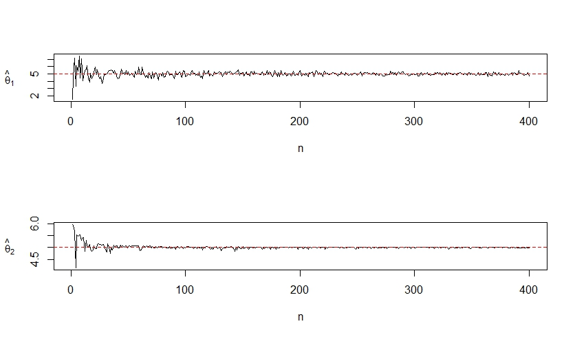
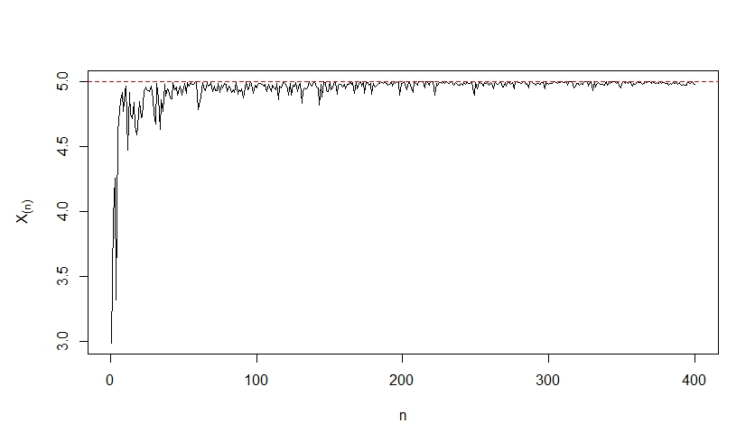

```{r setup, include=FALSE}
knitr::opts_chunk$set(echo = TRUE)
```
 
# Vídeos

Temas anteriores a esta clase (para repaso):

* [Insesgamiento asintótico](https://youtu.be/zuuNAjb-fx8)
* [Sesgo y error cuadrático medio](https://youtu.be/ya03V8ySoBI)
* [Eficiencia](https://youtu.be/GD4lUmIo9_g)
* [Información de Fisher](https://youtu.be/7O-an8MOL7g)
* [Cota inferior de Cramér-Rao](https://youtu.be/e8BhHJKB5Ks)
* [Comentarios sobre la cota inferior de Cramér-Rao](https://youtu.be/q0NI2tftYWg)
* [Primer ejemplo sobre la cota inferior de Cramér-Rao](https://youtu.be/YW1ZG1Hgg_k)
* [Segundo ejemplo sobre la cota inferior de Cramér-Rao](https://youtu.be/faFsaP1YE4U)

Temas para esta clase:

* [Consistencia](https://youtu.be/cgKK92xrfqo)
* [Relación general entre consistencia e insesgamiento](https://youtu.be/wAQ7zs-TmmY)
* [Suficiencia](https://youtu.be/vzG_dIdV5MA)
* [Ejemplos sobre suficiencia](https://youtu.be/1R4QauxorMQ)
* [Teorema de factorización](https://www.youtube.com/watch?v=Vgn4gdbqd0M)
* [Ejemplos de aplicaci&oacute;n del teorema de factorizaci&oacute;n](https://www.youtube.com/watch?v=xI9H4F35eVw)
---
 

# Consistencia
	
**Ejemplo.** 

Sea $X_{1}, X_{2}, ... , X_{n}$ una muestra aleatoria tal que $X_{j} \sim Unif(0,\theta)$ y sean $\overline{X}$ y $X_{(n)}$ estimadores de $\theta$.
	
Podemos encontrar que $E(\overline{X}) = \frac{\theta}{2}$ y $E(X_{(n)}) = \frac{n\theta}{n+1}$, por lo que $\overline{X}$ y $X_{(n)}$ son estimadores
sesgados. No obstante podemos construir estimadores insesgados a partir de ellos
que queden de la forma $\hat{\theta}_{1} = 2\overline{X}$ y $\hat{\theta}_{2} = \frac{n+1}{n}X_{(n)}$, respectivamente.
	
También podemos encontrar que la variancias de estos dos estimadores son las
siguientes:
	
  $Var(\hat{\theta}_{1}) = \frac{\theta^2}{3n} \qquad Var(\hat{\theta}_{2}) = \frac{\theta^2}{n(n+2)}$
	
El interés ahora yace en ver si estos estimadores se aproximan cada vez más al
valor verdadero de $\theta$ conforme aumentamos el tamaño de muestra y obtenemos
más información. Y si ambos cumplen esto también nos podría interesar cuál lo
hace de manera más rápida.

---

# Consistencia

Haciendo una simulación, con $\theta$ = 5, podemos observar que ambos estimadores convergen a $\theta$ conforme el tamaño de muestra va aumentando. Podemos decir que $\hat{\theta}_{1}$ y $\hat{\theta}_{2}$ son estimadores consistentes para estimar $\theta$. 
	
	

```{r pressure, echo=FALSE, fig.cap="Figura 1. Consistencia para dos estimadores insesgados de $\\theta$ ", out.width = '80%'}

```

---

# Consistencia

> **Definición 3.1. Consistencia.** Se dice que un estimador $\hat{\theta}$ es consistente para estimar $\theta$ ( $\hat{\theta}$ converge en probabilidad a $\theta$ ) si $\forall \varepsilon>0$ se cumple que: $\lim_{n \to +\infty}P\left(\left|\hat{\theta}-\theta\right|\leq \varepsilon\right) = 1$
		
O lo que es equivalente: $\lim_{n \to +\infty} P\left(\left|\hat{\theta}-\theta\right|> \varepsilon\right) = 0$

Se puede denotar con la definición de la convergencia en probabilidad,

$$\hat{\theta} \stackrel{p}{\longrightarrow} \theta.$$


---
# Consistencia

> **Teorema:** Si  $\lim_{n \to +\infty} \mathrm{MSE}(\hat{\theta})=0$ entonces $\hat{\theta}$ es consistente para estimar $\theta$. 

**Prueba:**

Recuerde que la *Desigualdad de Chebyshev* establece que si $X$ es una v.a. con $\mathbb{E}[X^{2}] < \infty$, entonces para cualquier $\varepsilon>0$, se tiene que 

$$\mathrm{P}(\vert X\vert > \varepsilon) \leq \frac{\mathbb{E}[X^2]}{\varepsilon^2}.$$

Tome $X=\hat{\theta}-\theta$. Si $\hat{\theta}$ es una v.a. que cumple que  $\operatorname{Var}(\hat{\theta})$ existe. Entonces para cada número  $\varepsilon>0$

$$\operatorname{P}(|\hat{\theta}-\theta| \geq \varepsilon) \leq  \frac{\mathbb{E}[(\hat{\theta}-\theta)^2]}{\varepsilon^2}=\frac{\operatorname{MSE}(\hat{\theta})}{\varepsilon^{2}}.$$
Finalmente, se tiene que

$$\lim_{n \to +\infty}\operatorname{P}(|\hat{\theta}-\theta| \geq \varepsilon) \leq  \frac{1}{\varepsilon^{2}} \cdot \lim_{n\to\infty}\operatorname{MSE}(\hat{\theta})=\frac{1}{\varepsilon^{2}} \cdot 0=0$$

---

# Consistencia con estimadores insesgados

> **Teorema 3.1** Si $\hat{\theta}$ es un estimador de $\theta$ entonces $\hat{\theta}$ es un estimador consistente si:

> a. $\hat{\theta}$ es insesgado para $\theta$, y  

> b. $\lim_{n \to +\infty} Var(\hat{\theta}) = 0$.


**Prueba:** Ejercicio.


---

# Consistencia

**Ejemplo.** 

Sea $X_{1}, X_{2}, ... , X_{n}$ una muestra aleatoria tal que $X_{j} \sim Unif(0,\theta)$ y sean $\hat{\theta}_{1} = 2\overline{X}$ y $\hat{\theta}_{2} = \frac{n+1}{n}X_{(n)}$ dos estimadores de $\theta$. Demuestre que estos estimadores son consistentes para estimar $\theta$.
	
**Solución.** 

Ya sabemos que $\hat{\theta}_{1}$ y $\hat{\theta}_{2}$ son estimadores insesgados de $\theta$, por lo que se cumple la primera condición del Teorema anterior; solo nos hace falta demostrar la segunda propiedad:
	
$$\lim_{n \to +\infty}Var(\hat{\theta}_{1}) = \lim_{n \to +\infty}\frac{\theta^2}{3n} = 0$$
	
$$\lim_{n \to +\infty}Var(\hat{\theta}_{2}) = \lim_{n \to +\infty}\frac{\theta^2}{n(n+2)} = 0$$
	
  Ambos estimadores son insesgados, con varianza que tiende a cero. Por lo tanto son consistentes para estimar $\theta$. 
  


---

# Consistencia

**OJO:** ¿ El estadístico $X_{(n)}$ es consistente?

**Respuesta:** Si, pero es sesgado.

$$B(X_{(n)}) =  \frac{n\theta }{n+1} - \theta$$
$$Var(X_{(n)}) = \frac{n }{n+2}\theta^2 - \frac{n^2}{(n+1)^2} \theta^2 $$

**Tarea:** Pruebe que $\displaystyle \lim_{n \to +\infty} \operatorname{MSE}(X_{(n)})=0$
---

Si observamos el gráfico de $X_{(n)}$ notamos su consistencia pero sin ser  insesgado. Esto significa que existen estimadores sesgados y consistentes. 

---

# Consistencia

A continuación demostraremos que $X_{(n)}$ es consistente para $\theta$ por medio de la definición.

**Ejemplo.** 

Sean $X_{1}, X_{2}, ... , X_{n}$ una muestra aleatoria tal que $X_{j} \sim Unif(0,\theta)$ y $X_{(n)}$ un estimador de $\theta$. Demuestre que $X_{(n)}$ es consistente para estimar $\theta$.
	
**Solución.** 

Como $X_{(n)}$ es un estimador sesgado para $\theta$ no podemos hacer uso del Teorema 3.1 por lo que debemos usar la definición de consistencia. Como esta nos pide encontrar probabilidades y sabemos que $X_{(n)}\sim Potencial(n,\theta)$ vamos a recordar la función de distribución de $X_{(n)}$:
	
$F_{X_{(n)}}(x) = \begin{cases} 0\quad si \quad x \leq 0 \\ \left(\frac{x}{\theta}\right)^{n} \quad si\quad 0<x<\theta \\ 1\quad si\quad x \geq \theta \end{cases}$
---

# Consistencia

Con esto podemos desarrollar la probabilidad en la definición:
	
$P\left(\left|X_{(n)}-\theta\right|\leq \varepsilon\right) = P\left(-\varepsilon \leq X_{(n)}-\theta\leq \varepsilon\right) = P\left(\theta - \varepsilon \leq X_{(n)} \leq \theta + \varepsilon\right) =$ 
$F_{X_{(n)}}(\theta + \varepsilon) - F_{X_{(n)}}(\theta - \varepsilon)$

Sabemos que $F_{X_{(n)}}(\theta + \varepsilon) = 1 \quad \forall \varepsilon > 0$ ya que $\theta + \varepsilon > \theta$. No obstante, dependiendo del valor de $\varepsilon$ puede que $\theta - \varepsilon$ sea menor a 0 o esté entre 0 y $\theta$, por lo que  $F_{X_{(n)}}(\theta - \varepsilon)$ puede tomar distintos valores dependiendo de $\varepsilon$:

$F_{X_{(n)}}(\theta - \varepsilon) = \begin{cases} \left(\frac{\theta - \varepsilon}{\theta}\right)^{n} \quad si \quad 0 < \varepsilon < \theta \\ 0 \quad si \quad \varepsilon \geq \theta \end{cases}$
	
Por lo tanto, aplicando la definición, obtenemos:
	
$\lim_{n \to +\infty} P\left(\left|X_{(n)}-\theta\right|\leq \varepsilon\right) = \lim_{n \to +\infty}\left(F_{X_{(n)}}(\theta + \varepsilon) - F_{X_{(n)}}(\theta - \varepsilon)\right)$
	
$= 1 - \lim_{n \to +\infty}F_{X_{(n)}}(\theta - \varepsilon) =\begin{cases} 1 - \lim_{n \to +\infty}\left(\frac{\theta - \varepsilon}{\theta}\right)^{n} \quad si \quad 0 < \varepsilon < \theta \\ 1 \quad si \quad \varepsilon \geq \theta \end{cases} = 1 \quad \forall \varepsilon > 0$
---

# Consistencia

Como se cumple la definición entonces concluimos que $X_{(n)}$ es un estimador consistente para $\theta$.
	
> **Teorema 3.2.** Suponga que $\hat{\theta}$ es un estimador consistente para estimar $\theta$ y que $\hat{\phi}$ es un estimador consistente para $\phi$, entonces:

> $\hat{\theta} \pm \hat{\phi}$ es consistente para estimar $\theta \pm \phi$

> $\hat{\theta} \cdot \hat{\phi}$ es consistente para estimar $\theta \cdot \phi$

> $\frac{\hat{\theta}}{\hat{\phi}}$ es consistente para estimar $\frac{\theta}{\phi}$

> Si $g(\cdot)$ es una función continua en $\theta$ entonces $g(\hat{\theta})$ es consistente para estimar $g(\theta)$

**Es decir, si $\hat{\theta} \stackrel{p}{\longrightarrow} \theta$ entonces $g(\hat{\theta}) \stackrel{p}{\longrightarrow} g(\theta)$**
---

# Consistencia

**Ejemplo.** 

Sea $X_{1}, X_{2}, ... , X_{n}$ una muestra aleatoria de una población Normal con media $\mu$ y variancia $\sigma^2$. 
	
a. Demuestre que $S^2$ es un estimador consistente para $\sigma^2$. 

**Solución:** Ya conocemos que $E(S^2) = \sigma^2$ por lo que se cumple que $S^2$ es insesgado para $\sigma^2$. También sabemos que $Var(S^2) = \frac{2\sigma^4}{n-1}$, por lo tanto se cumple que $\lim_{n \to +\infty}Var(S^2) = 0$. Por lo tanto $S^2$ es un estimador consistente para $\sigma^2$. 

b. Pruebe que $S$ es un estimador consistente para estimar $\sigma$. 

**Solución:** Sea $g(x) = \sqrt{x}$ una función continua si $x \geq 0$, por lo tanto: $g(S^2) = S$ es consistente para estimar $g(\sigma^2) = \sigma$	

---

# Consistencia

> **Teorema 1.25. Teorema de Slutsky.** Suponga que $U_n$ es una variable aleatoria que tiene distribución que converge a una $N(0,1)$ cuando $n \to +\infty$. Además $W_n$ es una variable aleatoria que converge en probabilidad a 1. Se cumple, entonces, que la variable aleatoria $\frac{U_n}{W_n}$ tiene distribución que converge a una $N(0,1)$, cuando $n \to +\infty$.

**Ejemplo.** 
Sea $X_{1}, X_{2}, ... , X_{n}$ una muestra aleatoria de una población con media $\mu$ y variancia $\sigma^2$. Demuestre que $V = \frac{\overline{X}-\mu}{\frac{S}{\sqrt{n}}}$ converge a una $N(0,1)$ cuando $n \to +\infty$. 
	
**Solución.** 
Sea $U_n = \frac{\overline{X}-\mu}{\frac{\sigma}{\sqrt{n}}}$. Sabemos que por el Teorema del Límite Central $U_n$ converge en distribución a una $N(0,1)$ cuando $n \to +\infty$. 

Sea $W_n = \frac{S}{\sigma}$. Podemos demostrar que $S$ es consistente para estimar $\sigma$ para cualquier población, por lo que $\frac{S}{\sigma}$ converge en probabilidad a 1 ("es consistente para estimar 1"). 
	
Entonces se cumple que $V = \frac{\overline{X}-\mu}{\frac{S}{\sqrt{n}}} \xrightarrow{\text{d}} N(0,1)$ cuando $n \to +\infty$. 

---


# Suficiencia

	
Hasta el momento la selección de estimadores ha sido intuitiva, sin embargo en esta sección utilizaremos la propiedad de suficiencia para determinar estimadores a partir de ciertos estadísticos. Se dice que un estadístico es suficiente si **hace uso de toda la información de la muestra**. Ejemplos: $\overline{X}, S^{2}, X_{(n)}$.
	
> **Definición 4.1. Suficiencia mínima.** Si $X_{1}, X_{2}, ... , X_{n}$ es una muestra aleatoria sobre una población con parámetro desconocido $\theta$ y función de densidad/probabilidad $f_{X}(x|\theta)$. Se dice que un estadístico $U = g(X_{1}, X_{2}, ... , X_{n})$ es **suficiente mínimo** para estimar $\theta$ si la distribución condicional de $X_{1}, X_{2}, ... , X_{n}$ dado $U=u$ es independiente de $\theta$. 

> Es decir, $P(X_{1}, X_{2}, ... , X_{n} \vert U =u)$ no depende de $\theta$.


---

# Suficiencia

De otra forma, se puede decir que un estadístico $U = T(X_{1}, X_{2}, ... , X_{n})$, de una muestra aleatoria $X_{1}, X_{2}, ... , X_{n}$, es suficiente mínimo para estimar $\theta$ si no se puede encontrar otro estadístico que realice una mejor reducción de los datos que la que realiza $U$. Es decir, el estadístico suficiente mínimo logra **explicar toda la información del parámetro que se presenta en la muestra aleatoria**.
	
Ejemplo. Sea $X_{1}, X_{2}, ... , X_{n}$ una muestra aleatoria tal que $X_{j} \sim Bernoulli(p)$. Pruebe que $U = \sum_{j=1}^{n} X_{j}$ es suficiente para estimar $p$.
	
Solución. Sabemos que la función de probabilidad de una Bernoulli viene dada por la siguiente expresión:
	
$f_{X}(x|p) = \begin{cases} p^{x}\left(1-p\right)^{1-x} \quad si \quad x \in \left\lbrace 0,1\right\rbrace  \\ 0 \quad en \quad otros \quad casos \end{cases}$
	
También sabemos de antemano que la suma de Bernoulli es una Binomial, por lo que $U \sim Bin(n,p)$, por lo que tiene la siguiente función de probabilidad:
	
$f_{U}(u|p) = \begin{cases} \binom{n}{u}p^{u}\left(1-p\right)^{n-u} \quad si \quad u \in \left\lbrace0,1,2,...,n\right\rbrace \\ 0 \quad en \quad otros \quad casos \end{cases}$
	
---

# Suficiencia

Ahora tenemos que encontrar la función de probabilidad condicional de $X_{1}, X_{2}, ... , X_{n}$ dado $U=u$, que por lo visto en cursos anteriores sabemos que es:
	
$$f(x_{1}, ... , x_{n} | U = u) = \frac{f(x_{1}, ... , x_{n}, u)}{f_{U}(u)}$$

En este caso el numerador es la función de probabilidad conjunta de $X_{1}, X_{2}, ... , X_{n}$ y $U$, pero al estar este en términos de toda la muestra aleatoria entonces quedamos con solo la función de probabilidad conjunta de $X_{1}, X_{2}, ... , X_{n}$, $f(x_{1}, ... , x_{n})$. Recordemos que bajo independencia $f(x_{1}, ... , x_{n}) = \prod_{j=1}^{n}f_{X_{j}}(x_{j}|p)$. Esta función también lleva el nombre de **función de verosimilitud** y se denota como $\mathcal{L}(x_{1}, ... , x_{n}|p)$ o también solo como $\mathcal{L}(p)$. 
	
$$\mathcal{L}(x_{1}, ... , x_{n}|p) =  \prod_{j=1}^{n} p^{x_{j}}\left(1-p\right)^{1-x_{j}}= p^{\sum_{j=1}^{n}x_{j}}\left(1-p\right)^{n-\sum_{j=1}^{n}x_{j}} = p^{u}\left(1-p\right)^{n-u}.$$


---

# Suficiencia

Por lo tanto, $f(x_{1}, ... , x_{n} | U = u) = \frac{p^{u}\left(1-p\right)^{n-u}}{\binom{n}{u}p^{u}\left(1-p\right)^{n-u}} = \frac{1}{\binom{n}{u}}$
	
Como vemos, esta función condicional no depende de $p$, por lo que decimos que $U$ es suficiente para estimar $p$. 

Ejemplo. Sea $X_{1}, X_{2}, ... , X_{n}$ una muestra aleatoria de una población Uniforme en el intervalo $(0,\theta)$. Demuestre que el máximo muestral es un estimador suficiente para $\theta$. 
	
Solución. Ya habiamos demostrado con anterioridad que para este caso $U = X_{(n)} \sim Potencial(n,\theta)$, por lo que conocemos su función de densidad:

$f_{U}(u) = \frac{nu^{n-1}}{\theta^n}$
	
Con esto podemos encontrar la función de densidad marginal:
	
$f(x_{1}, ... , x_{n} | U = u) = \frac{\theta^{-n}}{\frac{nu^{n-1}}{\theta^n}} = \frac{1}{nu^{n-1}}$
	
Como esta expresión no depende de $\theta$ entonces decimos que el máximo muestral es suficiente para estimar $\theta$. 


---

# Técnicas para demostrar suficiencia

1. Técnica de factorización
2. Técnica de la familia exponencial.
	
> **Teorema 4.1. Técnica de factorización.** Si $U$ es un estadístico definido sobre una muestra aleatoria $X_{1}, X_{2}, ... , X_{n}$ de una población con parámetro desconocido $\theta$ y $\mathcal{L}(X_{1}, X_{2}, ... , X_{n}|\theta) = \mathcal{L}(\theta)$ es la función de verosimilitud entonces $U$ es suficiente para $\theta$ si y solo si existen funciones $g(u,\theta)$ y $h(x_{1}, x_{2}, ... , x_{n})$ tal que $\mathcal{L}(\theta) = g(u,\theta) \cdot h(x_{1}, x_{2}, ... , x_{n})$ donde $g(\cdot)$ depende de $X_{1}, X_{2}, ... , X_{n}$ solo por medio de $U$ y $h(\cdot)$ no depende de $\theta$. 


---

# Suficiencia

Ejemplo. Sea $X_{1}, X_{2}, ... , X_{n}$ una muestra aleatoria tal que $X_{j} \sim Bernoulli(p)$. Pruebe que $U = \sum_{j=1}^{n} X_{j}$ es un estadístico suficiente mínimo para $p$. 

Solución. En el caso de una muestra aleatoria Bernoulli, su función de verosimilitud viene dada por
	
$$\mathcal{L}(p) = \prod_{j=1}^{n} p^{x_{j}}\left(1-p\right)^{1-x_{j}} = p^{\sum x_{j}}\left(1-p\right)^{n-\sum x_{j}} = p^{u}\left(1-p\right)^{n-u}$$
	
Si tomamos $g(u,p) = p^{u}\left(1-p\right)^{n-u}$ y $h(x_{1}, x_{2}, ... , x_{n}) = 1$ podemos ver que se cumple el teorema anterior por lo que queda demostrado que $U = \sum_{j=1}^{n} X_{j}$ es un estadístico suficiente mínimo para $p$.
---

# Suficiencia

Ejemplo. Sea $X_{1}, X_{2}, ... , X_{n}$ una muestra aleatoria de una población Poisson con media $\lambda$. Encuentre un estadístico suficiente mínimo para $\lambda$. 
	
Solución. Primero debemos encontrar la función de verosimilitud para una muestra aleatoria Poisson,
	
$$\mathcal{L}(\lambda) = \prod_{j=1}^{n} \frac{\lambda^{x_{j}}e^{-\lambda}}{x_{j}!} = \frac{\lambda^{\sum x_{j}}e^{-n\lambda}}{\prod x_{j}! }$$

Si tomamos $U = \sum_{j=1}^{n} X_{j}$ entonces podemos observar que $g(u,\lambda) = \lambda^{u} e^{-n\lambda}$ y $h(x_{1}, x_{2}, ... , x_{n}) = \frac{1}{\prod x_{j}! }$ cumplen que su producto sea igual a la verosimilitud, por lo que $U = \sum_{j=1}^{n} X_{j}$ es un estadístico suficiente mínimo. 


---

# Ejercicios grupales

- **9.17** (Mendenhall) Suponga que $X_1, X_2, ..., X_n$ y $Y_1, Y_2, ..., Y_n$ son muestras aleatorias independientes provenientes de dos poblaciones con medias $\mu_1$ y $\mu_2$ y variancias $\sigma_1^2$ y $\sigma_2^2$, respectivamente. Demuestre que $\bar{X}-\bar{Y}$ es un estimador consistente de $\mu_1-\mu_2$.

- **9.18** (Mendenhall) Con los mismos supuestos del ejercicios 9.17 + asumiendo que las dos poblaciones son normales con $\sigma_1^2 = \sigma_2^2 = \sigma^2$. Demuestre que: 

$$\frac{\sum_{i=1}^n(x_i-\bar{x})^2+\sum_{i=1}^n(y_i-\bar{y})^2}{2n-2}$$
es un estimador consistente de $\sigma^2$.


---
class: center, middle

# ¿Qué discutimos hoy?

ECM y propiedades de los estimadores: consistente y suficiente. 

Para la próxima clase: métodos para encontrar estadísticos suficientes y métodos para encontrar estimadores.


