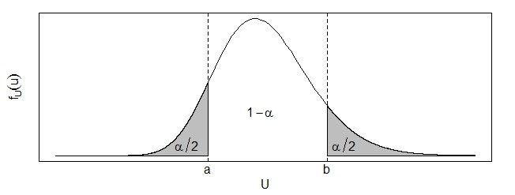

```{r setup, include=FALSE}
knitr::opts_chunk$set(echo = TRUE)
```


## ¿Qué hemos visto hasta ahora?

Todo sobre estimadores puntuales.

## ¿Qué vamos a discutir hoy?

Intervalos de confianza clásicos 

---

class: center, middle

# ¿Qué es un intervalo de confianza?
<iframe width="560" height="315" src="https://www.youtube.com/embed/nNZH9FXnjvM" frameborder="0" allow="accelerometer; autoplay; encrypted-media; gyroscope; picture-in-picture" allowfullscreen></iframe>

---

# Estimación por Intervalo

* Una estimación por intervalo para un parámetro desconocido $\theta$ viene dada por un rango o intervalo que posee cierta probabilidad $1-\alpha$ de contener a dicho parámetro.

* Usualmente este concepto de *confianza* se interpreta diciendo que si obtenemos 100 intervalos entonces $\alpha \%$ de ellos no van a incluir el valor del parámetro. Es decir, si tenemos 100 intervalos del $95\%$ de confianza entonces se espera que 5 de ellos no incluyan el valor del parámetro, o que de 20 intervalos haya uno que no lo incluya.

 
Visualmente:
https://seeing-theory.brown.edu/frequentist-inference/es.html


---

# Estimación por Intervalo


```{r, echo=FALSE, fig.width=10, warning=FALSE}
library(plotrix)
X <- matrix(rnorm(20*150, mean = 17, sd = 3), ncol = 150)
xbar <- colMeans(X)
ls <- xbar + qnorm(0.975)*3/sqrt(20)
li <- xbar - qnorm(0.975)*3/sqrt(20)
x <- 1:20

set.seed(4)
lims <- as.data.frame(cbind(li,ls,xbar))
TT <- lims$li > 17 | lims$ls <17
limsF <- lims[TT,]
limsT <- lims[!TT,]
uno <- sort(sample(1:145, 19))
dos <- sample(1:5, 1)
plims <- rbind(limsT[uno,], limsF[dos,])
plims$row <- as.numeric(rownames(plims))
#plims %>% arrange(row)

plotCI(x, plims$xbar, ui = plims$ls, li = plims$li, pch = 16, yaxt = "n", 
       xlab = "Ensayo", ylab = "")
abline(h = 17, lty = 2, col = "red")
mtext(text = expression(mu), side = 2, line = 1, at = 17, las = 2)
```

---

# Estimación por Intervalo

Existen dos tipos de estimaciones por intervalos:

* Intervalos bilaterales
* Intervalos unilaterales
	
En el primer caso se tienen dos valores $a$ y $b$ que constituyen los límites inferior y superior del intervalo. Es decir, el intervalo $\left[a, b\right]$ contiene el valor de $\theta$ con una confianza del $(1-\alpha)\cdot 100\%$. 
	
En el segundo caso, se determina solamente un límite que puede ser inferior $(a)$ o superior $(b)$, dependiendo del interés del estudio. Se tiene así intervalos de la forma $\left[ a, +\infty \right[$ o $\left] -\infty, b \right]$. Los valores $\pm \infty$ pueden ser sustituidos por el mínimo o máximo valor del dominio del parámetro de interés. 
	
---


## Técnica para estimaciones por intervalo
	
Existen varias técnicas para obtener estimaciones por intervalo, sin embargo en este curso nos enfocaremos en la **técnica del pivote**.

En la versión en línea verán un video acá

<p></p>
	
<div align="center"><iframe width="560" height="315" src="https://www.youtube.com/embed/LO2BOtWxMyY" frameborder="0" allow="accelerometer; autoplay; encrypted-media; gyroscope; picture-in-picture" allowfullscreen></iframe></div>

---

# Técnica del pivote
	
Esta técnica consiste en definir una variable aleatoria, $U$, que llamaremos **pivote**. El pivote debe cumplir con las siguientes condiciones: 
	
* Para una muestra aleatoria $X_{1}, X_{2}, ... , X_{n}$ y un parámetro desconocido $\theta$, $U$ debe estar definido en términos de los elementos de la muestra aleatoria y del parámetro desconocido, donde el parámetro desconocido $\theta$ sea la única cantidad desconocida. 

* La distribución de probabilidad de U debe ser conocido y no depender de $\theta$. 

---


**Ejemplo:** Sea $X_{1}, X_{2}, ... , X_{n}$ una muestra aleatoria tal que $X_{j} \sim N(\mu, \sigma^2)$, donde $\mu$ es deconocido y $\sigma^2$ es conocido. Obtenga una variable aleatoria que funcione como un pivote. 
	
**Solución:** Debemos encontrar una variable aleatoria que esté definida en términos de la muestra y de $\mu$. 

* Una forma de resumir toda la información de la muestra en una sola variable aleatoria. Lo ideal sería utilizar un estadístico suficiente: $\sum_{j=1}^{n} X_{j}$ es suficiente para estimar $\mu$, por lo que podriamos usar alguna función de este estadístico en el pivote. 

* $\overline{X}$ resume la información de la muestra aleatoria, pues está en términos de un estadístico suficiente y además sabemos que se distribuye $N(\mu, \dfrac{\sigma^2}{n})$. Ahora debemos encontrar alguna transformación de $\overline{X}$ que incluya a $\mu$ y cuya distribución no dependa de $\mu$. 
	
---


* $U = \dfrac{\overline{X} - \mu}{\dfrac{\sigma}{\sqrt{n}}}$, se distribuye $N(0,1)$. U cumple con las propiedades de un pivote pues está definida en términos de la muestra y del parámetro desconocido $\mu$ al igual que su distribución ya no depende de $\mu$. 

**NOTA:** U no es la única opción de pivote. Por ejemplo, $\overline{X} - \mu$ es otra variable aleatoria que también cumple las condiciones para ser un pivote. Existe una infinidad de variables aleatorias que cumplen esta condición, pero como veremos más adelante algunas son más útiles que otras. 
	
Ahora debemos seguir con el procedimiento para encontrar un intervalo de confianza por medio de la técnica del pivote. Hay dos caminos:

* Caso bilateral
* Caso unilateral

---


* **Caso bilaterial:** se requiere encontrar valores $a$ y $b$ tales que $P(a \leq U \leq b) = 1-\alpha$ y por lo tanto también se cumple que $P(U < a) + P(U > b) = \alpha$. Sin embargo, estas condiciones generan un número infinito de posibilidades para $a$ y $b$ por lo que se tiene que limitar de alguna manera. Para ello, se acostumbra utilizar la condición de cada una de las probabilidades de las "colas" sean iguales, es decir $P(U < a) = P(U > b) = \dfrac{\alpha}{2}$. 

* **Caso unilaterial:** podemos tener un límite inferior o superior. Dependiendo del que nos interese y de la forma del pivote debemos encontrar un valor $a$ o $b$ que cumpla $P(U \geq a) = 1-\alpha$ o $P(U \leq b) = 1 -\alpha$. Finalmente, como $U$ está en términos de la muestra aleatoria y del parámetro $\theta$ entonces despejamos $\theta$ dentro de la probabilidad y con esto obtenemos los límites inferiores y superiores. 


---


**Ejemplo:** Sea $Y$ una variable aleatoria con distribución Exponencial con media $\beta$ desconocida. Utilice este valor para construir un intervalo bilateral para $\beta$ con una confianza del $90\%$.
	
**Solución:** En este caso podemos utilizar como pivote $U = \dfrac{Y}{\beta}$ ya que está en términos de la variable aleatoria y de $\beta$ al igual que se puede demostrar que su distribución no depende de $\beta$. En este caso $U \sim Exp(1)$. 

Nuestro siguiente paso es buscar los valores $a$ y $b$ tales que:
	
$P(a \leq U \leq b) = 0.9  \quad y \quad P(U < a) = P(U > b) = 0.05$

Recordemos que en el caso de una variable aleatoria continua $P(U < a) = P(U \leq a) = F_{U}(a)$. Podemos usar nuestro conocimiento de la función de distribución de la exponencial para encontrar el valor de $a$:
	
$P(U < a) = F_{U}(a) = 1 - e^{-a} = 0.05, \quad \Rightarrow  a = -\ln(0.95)$

---


Podemos hacer lo mismo para encontrar el valor de $b$: 
	
$P(U > b) = 1 - P(U \leq b) = 1 - F_{U}(b) = e^{-b} = 0.05, \quad \Rightarrow b = -\ln(0.05)$.

Nuestro último paso ahora es despejar el valor de $\beta$ de la probabilidad que acumula $0.90$:
\begin{align*}
P(a \leq U \leq b) &= P\left( -\ln(0.95) \leq \dfrac{Y}{\beta} \leq -\ln(0.05) \right) \\ 
 &= P\left( \dfrac{-1}{\ln(0.95)} \geq \dfrac{\beta}{Y} \geq \dfrac{-1}{\ln(0.05)} \right) = P\left( \dfrac{-Y}{\ln(0.95)} \geq \beta \geq \dfrac{-Y}{\ln(0.05)} \right)\\ 
 & = 0.90
\end{align*}
	
Por lo tanto tenemos que $a = \dfrac{-Y}{\ln(0.05)}$ y $b = \dfrac{-Y}{\ln(0.95)}$ por lo que podemos concluir que con una confianza del $90\%$ el intervalo $\left[ \dfrac{-Y}{\ln(0.05)}, \dfrac{-Y}{\ln(0.95)} \right]$ incluye el valor de $\beta$. 
	
---


**Ejemplo:** Sea $X$ una variable aleatoria Uniformemente distribuida en el intervalo $(0, \theta)$, con $\theta$ desconocido. Determine un intervalo de confianza unilateral inferior para $\theta$ del $95\%$.
	
**Solución:** Primero debemos encontrar una cantidad pivote satisfactoria. En este caso podemos utilizar $U = \dfrac{X}{\theta}$ como pivote ya que cumple ambas condiciones. Se puede demostrar que $U \sim Unif(0,1)$ por medio de la segunda técnica de transformaciones: 
	
Sea $U = h(X) = \dfrac{X}{\theta}$, por lo tanto $h^{-1}(U) = U\theta \quad \Rightarrow \dfrac{dh^{-1}(u)}{du} = \theta$

Aplicando la técnica tenemos:
	
$f_{U}(u) = f_{X}(u\theta) \cdot \theta = \dfrac{1}{\theta} \cdot \theta = 1$

---


Al ser el dominio original $0 < x < \theta$ al sustituir $x$ por $u\theta$ obtenemos el nuevo dominio: $0 < u < 1$. Por lo tanto concluimos que $U \sim Unif(0,1)$. 
	
Ahora podemos usar esto para encontrar el valor de $b$ tal que $P(U \leq b) = 0.95$:
	
$P(U \leq b) = F_{U}(b) = 0.95, \quad \Rightarrow b = 0.95$


Con este valor podemos proceder a despejar el valor de $\theta$ de esta probabilidad y obtener así el límite inferior de nuestro intervalo:
	
$P(U \leq b) = P\left( \dfrac{X}{\theta} \leq 0.95  \right) = P\left( \theta \geq \dfrac{X}{0.95}  \right) = 0.95$
	
Por lo tanto podemos concluir que con un $95\%$ de confianza el intervalo $\left[ \dfrac{X}{0.95}, +\infty \right[$ incluye el valor de $\theta$. 

---


<!-- **Ejemplo:** Suponiendo que $\theta = 50$ simule un valor que pertenece a la población del ejemplo anterior y evalueelo en el intervalo encontrado.  -->
	
<!-- **Solución:** Recordemos que para simular debemos igualar la función de distribución de la variable aleatoria objetivo con la de una Uniforme $(0,1)$. En nuestro caso tenemos la siguiente función de distribución para $X$: -->
	
<!-- $F_{X}(x)=\begin{cases}0\quad si \quad x \leq 0 \\ \dfrac{x}{\theta} \quad si \quad 0 < x < \theta \\ 1 \quad si \quad x > \theta \end{cases}$ -->

<!-- Por lo tanto para simular un valor de esta distribución debemos hacer lo siguiente: -->
	
<!-- $$U = \dfrac{X}{\theta} \Rightarrow X = \theta U$$ -->
	
<!-- Usando la función para valores aleatorios entre cero y uno de una calculadora obtuvimos que $u = 0.821$, por lo tanto el valor simulado sería $x = 41.05$, con $\theta = 50$.  -->

<!-- --- -->


<!-- Evaluando este valor en el intervalo obtenido tenemos que con un $95\%$ de confianza el intervalo $\left[ 43.21, +\infty \right[$ incluye el valor de $\theta$. Podemos ver que en este caso nuestro intervalo acertó el verdadero valor de $\theta$.  -->
	
<!-- **NOTA:** Es posible observar que si $u > 0.95$ entonces el intervalo no va a incluir el valor de $\theta = 50$, para una confianza del $95\%$.  -->
	
**Ejemplo:** Sea $X_{1}, X_{2}, ... , X_{20}$ una muestra aleatoria tal que $X_{j} \sim Exp(\beta)$. Determine un intervalo de confianza bilateral para $\beta$ con una confianza del $(1-\alpha)\%$. Utilice como pivote una función de $\sum_{j=1}^{20} X_{j}$. 

---


**Solución:** Sabemos de antemano que $T = \sum_{j=1}^{20} X_{j} \sim Gamma(\alpha = 20,\beta)$. 
	
$T$ no sirve como pivote pues no depende de $\beta$ y su distribución todavía depende de $\beta$. Debemos encontrar alguna transformación de $T$ que haga que se cumplan las dos condiciones.


**Primera opción:**

Recordemos que la función generadora de momentos de una Gamma $(\alpha,\beta)$ es $(1-\beta t)^{-\alpha}$. Por lo tanto, si $U = \dfrac{T}{\beta}$ entonces,
	
$$m_{U}(t) = m_{T}\left(\dfrac{t}{\beta}\right) = \left(1-t\right)^{-20}$$
	
Esto quiere decir que $U \sim Gamma(20,1)$ y por lo tanto se puede emplear como un pivote pues cumple las dos condiciones. Ahora procedemos a encontrar los valores $a$ y $b$ tales que $P(U < a) = P(U > b) = \dfrac{\alpha}{2}$. Como la Gamma no tiene una función de distribución en forma cerrada debemos proceder a integrar la función de densidad:
	
$$P(U < a) = \int_{0}^{a} \dfrac{u^{19}e^{-u}}{\Gamma(20)} du = \dfrac{\alpha}{2}$$

---


Esta integral es posible de calular a mano, pero su desarrollo necesita de 19 veces de "por partes" que hacen su cálculo extremadamente largo y tedioso. Sin embargo, podemos hacer uso de tablas estadísticas que nos dan cuartiles para ciertas probabilidades. En este caso no tenemos una tabla para una Gamma con estos parámetros, pero sí tenemos para otra Gamma: la $\chi^2$-cuadrado.

**Segunda opción:**

Afortunadamente existe una forma para pasar de cualquier Gamma a una $\chi^2$: 
	
Sea $V = \dfrac{2T}{\beta}$ entonces,
	
$$m_{V}(t) = m_{T}\left(\dfrac{2t}{\beta}\right) = \left(1-2t\right)^{-20} = \left(1-2t\right)^{-\frac{40}{2}}$$
	
Esta es la función generadora de momentos de una $\chi^2$-cuadrado con 40 grados de libertad, de la cuál sí tenemos tablas para encontrar cuantiles. Ahora si podemos proceder a encontrar los valores de $a$ y $b$, sabiendo que gráficamente lucen de la siguiente manera: 
	
---


	


---


Como la tabla de la $\chi^2$-cuadrado acumula hacia la derecha (a más de), esto significa que $a$ es el valor de la tabla de una $\chi^2$-cuadrado con $40$gl que acumula a su derecha una probabilidad de $1-\frac{\alpha}{2}$. Por consiguiente $b$ es el valor de la tabla que acumula a su derecha una probabilidad de $\frac{\alpha}{2}$. Para simiplicidad vamos a llamar estos valores $\chi^{2}_{1-\frac{\alpha}{2}, 40}$ y $\chi^{2}_{\frac{\alpha}{2}, 40}$, respectivamente. 
	
Ya encontrados los valores de $a$ y $b$ podemos proceder a despejar $\beta$ de la probabilidad que acumula $1-\alpha$:

$$P(a \leq V \leq b) = P\left( \chi^{2}_{1-\frac{\alpha}{2}, 40} \leq \frac{2T}{\beta} \leq \chi^{2}_{\frac{\alpha}{2}, 40} \right) =  P\left(  \frac{2T}{\chi^{2}_{\frac{\alpha}{2}, 40}} \leq \beta \leq \frac{2T}{\chi^{2}_{1-\frac{\alpha}{2}, 40}}  \right) = 1 -\alpha$$
	
Por lo tanto, con una confianza de $(1-\alpha)\%$ el intervalo $\left[ \frac{2\sum_{j=1}^{20} X_{j}}{\chi^{2}_{\frac{\alpha}{2}, 40}}, \frac{2\sum_{j=1}^{20} X_{j}}{\chi^{2}_{1-\frac{\alpha}{2}, 40}}  \right]$ incluye el valor de $\beta$. 

---
class: center, middle

# ¿Qué discutimos hoy?

Estimación por intervalos, método del pivote

